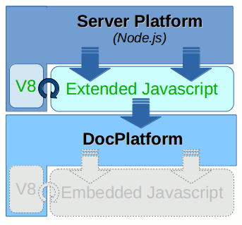
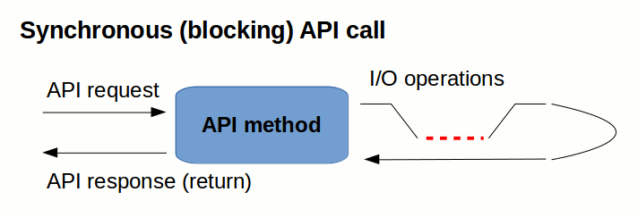
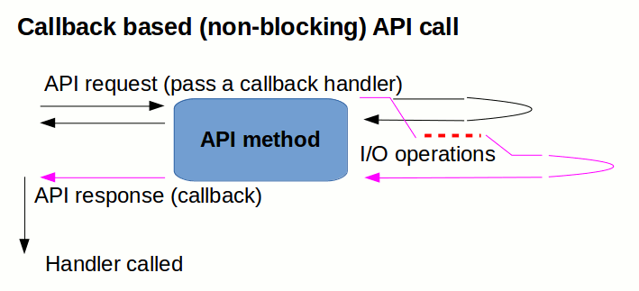
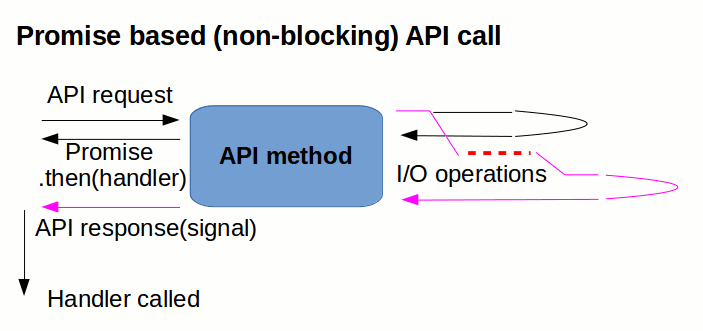
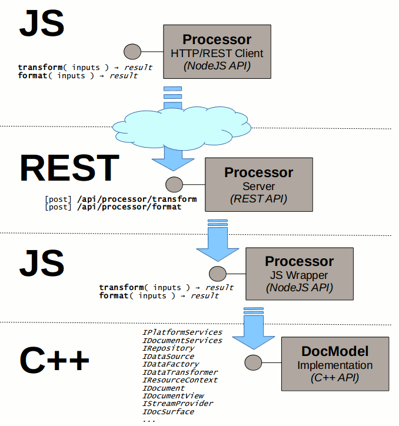
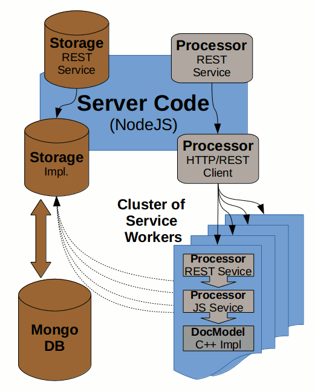
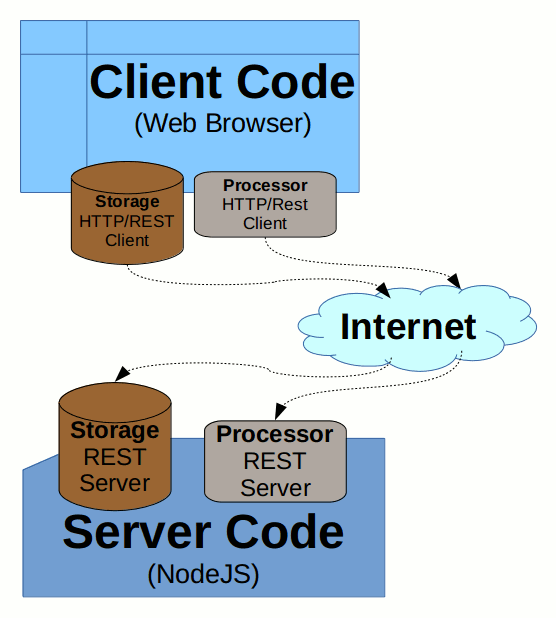
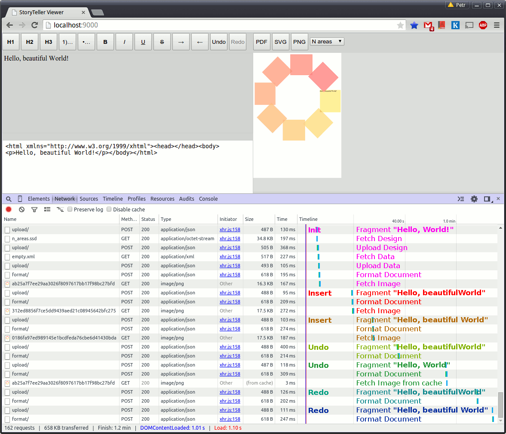

# Javascript Extending

This Section describes the motivation and technology behind the *DocPlatform Extending by Javascript*. It is the first part of the
[Javascript Documentation](index.md).

First we describe the environment used for *DocPlatform* extending, and list use cases how can such integration be exploited.

We will also discuss general conventions how to define the *Javascript APIs* and describe the resulting exposed API based 
on a convention we picked.

We will conclude this section with some example implementations of the API and proposals how to deploy and integrate them 
in real world scenarios.



## Environment

As an example of *DocPlatform Extending by Javascript* we use popular
[Node.js platform](https://nodejs.org/). It is a modern framework based
on top of the [Google v8 Javascript
engine](https://code.google.com/p/v8/) which allows to build fast,
scalable
[distributed](http://en.wikipedia.org/wiki/Distributed_computing)
[network-based](http://en.wikipedia.org/wiki/Network_service)
(client/server) applications completely in *Javascript* programming
language (on both *server* and *client* side).

*Node.js* is being adopted as a server-side platform by many big
companies including [Microsoft](http://en.wikipedia.org/wiki/Microsoft),
[Yahoo!](http://en.wikipedia.org/wiki/Yahoo!),
[SAP](http://en.wikipedia.org/wiki/SAP_SE) etc.

Thanks to its
[event-driven](http://en.wikipedia.org/wiki/Event-driven_programming),
[non-blocking I/O model](http://en.wikipedia.org/wiki/Asynchronous_I/O)
*Node.js* based server solutions tend to be very lightweight, efficient
and well suitable for data-intensive real-time applications.

At the heart of *Node.js* is an [event
loop](http://en.wikipedia.org/wiki/Event_loop). Event loops are widely
used in GUI applications and allow them to responsibly handle incoming
events (e.g. when a user clicks a button). When such event occurs GUI
has to handle it somehow - it executes the logic associated with the
particular event. Afterward, the application is ready to respond to next
events (either queued ones that have already arrived, or ones that might
arrive later, based on user interaction).

*Node.js* really shines for data-intensive applications. The method how
it handles incoming requests is quite similar to the GUI implementation
described above. Instead of user events (like a click to a button) it
just handles HTTP requests of similar kinds of events. And it does it
quite efficiently - just a single thread of execution and a single task
queue is enough for responsible, real-time applications thanks to the
fact that majority of *Node.js* internal APIs and libraries are
non-blocking/asynchronous.

The *Node.js* event-based architecture is quite similar to the one of
the [NginX](http://nginx.org/) HTTP server (serving more than \~21% of
busiest web sites in March 2015).

Here is the comparison of [NginX](http://en.wikipedia.org/wiki/Nginx)
and [Apache](http://en.wikipedia.org/wiki/Apache_HTTP_Server) HTTP
servers under a heavy load:

### Throughput (reqs/sec):


### Memory consumption:


It is clearly visible that the *NginX* it scales much better than
traditional (thread based) solutions (like *Apache*). It is especially
true in high-throughput scenarios thanks to the asynchronous
(non-blocking) approach. For I/O bound use cases the event-based
solution is superior as there is no need to spare threads for
busy-waining operations.

For CPU intensive application the event-loop approach does not work on
it's own. Such cases are typically solved by multiprocessing. We will
show a draft of such solution at the end of this section.

## Use cases

This chapter lists possible use cases how extending *DocPlatform* API to
*Javascript* can be utilized.

### Testing

Right now the main motivation was to prepare a suitable testing
environment in order to be able to bring *Document Platform* &
*Javascript* integration to a production quality.

The fact that the *Node.js* is a command-line tool and can serve as a
[REPL](http://en.wikipedia.org/wiki/Read%E2%80%93eval%E2%80%93print_loop)
console makes it very suitable for both interactive and automated
testing.

We used quite similar approach with [CPython
interpreter](http://en.wikipedia.org/wiki/CPython) (with regard to the
*DocPlatform* integration with [Python programming
language](http://en.wikipedia.org/wiki/Python_(programming_language)))
and it subsequently lead to an explosion of automated testing (helped us
to create more than \~5000 regression tests) and making sure the
implementation quality is not compromised under a pressure of developing
heavy load of new features demanded to every release.

### Client/Server Applications

Another possible use cases include some runtime solutions based on
*Node.js* platform. With help of *Javascript* there is a potential to
rapidly create *Web-based Viewers* and *Editors* of *SSD Documents*, it
should also be possible to create [Server
Clusters](http://en.wikipedia.org/wiki/Computer_cluster) to scale the
solution and [Balance the
Load](http://en.wikipedia.org/wiki/Load_balancing_(computing)) and so
better utilize the computing power available in contemporary hardware.

### Multi-platform Desktop/Mobile applications

With modern frameworks like [AppJS](http://appjs.com/) (or alternatively
[TideSDK](http://www.tidesdk.org/)/[TideKit](https://www.tidekit.com/))
it is possible to build multi-platform desktop (and mobile) applications
based on web technologies. It shows that
[HTML5](http://slides.html5rocks.com/), [CSS3](http://www.css3.info/)
and [Javascript](http://www.w3schools.com/js/) are suitable not only for
[Web Pages](http://en.wikipedia.org/wiki/Web_page) and [Web
Applications](http://en.wikipedia.org/wiki/Web_application) but also for
[Desktop](http://en.wikipedia.org/wiki/Application_software) and
[Mobile](http://en.wikipedia.org/wiki/Mobile_app) Applications.

The *AppJS* uses at its core the [Chromium browser
engine](https://www.chromium.org/Home) and
[Node.js](https://nodejs.org/) again. So the *Node.js* integration opens
the door for *DocPlatform* to this area as well. With modern
technologies like this we could possibly have a *StoryTeller Editor*
and/or *Viewer* deployed to the *Web*, *Desktop* (Windows, Mac OS and
Linux) and *Mobile* from just a single source code base.

## Javascript Interfaces

Right now we are using [SWIG Interface generator](http://www.swig.org/)
for automatic generation of interface wrappers to *Javascript*. With
recent *SWIG* version (3.0.5 at the time of this writing) it works
relatively well, but with notable limitation though.

The main problem we are facing is the lack of callback support (and
inability to automatically prepare asynchronous interfaces associated
with it).

An alternative would be to write *v8* wrappers manually instead of
generating them via *SWIG*. But the fact is that *C++* interfaces are
typically designed differently than the *Javascript* ones and so there
is always a possibility to make one or more layers on top of the exposed
"raw" C++ functionality.

That is exactly what we have done during the *Javascript Extending POC*.
Simple callback based interfaces for *Storage* and *Processor* were
created on top of current (blocking) C++ interfaces. Then corresponding
REST interfaces were then created on top of that.

Before we dive into the actual interface details, let's look at general
possibilities how the whole *DocPlatform Javascript API* could be built
namely in respect to [Asynchronous method
invocation](http://en.wikipedia.org/wiki/Asynchronous_method_invocation).

### Calling Conventions

#### Synchronous API

The most straightforward calling convention is the plain old
*Synchronous Call* - passing input arguments and retrieving a result
directly as a *Return Value*.



We call a `storage.uploadSync()` API method as follows:

```javascript
var fs = require('fs');

funtion uploadXMLFileSync(filepath) {
  var data = {type: 'application/xml'};
  var content = fs.createReadStreamSync(filepath);
  return storage.uploadSync(content, data);
}

// upload XML file synchronously - wait for the result
var data = uploadXMLFileSync(xmlpath);
console.log(data);
```

... and the code above can result in a following output:

```javascript
{ type: 'application/xml',
  hash: '4fbf890c4cf64a8900afb0589352ed2ef717b906',
  size: 438,
  time: Tue Apr 07 2015 10:40:16 GMT+0200 (CEST) }
```

If there is a chain of operation to be performed, we just do them all
sequentially (to avoid "naked" loops we can use a helper library like
[underscore.js](http://underscorejs.org/)):

```javascript
var _ = require('underscore');
var xmlpaths = [ 'file1.xml', 'file2.xml', ... ];

// upload all files synchronously and print the result 
var data_array = _.map(xmlpaths, uploadXMLFileSync);

console.log(data_array);
```

We probably all agree that mentally this is the most simple concept that
every programmer understands. We would be all happy if we could write a
sequential code like this (like we did for past 20 years or so).

The problem is that such calling convention implicitly enforces
*blocking calls* - the call sequence is tightly coupled with the current
*processing thread*. The diagram above tries to demonstrate the problem.

If this was a convention we used for our API then parallelism would be
achieved only by throwing more and more *processing threads* at the
problem. Thankfully we can do better than that.

#### Asynchronous callback-based API

If we do not want to block the current *processing thread* with a
(potentially) blocking operation we must somehow leverage a
[Callback](http://en.wikipedia.org/wiki/Callback_%28computer_programming%29)
mechanism.



Such [Asynchronous Operation](http://en.wikipedia.org/wiki/Asynchronous_I/O) is split to
two phases - the first part just registers a *request* and passes a
*callback* to be called as part of the *response*.

Such upload operation can look something like this:

```javascript
funtion uploadXMLFile(filepath, callback) {
  var data = {type: 'application/xml'};
  var instream = fs.createReadStream(xmlpath);
  storage.upload(instream, data, callback);
}

// upload file asynchronously
uploadXMLFile(xmlpath, function (err, data) {
  if (err) throw err;
  console.log(data);
});
```

Very often we want to chain several API calls together.

It is always possible to simply nest the API calls - in every callback a
next API request is called:

```javascript
// upload two files asynchronously, but sequentially - callback nesting
uploadXMLFile(xmlpath1, function (err, data1) {
  if (err) throw err;
  uploadXMLFile(xmlpath2, function (err, data2) {
    if (err) throw err;
    console.log(data1);
    console.log(data2);
  });
});
```

But frequently there is no specific ordering needed (we just want to
have all the methods finished) before doing something with the results.
In such cases the situation slightly changes and we have to reorganize
the code flow a bit. We typically collect the request arguments to an
array and process the whole array in parallel. There exist many utility
modules to make such operation easier, here we use the
[async.js](https://github.com/caolan/async) library:

```javascript
var async = require('async');
var xmlpaths = ['file1.xml', 'file2.xml', ...];
// upload all the files in parallel (use async.mapSeries() for serial upload)
async.map( 
  xmlpaths, 
  uploadXMLFile, 
  function (err, data_array) {
    if (err) throw err;
    // all the files are uploaded now
    console.log(data_array);
  });
```

Admittedly the *asynchronous* calling convention is more complex than
the *synchronous* one described in the previous section. But the great
advantage of the *asynchronous* approach is that it is much more
scalable and composable solution allowing much more efficient
utilization of computing resources.

Many services we use to handle an API call are already natively
asynchronous:

-   Filesystem I/O
-   Database engines
-   Network communication
-   ...

... and so there is neither a need to block the main thread by just
waiting for a result nor a need to create more *processing threads*.
Instead we are actively using the main thread just for plumbing
operations (connecting the callbacks) and then handling a result when it
arrives.

More examples will follow to demonstrate how this approach is composable
and able to scale up across the *process* and *computer* boundary.

#### Asynchronous, promise-based API

Another alternative, how to implement [Asynchronous
Calls](http://en.wikipedia.org/wiki/Asynchronous_I/O) (one making
*asynchronous* calls more syntactically similar to *synchronous* ones)
is using [Promises](http://en.wikipedia.org/wiki/Futures_and_promises).



This relatively new approach is gaining popularity and there is even a
standardization effort to make promises more inter-operable across
various library implementations -
[Promises/A+](https://github.com/promises-aplus/promises-spec).

A *promise* represents the eventual *result* of an *asynchronous
operation*. The primary way of interacting with a *promise* is through
its `then` method, which registers callbacks to receive either a
promise's eventual value or the reason why the promise cannot be
fulfilled.

The *callback* approach is called an "inversion of control". A function
that accepts a *callback* instead of a return value is saying, "Don't
call me, I’ll call you.". *Promises* on the other hand un-invert the
inversion, cleanly separating the input arguments from control flow
arguments. This simplifies the use and creation of API’s.

There are several A+ compliant implementations of *promises*; we are
using the [q.js](https://github.com/kriskowal/q) library in our examples
(an alternative would be for example the [vow
library](https://github.com/dfilatov/vow)).

With the *q.js* library it is even possible to convert a
*callback-based* asynchronous function to a *promise-based* with help of
just a single
[decorator](http://en.wikipedia.org/wiki/Decorator_pattern) call:

```javascript
var Q = require('q');
// convert callback-based interface to promise-based one
var uploadXMLFile = Q.denodeify(uploadXMLFile);
```

Now we are ready to use the *Promise-based API*. The API call returns a
*promise* and we can attach callback handlers through it's `then`
method.

```javascript
// upload file asynchronously (we get the promise immediately)
var promise = uploadXMLFile(xmlpath);
// we can append deferred handlers 
promise
  .then(console.log, function (err) { throw err; });
```

But where the *promises* really shine is the chaining of a set of
operations. With promises it is really easy and does not require a
different approach as it was in the case of callback-based asynchronous
calls.

Here we can simply combine an array of *promises* to a single *promise*
and the rest is exactly like it was with just a single operation.

```javascript
var xmlpaths = ['file1.xml', 'file2.xml', ...];
// create promise representing upload of all files
var promise = Q.all(_.map(xmlpaths, uploadXMLFile));
// we append deferred handlers exactly like in case of a single call
promise
  .then(console.log)
  .fail(console.error);
```

As an alternative to passing error handler as a second argument of the
`then` method we can pass the error handler to a `fail` method (this
separation is beneficial namely in case of a longer chain of `then`
clauses).

The good news is that both approaches for *asynchronous* calls
(*callbacks* and *promises*) are compatible with each other and can be
converted back and forth. Just a simple decorator-based adapters
(`denodeify` and `nodeify`) must be created to interconnect the
*callback-based* and *promise-based* worlds.

## Storage

The first facility we expose to the *Javascript* world is the *Storage*
service. It simply serves as a [Content Addressable
Storage](http://en.wikipedia.org/wiki/Content-addressable_storage), it
enables storing any [blob of
data](http://en.wikipedia.org/wiki/Binary_large_object) (represented as
a stream), retrieving a *content based hash key* for any data uploaded
and then using the *key* for obtaining the same data back.

The [SHA-1](http://en.wikipedia.org/wiki/SHA-1) cryptographic (20-bytes)
hash function is used for key computation and so there is a very high
collision resistance. This cryptographic function is very robust and
future proof (other tools like
[Git](http://en.wikipedia.org/wiki/Git_%28software%29) [Distributed
Revision
Control](http://en.wikipedia.org/wiki/Distributed_revision_control) use
the same function successfully), but of course it can be easily replaced
by a more robust alternative
([SHA-2](http://en.wikipedia.org/wiki/SHA-2),
[SHA-3](http://en.wikipedia.org/wiki/SHA-3), ...) if there is such a
need.

The *Storage* interface is asynchronous, and dual, supporting both
*callback* and *promise* conventions described above. The *callback*
convention dictates that the last method argument is always a callback
whose first argument represents possible method call error. The
*promise* convention always returns a *promise*. Usage examples using
either convention are provided for each interface method.

### storage.upload()

`storage.upload( input: instream, data? : {...} ) : { hash: hash, size: number, ... }`

Clients can upload any *content stream* and pass a *callback* which is
called when the upload operation has finished.

It is possible to associate some *meta-data* with *uploaded stream*.

When the upload operation is performed, a dictionary of data is
returned, namely:

-   `hash` ... SHA-1 hash of the uploaded content
-   `size` ... Content length in bytes
-   `time` ... Time-stamp of the initial upload
-   \[...\] ... Other optional data given by client (type, encoding,
    ...)

#### Example usage \[callback\]:

```javascript
var fs = require('fs');

var instream = fs.createReadStream(filepath);
storage.upload(instream, {type: 'application/xml'}, function (err, data) {
  if (err) console.error(err);
  else console.log(data);
});
```

#### Example usage \[promise\]:

```javascript
var fs = require('fs');

var instream = fs.createReadStream(filepath);
storage.upload( instream, {type: 'application/xml'})
  .then(console.log, console.error);
```

#### Output:

```javascript
{ type: 'application/xml',
  hash: '4fbf890c4cf64a8900afb0589352ed2ef717b906',
  size: 438,
  time: Tue Apr 07 2015 10:40:16 GMT+0200 (CEST) }
```

### storage.content()

`storage.content( hash: hash ) : instream`

This method retrieves *content stream* associated with given *hash key*.

Caller passes `hash` key representing content and a *callback* to be
called when the requested *content* is ready. The *content* is
represented as a *readable stream*.

#### Example usage \[callback\]:

```javascript
var hash = '4fbf890c4cf64a8900afb0589352ed2ef717b906';
storage.content(hash, function (err, instream) {
  if (err) throw err;
  instream.pipe(fs.createWriteStream('/tmp/' + hash));
});
```

#### Example usage \[promise\]:

```javascript
var hash = '4fbf890c4cf64a8900afb0589352ed2ef717b906';
storage.content(hash)
  .then(function (instream) {
    instream.pipe(fs.createWriteStream('/tmp/' + hash));
  })
  .done();
```

### storage.info()

`storage.info( hash : hash ) : { hash: hash, size: number, ... }`

This method retrieves *meta-data* associated with given *hash key*.

Caller passes a `hash` key representing *content* and a *callback* to be
called when the requested *meta-data* is ready.

Meta-data is a dictionary consisting of the following items:

-   `hash` ... SHA1 hash key representing content (equals to the hash
    input argument)
-   `size` ... Content length in bytes
-   `time` ... Time-stamp of the initial upload
-   \[...\] ... Other optional data given by client (type, encoding,
    ...)

#### Example usage \[callback\]:

```javascript
var hash = '4fbf890c4cf64a8900afb0589352ed2ef717b906';
storage.info(hash, function (err, data) {
  if (err) throw err;
  console.log(data);
});
```

#### Example usage \[promise\]:

```javascript
var hash = '4fbf890c4cf64a8900afb0589352ed2ef717b906';
storage.info(hash)
  .then(console.log)
  .fail(function (err) { throw err; });
```

#### Output:

```javascript
{ type: 'application/xml',
  hash: '4fbf890c4cf64a8900afb0589352ed2ef717b906',
  size: 438,
  time: Tue Apr 07 2015 10:40:16 GMT+0200 (CEST) }
```

## Processor

*Processor* represents a collection of *computationally intensive
services* provided by *DocPlatform* to a client. Right now we expose two
such *Services*:

-   *TDT Transformation*
-   *Document Formatter*

Both services accept several inputs and produce outputs in form of a
*content stream*. For that purpose the *Storage* interface described
above is leveraged. Any content must be first uploaded to the *Storage*
and the resulting `hash` is then passed as an argument to the
corresponding service call.

All the *Processor* API methods are *asynchronous*. That way it is
easily possible to use a *separate process* or even *separate machines*
to do the actual work without changing the interface. As far as there is
a *local proxy* available to a client he can stick with the interface
and the *computing load* can be easily balanced and distributed to many
worker *processes* and/or *machines*.

The *Processor* interface methods are dual, supporting both *callback*
and *promise* conventions described above. The *callback* convention
dictates that the last method argument is always a callback whose first
argument represents possible method call error. The *promise* convention
always returns a *promise*. Usage examples using either convention are
provided for each interface method.

### processor.transform()

`processor.transform( inputs : { ... } ) : { inputs: {...}, result: hash }`

This API method calls the *TDT Transformation*. More details about what
the *TDT Transformation* actually is can be found in [this
document](./Dev-Transformation.html).

TDT transformation request consists of three parts:

-   *TDT Transformation Definition*
-   *TDT Template*
-   *Input XML Data*

... and results in *Output XML Data*.

Client first uploads all the inputs and then creates a dictionary with
resulting `hash` values. The `inputs` dictionary must have the following
contents:

-   `template` ... Hash value of the *TDT Template*
-   `tdt` ... Hash value of the *TDT Definition*
-   `src` ... Hash value of the *Source XML Data*

When the *Transformation* is finished (and the resulting XML data are
uploaded to the associated *Storage*) the *callback* is called with
following arguments:

The first argument represents a possible error. If there is no error,
then the next argument is a `result` dictionary with the following keys:

-   `inputs` ... Copy of the `inputs` argument
-   `result` ... Hash of the resulting *XML Data* stream

#### Example usage \[callback\]:

```javascript
var files = ["tdt.xml", "message.xml", "template.xml"];
async.map( 
  files, 
  uploadXMLFile, 
  function (err, items) {
    var inputs = {
      tdt: items[0].hash,
      src: items[1].hash,
      template: items[2].hash
    };
    processor.transform(inputs, function (err, result) {
      if (err) throw err;
      console.log(result);
    });
  });
```

#### Example usage \[promise\]:

```javascript
var files = ["tdt.xml", "message.xml", "template.xml"];
Q.all(files, uploadXMLFile)
  .then( function ( items ) {
    var inputs = {
      tdt: items[0].hash,
      src: items[1].hash,
      template: items[2].hash
    };
    return processor.transform(inputs);
  })
  .done(console.log);
```

#### Output:

```javascript
{ inputs: 
   { tdt: 'b156ccc9179423371c3cfd7f6e953848a62e58c5',
     src: '2e5477b74bc3ab43fa7aca50141fce595d601d5b',
     template: '174d6f0530d514ec389e863ace3933234d33faf2' },
  result: '65135dbf86200706b027b357c9b4c67591a3edf9' }
```

The *content* of the resulting *XML Data* (and *meta-data* associated
with it) can be retrieved via separate calls to the associated
*Storage*.

### processor.format()

`processor.format( inputs: { ... } ) : { inputs: {...}, pages: number, result: hash }`

This API method calls the *Document Formatter*.

*Document Formatter* is part of extensive infrastructure, more details
about it can be found in [this document](./Dev-Services.html).

Formatting transformation request consists of several parts:

-   *Document Design*
-   *Input XML Data*
-   Requested output format (`pdf`, `png` or `svg` are now supported)

... and results in one or more *Output Document Streams* (in dependence
on single-page or multi-page output format).

Client first uploads all the inputs and then forms a dictionary with
resulting `hash` values. The `inputs` dictionary must have the following
contents:

-   `design` ... Hash value of the *Input Document Design* (SSD file)
-   `src` ... Hash value of the *Source XML Data*
-   `format` ... String representing output format ('pdf', 'png' or
    'svg')

When the *Document Formatting* process is finished (and one or more
*result files* are uploaded to the associated *Storage*) the *callback*
is called with following arguments:

The first arguments represents a possible error. If there is no error,
then the next argument is a `result` dictionary with the following keys:

-   `inputs` ... Copy of the `inputs` argument
-   `pages` ... Number of pages in resulting document
-   `result` ... Array of hashes representing output document streams

#### Example usage \[callback\]:

```javascript
var files = [ "design.ssd", "data.xml" ];
async.map( 
  files, 
  uploadXMLFile, 
  function (err, items) {
    var inputs = {
      design: items[0].hash,
      data: items[1].hash,
      format: 'pdf'
    };
    processor.format(inputs, function (err, result) {
      if (err) throw err;
      console.log(result);
    });
  });
```

#### Example usage \[promise\]:

```javascript
var files = ["design.ssd", "data.xml"];
Q.all(files, uploadXMLFile)
  .then(function (items) {
    var inputs = {
      design: items[0].hash,
      data: items[1].hash,
      format: 'pdf'
    };
    return processor.format(inputs);
  })
  .done(console.log);
```

#### Output:

```javascript
{ inputs: 
   { format: 'pdf',
     design: '1096961af9eeafbd7b6512c841263dfad7c19a9f',
     data: 'ab55929e779f38ed1437300230875568dbb39934' },
  pages: 5,
  format: 'pdf',
  result: [ 'c424d57b7691669b0e055d002e6f00c25b88042e' ] }
```

The *content* of the resulting *Output Document* (and *meta-data*
associated with it) can be retrieved via separate calls to the
associated *Storage*.

## REST Interfaces

On top of the asynchronous *Javascript interfaces* it is easy to build a
corresponding *REST interfaces*. That way the whole service becomes
language independent and also process independent. With *REST
interfaces* we can provide our services across *environments* and
*programming languages*, *processes* and even *machines*.

We wrap both *Storage* and *Processor* to a *REST interface* and also
provide a *Javascript HTTP/REST Client Proxy* for completeness. That way
we have many possibilities how to combine the available elements without
changing the *client code* very much. It is just a matter of
configuration whether we call the service *locally* (in-process) or
*remotely* (in a separate process), or whether we use the client code in
*web browser* and communicate with a *server* via network connection.

Hopefully the following diagrams clarify the whole concept.

### Storage

In this section we describe the higher layers built on top of the basic
*Storage* implementation. On top of the actual implementation there is a
*REST interface* wrapper and the *REST client* proxy. All three layers
are depicted in the following diagram:


For the *REST server* implementation we use the
[express.js](http://expressjs.com/) framework (we could probably use
more lightweight library like
[node-restify](http://mcavage.me/node-restify/) as well).

The REST API wrapper on top of the actual implementation is very simple.
We just implement all the necessary handlers and register them for
appropriate REST method URIs:

```javascript
var express = require("express");
var app = express();
...
function content(req, res) {
  var hsh = req.params.hash;
  var metadata = null;
  storage.info( hsh )
    .then( function (info) {
      if ( !info ) throw 404;
      metadata = info;
      return storage.content(hsh);
    })
    .then( function (stream) {
       var mimetype = metadata.type || 'application/octet-stream';
       res.writeHead(200, {
          'Content-Type': mimetype,
          'Content-Length': metadata.size
          'Cache-Control': 'public, max-age=3600'  // cache it for one hour
       });
       stream.pipe(res);
    })
    .catch(server_error(res))
    .done();
  }
  function info(req, res) {
    var hsh = req.params.hash;
    storage.info(hsh)
      .then(function (body) { res.json( body ); })
      .catch(function (err) { res.sendStatus(404); })
      .done();
  }
  function upload(req, res) {
    req.busboy.on('file', function (field, stream, filename, encoding, mimetype) {
      var data = {encoding: encoding, type: mimetype, name: filename};
      storage.upload(stream, data)
        .then(function (body) { res.json(body); })
        .catch(server_error(res))
        .done();                
    });
    req.pipe(req.busboy);
}

app.get('/api/storage/content/:hash', content);
app.get('/api/storage/info/:hash', info);
app.post('/api/storage/upload', upload);
...
app.listen(port, function () { console.log('Listening on port ' + port); });
```

For *HTTP-REST Client* implementation we use the
[request.js](https://github.com/request/request) library. With help of
that library the task is really easy. The following code snippet
represents a complete implementation of the client code:

```javascript
exports.create = function (url) {
  var urlbase = (url || 'http://localhost:9000') + '/api/storage';
  var request = require('request');
  var Q = require('q');

  function handle_response(err, res, body, callback) {
    if (err) return callback(err);
    if (res.statusCode === 200) return callback(null, body);
    var href = res.request.uri.href;
    if (res.statusCode === 404) 
      return callback(new Error("File not found ("+href+")"));
    callback(new Error("HTTP status: " + res.statusCode + " ("+href+")"));
  }
  function is_valid(hsh) { return /\b([a-f0-9]{40})\b/.test(hsh); }
  function upload(instream, data, callback) {
    var url = urlbase + '/upload';
    var data = {url:url, formData:{file: instream}, json:true};
    request.post(data, function (err, res, body) { callback(err, body); });
  }
  function info(hsh, callback) {
    if (!is_valid(hsh)) return callback(new Error("Invalid hash: " + hsh)); 
    var url = urlbase + '/info/' + hsh;
    var data = {url: url, json: true};
    request.get( data, function (err, res, body) {
      handle_response(err, res, body, callback);
    });
  }
  function content(hsh, callback) {
    if (!is_valid(hsh)) return callback(new Error("Invalid hash: " + hsh)); 
    var url = urlbase + '/content/' + hsh;
    request.get(url)
      .on('error', callback)
      .on('response', function (res) { 
         handle_response(null, res, res, callback);
      });
  }
  return {
    upload: Q.denodeify( upload ),
    info: Q.denodeify( info ),
    content: Q.denodeify( content )
  };
}
```

The whole job of the *REST Proxy* code is to create the a *Javascript
Storage interface* (identical interface to the one described above) on
top of the *HTTP Client* code. This way all possible clients can use
exact same constructs regardless of the actual *Storage* implementation
(local or remote).

### Processor

In case of the *Processor* API the situation is quite similar:



We have taken the C++ implementation (a lot of individual interfaces)
and exposed those interfaces to *Javascript*. On top of those *Internal
interfaces* we created a *Processor* Service providing user friendly
asynchronous *Javascript Interface*.

On top of that we created a wrapper providing a *REST interface*.

Then we provided the identical *Javascript Interface* on top of the
HTTP/REST client code.

## Applications

This section briefly describes the possible applications of the
infrastructure built so far.

### Server Load balancing

With the framework described above it is possible to make scalable
server solutions using [Load
Balancing](http://en.wikipedia.org/wiki/Load_balancing_%28computing%29)
between multiple working processes and possibly even machines.



The *Processor* service is heavily CPU bound and so we create a cluster
of *Service Workers* to utilize multiple
[CPUs](http://en.wikipedia.org/wiki/Central_processing_unit). Whole
*cluster* is visible at the bottom-right part of the diagram above.

For that purpose we are using the
[cluster.js](https://nodejs.org/api/cluster.html) library, launching
several instances of *REST server* all listening on a single HTTP port.
The source code is really simple, it can look something like this:

```javascript
function start_server( port ) {
  port = port || 9000;
  var express = require("express");
  var app = express();
  ...
  app.listen(port, function () { console.log('Listening on port ' + port); });
}
function fork_server(workers) {
  workers = workers || require("os").cpus().length;
  for (var i = 0; i < workers; i++) cluster.fork();
  cluster.on('exit', function (worker, code, signal) {
    // worker crashed => log the event and restart the worker  
    console.error(
      'worker %d died (%s). restarting...', worker.process.pid, signal || code);
    cluster.fork();
  });
}

var cluster = require("cluster");
if ( cluster.isMaster )
  fork_server();
else
  start_server(process.argv[2]);
```

Such [Clustering](http://en.wikipedia.org/wiki/Computer_cluster) not
only addresses the [Load
Balancing](http://en.wikipedia.org/wiki/Load_balancing_(computing))
problem, but also makes the code more isolated and so more robust and
[reliable](http://en.wikipedia.org/wiki/High-availability_cluster).
Thanks to the isolation to separate processes it is possible to
workaround possible incidental [memory
leaks](http://en.wikipedia.org/wiki/Memory_leak) and/or
[crashes](http://en.wikipedia.org/wiki/Crash_%28computing%29). Even in
case a *worker process* crashes the *main process* still lives and so is
able to launch a new *Worker* instance. It can also monitor the [memory
footprint](http://en.wikipedia.org/wiki/Memory_footprint) of individual
*workers* and renew the ones exceeding certain limit.

The *Storage* service is not CPU bound (it is rather I/O bound) and so
it is not necessary to load-balance it (like it is in case of
*Processor* service). All the *Processor* worker instances running on a
single machine can share a single *Storage* instance (as all use the
local file system). Due to it's asynchronous nature the *Node.js* based
[file system implementation](https://nodejs.org/api/fs.html) is optimal
for such cases and it is not necessary to waste more
[threads](http://en.wikipedia.org/wiki/Thread_%28computing%29) or
[processes](http://en.wikipedia.org/wiki/Process_(computing)) on that.

The fact is that if our *Load Balancing* solution spreads to several
machines then of course some [Data
Replication](http://en.wikipedia.org/wiki/Replication_%28computing%29)
strategy would be necessary.

### Web Applications

The following diagram demonstrates a simple
[Client-Server](http://en.wikipedia.org/wiki/Client%E2%80%93server_model)
[Web application](http://en.wikipedia.org/wiki/Web_application),
communicating with a
[RESTful](http://en.wikipedia.org/wiki/Representational_state_transfer)
service.



This way it is possible to easily implement a simple *Document Viewer*
or *Document Editor* just via utilizing the exact same interfaces as we
do on *Node.js* server side - all this just built on top of available
*StoryTeller* services.

For actual *Web Application GUI code* we would probably use some modern
technology like [React](https://facebook.github.io/react/) or
[AngularJS](https://angularjs.org).

To be more concrete we have created a very simple web application as a
simple proof of the concepts discussed in this section. The application
demonstrates a possibility to interactively edit content fragments in a
web browser and see an immediate preview of the resulting document
formatting by *StoryTeller* formatter.

#### Fragment Editor

For HTML fragment editing we use the
[Guardian](http://guardian.github.io/developers/)'s HTML editor called
[Scribe](https://github.com/guardian/scribe). Code initializing the
editor (together with its toolbar and several plugins) is really simple:

```javascript
function create_editor(editor_selector, toolbar_selector) {
  var Scribe = require('scribe');
  var scribe = new Scribe(document.querySelector(editor_selector));
  var Toolbar = require('scribe-plugin-toolbar');
  scribe.use( Toolbar(document.querySelector(toolbar_selector)));
  var HeadingCmd = require('scribe-plugin-heading-command');
  scribe.use(HeadingCmd(1));
  scribe.use(HeadingCmd(2));
  scribe.use(HeadingCmd(3));
  var SmartLists = require('scribe-plugin-smart-lists');
  scribe.use(SmartLists());
  return scribe;
}
```

The rest of the application application simply leverages *StoryTeller*
concepts like *Variables*, *Repository Substitutions* and *Repository
Mounting* to achieve a limited dynamic content processing in real time.

#### Client REST Proxy

For REST/HTTP proxy allowing access to the *Storage* and *Processor*
services discussed in the previous sections we use the
[rest.js](https://github.com/cujojs/rest) library. The source code of
the proxy is very simple and looks as follows:

```javascript
function create_proxy(server_uri) {
  server_uri = server_uri || '';
  var rest = require('rest/browser');
  var mime = require('rest/interceptor/mime');
  var client = rest.wrap(mime);
  var baseuri = server_uri + '/api';
  var post_headers = {'Content-Type': 'multipart/form-data'};
  function get(uri) {
    return client(server_uri+uri).then(function(res) { return res.entity; }); 
  }
  function upload(data, type) {
    type = type || 'text/html';
    return client( { 
      path: baseuri + '/storage/upload/', 
      entity: {file: new Blob([data], {type: type})},
      headers: post_headers,
    }).then(function (res) { return res.entity; }); 
  }
  function metadata(hsh) {
    return client(baseuri + '/storage/metadata/' + hsh)
      .then(function (res) { return res.entity; }); 
  }
  function content_uri(hsh) { return baseuri + '/storage/content/' + hsh; }
  function format(inputs) {
    return client({ 
      path: baseuri + '/processor/format/', 
      entity: inputs,
      headers: post_headers,
    }).then(function (res) { return res.entity; });
  }
  return { 
    get: get,
    content_uri: content_uri,
    upload: upload,
    metadata: metadata,
    format: format
  };
}
```

#### Client Formatter

Higher level of the application is relatively straightforward. Whenever
user modifies a *Content Fragment*, it's HTML source code is uploaded to
the server and formatting of the document is requested.

Right now there are just two hard-coded *Content Fragments* available
for editing, but naturally it is really easy to extend the concept and
allow users to edit any number of HTML fragments (we can either allow
users create unique fragment identifiers used as individual variables,
or alternatively we use array variables).

*Content Formatter* maintains its internal state - params dictionary. It
contains all the necessary formatting properties (design, data, ...) so
clients can pass just changes (e.g. a different output format) and get a
meaningful result.

The code implementing the *Document Formatter* looks as follows:

```javascript
function create_formatter(inputs, server_uri) {
  var when = require('when');
  var keys = require('when/keys');
  var proxy = create_proxy(server_uri);
  var normalize_html = html_normalizer();
  var storage_prefix = 'storage:/';
  var sequence = 0;
  ...
  function html_normalizer() { ... }
  function format(changes, callback) {
    function init_inputs(changes) { ... }
    function update_params(inputs, output) { ... }
    function upload_fragments(inputs) {
      var fragments = get_new_fragments(inputs);        
      // upload content fragments if there are any
      if (fragments) {
        return keys.map(fragments, function (html) { 
          // convert incoming HTML to XHTML and reformat the document
          var xhtml = normalize_html(html);
          return proxy.upload(xhtml, 'text/html'); 
        })
        .then( function (fragments) {
          for ( var attr in fragments ) {
            inputs[attr] = storage_prefix + fragments[attr].hash;
          }
        });
      }
    }
    function upload_fixture( inputs, key, type ) {
      if (inputs[key][0] === '/') {
        return proxy.get(inputs[key])
          .then( function (data) { return proxy.upload(data, type); })
          .then( function (info) { inputs[key] = info.hash; });
      }
    }
    // update params and make a local copy with unique sequence number
    var inputs = init_inputs(changes);
    // upload all necessary data and call formatting
    upload_fragments( inputs )
      .then(function(){ return upload(inputs,'design','application/octet-stream');})
      .then(function(){ return upload(inputs, 'data', 'application/xml'); })
      .then(function(){ return proxy.format(inputs); })
      .then(function (output) { return update_params(inputs, output); })
      .then(callback)
      .catch(console.error)
      .done();
  }
  function uris(hashes) {
    return hashes.map(function (hash) { return proxy.content_uri(hash); });
  }
  return { uris: uris, format: format };
}
```

#### Client Event Handler

For handling user events and updating DOM there is a relatively
straightforward class called *Event Handler*. It basically handles three
categories of events:

-   Fixture Selection (SSD Design or XML data)
-   Fragment Selection (*primary* or *secondary* fragment)
-   Change of the current fragment content (HTML editing actions)
-   New window (user wants to open a new window containing full document
    in one of the supported formats)

The implementation looks as follows (shortened for brevity):

```javascript
function event_handler(formatter, fragments, preview_fmt, coalesce_timeframe) {
  preview_fmt = preview_fmt || 'png';
  coalesce_timeframe = coalesce_timeframe || 150;

  function change_skipper(timeout) { ... }
  function preview_updater(formatter) { ... }
  function new_window(selector, format) {
    document.querySelector(selector).onclick = function () {
      formatter.format({format: format}, function (output) {
        window.open(formatter.uris(output.result)[0]);
      });
    };
  }
  function fixture(selector, fixture, path) {
    var element = document.querySelector(selector);
    element.addEventListener("change", function () {
      var inputs = {format: preview_fmt};
      inputs[fixture] = path + element.value;
      // request formatting document in PNG and update the DOM
      formatter.format(inputs, update_preview);
    });
  }
  function fragment(editor, markup_selector, fragment_selector) {
    function content(changes) {
      var inputs = {format: preview_fmt};
      copy_dict(inputs, changes);
      // request formatting document in PNG and update the DOM
      formatter.format(inputs, update_preview);
    }
    var markupElement = document.querySelector(markup_selector);
    var fragmentElement = document.querySelector(fragment_selector);
    // register event - select fragment for editting
    fragmentElement.addEventListener("change", function () {
      var html = fragments[fragmentElement.value];
      editor.undoManager.clearUndo();
      editor.undoManager.clearRedo();
      editor.setHTML(html, true);
      markupElement.value = html;
    });
    // register event - current fragment updated
    editor.on('content-changed', function () { 
      var html = editor.getHTML();
      var fragment = fragmentElement.value;
      fragments[fragment] = html;
      markupElement.value = html;
      // we coalesce overzealous changes coming 
      // in a preconfigured time window (like 150 ms) 
      skip_eager_changes(html, function (html) {
        inputs[fragment] = html;
        // request formatting document in PNG and update the DOM
        formatter.format({format: preview_fmt}, update_preview);
      });
    });
  }
  var update_preview = preview_updater( formatter );
  var skip_eager_changes = change_skipper( coalesce_timeframe );
  return {window: new_window, fixture: fixture, fragment: fragment};
}
```

#### Integration Layer

Top level integration code just initializes all main components
(*Formatter*, *Editor* and *Event Handler*) and connects them together:

```javascript
// initialize formtter with hardcoded fragments, initial design and data
var fragments = {'$primary': '', '$secondary' : ''};
var inputs = {design: "/static/ssd/n_areas.ssd", data: "/static/xml/empty.xml"};
copy_dict( fragments, inputs );

var formatter = create_formatter(inputs); 
// png used as preview format
var handler = event_handler(formatter, fragments, 'png');
var editor = create_editor('#fragment-editor', '#editor-toolbar');

// register events - select fragment for editting & current fragment gets updated
handler.fragment(editor, '#fragment-markup', '#fragment-selection');

// register event - fixture (design & data) change
handler.fixture('#design-selection', 'design', "/static/ssd/");
handler.fixture('#data-selection', 'data', "/static/xml/");

// register event - open formatted document in a new browser window
handler.window('.pdf-output', 'pdf');
handler.window('.svg-output', 'svg');
handler.window('.png-output', 'png');
handler.window('.html-output', 'html');
handler.window('.docx-output', 'docx');

  // trigger initial formatting
  editor.trigger('content-changed');
```

#### User Interface

The application consists just of a single full-screen window. On the
left side of the application are the fragment content related controls:

-   Fragment selection
-   WYSIWYG editor window
-   HTML markup window

On the right side there are formatter related controls:

-   Buttons triggering formatting in various formats (PDF, SVG, PNG,
    HTML and DOCX)
-   Selection of the *Document Design* (SSD) used for formatting
-   Selection of the *Document Data* (XML) used for formatting
-   Preview of the formatted document (PNG)

The HTML markup of the application directly reflects the simple
structure described above:

```html
<!doctype html>
<html>
    <head>
        <title>StoryTeller Viewer</title>
        <script data-main="app" src="lib/requirejs/require.js"></script>
        <link rel="stylesheet" type="text/css" href="static/css/style.css">
    </head>

    <body>
      <div class="left">
        <div>
          <label for="fragment-selection">Fragment:</label>
          <select id="fragment-selection">
            <option value="$primary">Primary</option>
            <option value="$secondary">Secondary</option>
          </select>
        </div>
        <div id="editor-toolbar">
          <button data-command-name="h1"><b>H1</b></button>
          <button data-command-name="h2"><b>H2</b></button>
          ...
        </div>
        <div id="fragment-editor"></div>
        <textarea id="fragment-markup" readonly></textarea>
      </div>
      <div class="right">
        <div class="output-toolbar">
          <div>
            <label for="design-selection">Design:</label>
            <select id="design-selection">
              <option value="n_areas.ssd">N areas</option>
              <option value="geometry.ssd">Geometry</option>
              ...
            </select>
            <label for="data-selection">Data:</label>
            <select id="data-selection">
              <option value="empty.xml">Empty</option>
              <option value="ChannelMarathi.xml">Marathi</option>
              ...
            </select>
          </div>
          <div>
            <label>Export:</label>
            <button class="pdf-output">PDF</button>
            <button class="svg-output">SVG</button>
            <button class="png-output">PNG</button>
            <button class="html-output">HTM</button>
            <button class="docx-output">DOC</button>
          </div>
        </div>
        <ul class="preview">
          <li></li>
        </ul>
      </div>
    </body>
</html>
```

Here is a screen-shot of the web viewer/editor application:


#### Network Communication

The application provides interactive preview of the document while user
write his changes. Simplicity of the design stems from the fact, that
the server is stateless while the client maintains the whole state of
the user session (position of the cursor, incremental changes,
undo/redo, etc). Server has no information about such low-level state
properties. Whenever anything is updated in a fragment, client uploads
the whole fragment to the server and requests the document reformatting.
When it receives a formatting response, all the necessary information
(array of the preview image hashes) is available. As the preview images
are served with a long expiration age (currently set to one hour)
browser uses a cached image whenever possible. It is very easy but
valuable optimization for cases like undo/redo (we return to a previous
state of the document), or for multi-page documents (not all pages get
changed on a typical user action).

Here is an example session containing all the REST/HTTP messages
annotated with individual user actions. It is clearly visible how in
some cases there is no need to fetch an image or it is possible to use a
cached version:



If there would be still a concern that the network traffic is too high,
it is possible to introduce some kind of [delta
encoding](http://en.wikipedia.org/wiki/Delta_encoding) algorithm for
image transfer.

Instead of always transferring full images, server would rather compute
a difference (delta) and transferred a { &lt;hash&gt;,
&lt;base-hash&gt;, &lt;delta&gt; } troika whenever practical. Client
would then pick its cached old data (corresponding to the
&lt;base-hash&gt; and applied given &lt;delta&gt; on it and ultimately
checked the result against the &lt;hash&gt;). This way the incremental
transfer would be relatively efficient from the traffic standpoint,
while preserving the stateless nature of the server (all this mechanism
would be implemented as some kind of a middle-ware and would be totally
transparent to the rest of the implementation).

Relatively easy approach would be to use
[SVG](http://en.wikipedia.org/wiki/Scalable_Vector_Graphics) format
instead of [PNG](http://en.wikipedia.org/wiki/Portable_Network_Graphics)
and utilize some existing diff & merge solution. For example there is an
interesting [node-delta](https://github.com/znerol/node-delta) library
usable on both server (*Node.js*) and client (*browser*) side - it is
another demonstration how great it is to have the same language on both
sides of the network).

# Extending Summary

The following areas were covered in this section:

-   An example server-side hosting Platform (Node.js)
-   Various kinds of Javascript Interfaces
    -   Synchronous
    -   Asynchronous Callback-based
    -   Asynchronous Promise-based
-   REST Interfaces
    -   Server side
    -   Client side
-   Use cases
    -   Server Load Balancing
    -   Client-Server Communication in a Web Application

