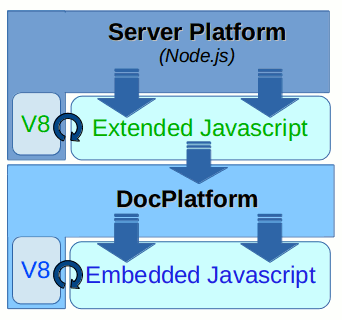

# StoryTeller Javascript integration

This document aims to discuss technical aspects and possible benefits of integrating *Document Platform* with
[Javascript](http://en.wikipedia.org/wiki/JavaScript) programming language. *Javascript* (as a programming 
language together with whole ecosystem around it) has many advantages and so can be very beneficial
for future extensions of *Document Platform* and related services.

The indisputable fact is that *Javascript* is very popular among developers for many reasons:

-   It is the only language natively supported in [web browsers](http://en.wikipedia.org/wiki/List_of_web_browsers), it is
    sometimes called "[The Language of the Web](http://tomtunguz.com/javascript/)"
-   It is very easy to learn (at least the basics)
-   Knowing the language well is not necessary to use it effectively
-   It has enormous expressive power (dynamic language supporting many programming paradigms)
-   There are lots of libraries available for almost anything (due to a [network effect](http://en.wikipedia.org/wiki/Network_effect) thanks to its popularity)
-   Despite its dynamic nature it is surprisingly fast (thanks to highly optimized [interpreters](http://en.wikipedia.org/wiki/List_of_ECMAScript_engines) available)
-   [JSON](http://en.wikipedia.org/wiki/JSON) as a [Data Exchange Format](http://en.wikipedia.org/wiki/Data_exchange) 
    is basically an integral part of the language
-   ...

*Javascript* can be used on [client side](http://en.wikipedia.org/wiki/Client-side_scripting) (in any modern
[web browser](http://en.wikipedia.org/wiki/Web_browser)), on [server side](http://en.wikipedia.org/wiki/Server-side_scripting) 
(in [Node.js](http://en.wikipedia.org/wiki/Node.js) or similar environment) as well as 
[embedded](https://developers.google.com/v8/embed) in a *C++* or *Java* project (thanks to modern *Javascript Engines* like
[v8](http://en.wikipedia.org/wiki/V8_%28JavaScript_engine%29), [JavaScriptCore](http://en.wikipedia.org/wiki/WebKit#JavaScriptCore),
[Rhino](http://en.wikipedia.org/wiki/Rhino_%28JavaScript_engine%29) or [SpiderMonkey](http://en.wikipedia.org/wiki/SpiderMonkey_(software))).

## Javascript Extending vs. Embedding

*Javascript* can be utilized in two ways in respect to *Document Platform*:

-   The first possibility is to **extend** *Document Platform* and wrap
    its services in a set of *Javascript* interfaces. This way it would
    be possible to *transform data* and *format documents* directly from
    a *Javascript* enabled environment.
-   Another possibility is to **embed** an implementation of a
    *Javascript Interpreter* right into our *Document Formatter*. That
    way it is possible to write runtime formatting scripts in
    *Javascript Programming Language*, access *Variables* and alter the
    formatting of individual *Layout Objects* just like it is now
    possible with [StreamServe Scripting Language](http://onlinehelp.streamserve.com/5.6.2/en/wwhelp/wwhimpl/js/html/wwhelp.htm#href=Scripting%20reference/ScriptingFunctions.2.037.html).

## Sections

-   [Javascript Extending](extending.md)
-   [Javascript Embedding](embedding.md)

