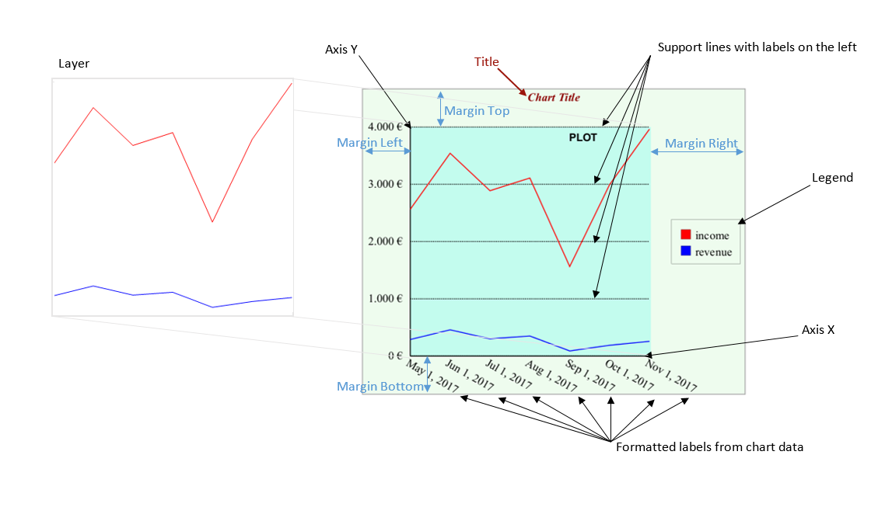

# Chart STL Syntax

This document describes a syntax of business graphics and associated data structures used in STL markup.

Users can use `stl:chart` element for creating an instance of page or
inline chart.

Following chart specific attributes are supported:

-   `modern` ... defines what charting library is used.
   - "false" - use StreamServe library (default)
   - "true" - creates svg charts using NVD3 javascript library. Some settings are limited
-   `xpath` ... defines xpath to data where a part of chart definition that overrides chart definition defined under stl:chart is placed (available for scd and only for modern = "false" since 16.4) . Data related elements and attributes (`scd:layer/@xpath`, `scd:series`) cannot be modified this way. (See [Chart definition in data](#chart-definition-in-data-since-164))

   ​

```xml
 <stl:chart w="311.81pt" h="99.54pt" modern="false">
   <scd:scd xmlns:scd="http://developer.opentext.com/schemas/storyteller/chart/definition" style="font-family:Arial;font-size: 7pt;">
      <scd:plot left_offset="28.35pt" right_offset="14.17pt" top_offset="14.17pt" bottom_offset="28.35pt" logical_x_low="0" logical_x_high="100" logical_y_low="0" logical_y_high="1000"/>
      <scd:axis_x logical_position_x ="0" logical_position_y ="0" draw_behind="true"/>
      <scd:axis_y label="kWh" label_alignment="left" label_position_v="top" label_placement="end" logical_position_x ="0" logical_position_y ="0" draw_behind="true"/>
      <scd:support_lines logical_position_x ="0" logical_position_y ="0" logical_step ="100" label_placement="start" label_position_v="center" label_alignment="left" logical_width="2" draw_behind="true" mask="num.integer{}" style="font-family:Arial;font-size: 7pt;stroke-width: 0.57pt"/>
      <scd:layer type="line" xpath="//tabledata[@id='table1']" labels_offset="5" node_type="dot" node_size="2" line="stroke:rgba(0,0,0,1);stroke-width: 0.57pt;">
	    <scd:series y_column="1" x_column="2" label_column="3"/>
      </scd:layer>
   </scd:scd>
</stl:chart>   
```

### Chart definition

Docbuilder definition of chart begins with scd:scd. In future user would
use different chart definitions

####  scd:scd

-   `style` ... default chart style
-   `class` ... style class (limited when used for svg charts)


#### Chart parts

[](https://github.com/opentext/storyteller/blob/master/docplatform/distribution/py/tsdesigns/docbuilder/chart31-line-description.xml)

Users can specify the chart parts elements:

-   `scd:title` ... title of chart
-   `scd:legend` ... legend of chart
-   `scd:plot` ... position, size and low/high logical coordinates for chart drawing
-   `scd:axis_x` ... axis x, more than one x axis can be defined (limited when used for svg charts)
-   `scd:axis_y` ... axis y, more than one x axis can be defined (limited when used for svg charts)
-   `scd:support_lines` ... support lines to allow better view of chart values (limited when used for svg charts)
-   `scd:layer` ... chart layer defines chart type and its parameters. The layer is drawn to the chart plot. More than one layer can be defined. Order of layers defines z-order.

##### scd:title

Users can specify following attributes

-   `text` ... text of title
-   `position` ... title position (top/bottom)
-   `style` ... style of title
-   `class` ... style class (limited when used for svg charts)

#####  scd:legend

Users can specify following attributes

-   `alignment_v` ... legend vertical alignment (top/center/bottom)
-   `alignment_h` ... legend horizontal alignment (left/center/right)
-   `style` ... style of legend text and border line
-   `class` ... style class (limited when used for svg charts)

#####  scd:plot

Users can specify following attributes

-   `style` ... accepts margin-left/margin-right/margin-top/margin-bottom to define offsets of chart drawing from the chart border (in points)
-   `logical_x_low` ... logical low x value
-   `logical_x_high` ... logical high x value
-   `logical_y_low` ... logical low y value
-   `logical_y_high` ... logical high y value

#####  scd:axis_x, scd:axis_y

Users can specify following attributes

-   `style` ... style of legend text and border line
-   `class` ... style class (limited when used for svg charts)
-   `label` ... axis label
-   `label_alignment` ... label alignment (left/center/right)
-   `label_position_v` ... label vertical position (top/center/bottom)
-   `label_placement` ... label placement (start/end)
-   `logical_position_x` ... logical x value, where the axis is positioned to
-   `logical_position_y` ... logical y value, where the axis is positioned to
-   `logical_x_low` ... logical low x value
-   `logical_x_high` ... logical high x value
-   `logical_y_low` ... logical low y value
-   `logical_y_high` ... logical high y value
-   `draw_behind` ... axis should be drawn behind the chart

axis_x specific:
-   `logical_width` ... logical width of x axis line
-   `label_rotation` ... data labels rotation in degrees
-   `data_labels_position_h` ... data labels default horizontal position (alignment) (left/center/right)
-   `data_labels_position_v` ... data labels default vertical position (top/center/bottom)


axis_y specific:

- `logical_height` ... logical height of y axis line

If no attribute is specified the axis x/y is created with default settings.

#####  scd:support_lines

Users can specify following attributes

-   `label_alignment` ... label alignment (left/center/right)
-   `label_position_v` ... label vertical position (top/center/bottom)
-   `label_placement` ... label placement (start/end)

-   `logical_position_x` ... logical x value, where the lines start is positioned to
-   `logical_position_y` ... logical y value, where the lines start is positioned to
-   `logical_width` ... logical width of lines
-   `logical_step` ... step between lines in logical coordinates

-   `logical_x_low` ... logical low x value
-   `logical_x_high` ... logical high x value
-   `logical_y_low` ... logical low y value
-   `logical_y_high` ... logical high y value

-   `draw_behind` ... axis should be drawn behind the chart
-   `mask` ... format mask of values
-   `style` ... style of labels and lines

If no attribute is specified the support lines are created with default settings.

#####  scd:layer

Users can specify following attributes

-   `type` ... type of chart (line/bar/pie/stackedLine\*/stackedArea\*), modern types includes also (stackedAreaChart, multiBarHorizontalChart)
-   `xpath` ... xpath to data for chart
-   `labels_offset` ... offset of labels from axis in points
-   `labels_line` ... style of lines connection to labels (for 16.2 just for bar/line charts)
-   `line` ... default style of lines around chart segments (for 16.2 just for pie chart)
-   `mask_label`* ... format mask of data labels
-   `mask_legend`* ... format mask of legend labels

    \* *since 16.3 update 1*

Attributes for a pie chart

-   `line` ... style of lines in a pie chart
-   `radius` ... radius of a pie chart in logical coord.
-   `center_x` ... logical coord. x of center
-   `center_y` ... logical coord. y of center
-   `start_angle` ... start angle in degrees
-   `clockwise` ... true for clockwise pie slices placement
-   `height3d` ... height of 3D chart in logical coord.
-   `xyratio` ... inclination of of chart (0..1)
-   `donut_ratio` ... ratio of radius for donut hole (0..1), 0 means no hole, 1 - hole has the same radius as pie chart
-   `line` ... style of lines in a pie chart
-   `labels_connection` ... type of connection between labels and a pie chart (none/normal/level/radial/underlined/aligned)

Attributes for a line chart

-   `node_type` ... type of data values nodes (none/dot/square)
-   `node_size` ... data values nodes size (radius for dot or half of square width)
-   `connected_axis_x` ... index (from 1) of axis x used for showing labels and getting logical coordinates
-   `connected_axis_y` ... index (from 1) of axis y used for showing labels and getting logical coordinates
-   `area` ... "true" for area color from data or directly fill color of area under line

Attributes for a bar chart

-   `offset_left` ... left offset of the first bar (in logical coordinates)
-   `offset_right` ... right offset of the first bar (in logical coordinates)
-   `bar_width` ... width of bars (in logical coordinates)
-   `gap` ... gap between bars (in logical coordinates)
-   `rx` *... x radius of bar chart rounded corners
-   `ry` *... y radius of bar chart rounded corners
-   `connected_axis_x` ... index (from 1) of axis x used for showing labels and getting logical coordinates
-   `connected_axis_y` ... index (from 1) of axis y used for showing labels and getting logical coordinates

    \* *since 16.3 update 1*

Subelement `scd:series` for data definition

Attributes:

-   `col_x` - index of column (started from 1) in data table for x values
-   `col_y` - index of column (started from 1) in data table for y values
-   `col_label` - index of column (started from 1) in data table for labels
-   `col_legend` - index of column (started from 1) in data table for legend


#### Dynamic definition in script

Selected scd elements can be modified using  `stl:script` :

`Title` - chart title

`Direction` - chart texts direction ('None', 'L2R', 'R2L')

`BidiAndShaping` - chart texts bidi and shaping ('chars', 'forms', 'glyphs')

Plot

`LogicalXLow` ... logical low x value

`LogicalXHigh` ... logical high x value

`LogicalYLow` ... logical low y value

`LogicalYHigh` ... logical high y value

`MarginLeft` ... left margin in points

`MarginRight` ... right margin in points

`MarginTop` ... top margin in points

`MarginBottom` ... bottom margin in points

```javascript
var plot = require('layout').item().Plot;
plot.LogicalYHigh = 5000;
```

AxesX - array of X axes (zero based index)

AxesY - array of Y axes (zero based index)

`LogicalPositionX` ... logical x value, where the axis is positioned to

`LogicalPositionY` ... logical y value, where the axis is positioned to

`LogicalXLow` ... logical low x value

`LogicalXHigh` ... logical high x value

`LogicalYLow` ... logical low y value

`LogicalYHigh` ... logical high y value

`LogicalWidth` ... logical width (length) of x axis line

`LogicalHeight` ... logical height (length) of y axis line

```javascript
var axis_x = require('layout').item().AxesX[0];
axis_x.LogicalPositionY = -2000;				

var axis_y = require('layout').item().AxesY[0];
axis_y.LogicalHeight = 2000;				
```


SupportLines - array (zero based index) of support lines definitions

`LogicalPositionX` ... logical x value, where the axis is positioned to

`LogicalPositionY` ... logical y value, where the axis is positioned to

`LogicalXLow` ... logical low x value

`LogicalXHigh` ... logical high x value

`LogicalYLow` ... logical low y value

`LogicalYHigh` ... logical high y value

`LogicalWidth` ... logical width (length) of x axis line

`LogicalStep` ... step between lines in logical coordinates

```javascript
var support_lines = require('layout').item().SupportLines;
var support_line = support_lines[0];
support_line.LogicalStep = 1000;				
```

### Chart definition in data (since 16.4)

The  scd:scd structure can be defined in data. This way can be defined values with data transformation. The scd definition from data overrides definition from document.  Axes, support lines or layers overrides the ones in the same order or adds new ones. Chart definition in data cannot override layer/xpath attribute and series.

```xml
<chartdata id="table1">
	<scd:scd xmlns:scd="http://developer.opentext.com/schemas/storyteller/chart/definition">
		<scd:title text="Bar Chart"/>
      	<scd:plot logical_y_high="2000"/> 
		<scd:axis_x label="year"/>
		<scd:layer type="bar"/>
	</scd:scd>				
</chartdata>
....
<stl:p class="paragraph">
	<stl:chart id="bar" w="400pt" h="320pt" xpath="//chartdata/scd:scd">
		<scd:scd>
			<scd:title text="Title in definition" style="font-size:20pt;font-style:italic"/>
			<scd:legend style="font-size:10pt;font-style:italic"/>
			<scd:axis_x label_alignment="right" label_position_v="center" label_placement="end" label="X" style="font-size:10pt;font-style:italic;stroke:rgb(255,0,0);stroke-width:3pt"/>
			<scd:layer xpath="//chartdata">
				<scd:series col_label="1" col_y="3"/>
			</scd:layer>
		</scd:scd>
	</stl:chart>
</stl:p>
```

### Chart data

Data structure must be defined to use charts. 

```xml
 <tabledata id="table1" default_style="font-family:Arial">
    <ddi:header>
       <ddi:cell data_type="number" data_style="fill:#ff0000;stroke:#ff0000">Value</ddi:cell>
       <ddi:cell data_type="number">X</ddi:cell>
       <ddi:cell>Description</ddi:cell>
    </ddi:header>
    <ddi:row>
       <ddi:cell data_style="fill:rgb(212,113,28); stroke:rgb(212,113,28); stroke-width:1.42;stroke-dasharray:1, 2">0</ddi:cell>
       <ddi:cell>7.6</ddi:cell>
       <ddi:cell label_rotation="45" label_position_h="center" data_style="font-size: 7pt;">jan-12</ddi:cell>
    </ddi:row>
</tabledata>
```

Main element of chart data can have `default_style` attribute that defines default text style for data labels.

Predefined elements use ddi namespace defined already for rigid data of interactive items: *xmlns:ddi="http://developer.opentext.com/schemas/storyteller/layout/ddi/v1"*.

Elements:

####  ddi:header

Users defines column headers for data columns.

#####  ddi:cell

Attributes:

-   `data_type` ... type of data (e.t. number) in the column. If not defined, string type is taken as default
-   `data_style` ... style for the whole series

####  ddi:row

Users defines rows of data

#####  ddi:cell

Attributes:

-   `data_style` ... style used for the chart elements and their labels
-   `exploded` ... part of pie chart that should be exploded (burst) (true/false)
-   `label_rotation` ... rotation of label in degrees
-   `label_position_h` ... horizontal position of label (left/center/right), default is center if not specified as axis_x attribute
-   `label_position_v` ... vertical position of label (top/center/bottom), default is bottom if not specified as axis_x attribute

**Chart examples:**


<a class="try-it-btn" href="editor/?stl=https://raw.githubusercontent.com/opentext/storyteller/master/docplatform/distribution/py/tsdesigns/docbuilder/chart2-bar.xml" target="_blank">Try in STLEditor »</a>


<a class="try-it-btn" href="editor/?stl=https://raw.githubusercontent.com/opentext/storyteller/master/docplatform/distribution/py/tsdesigns/docbuilder/chart3-line.xml" target="_blank">Try in STLEditor »</a>


<a class="try-it-btn" href="editor/?stl=https://raw.githubusercontent.com/opentext/storyteller/master/docplatform/distribution/py/tsdesigns/docbuilder/chart90-area.xml" target="_blank">Try in STLEditor »</a>


<a class="try-it-btn" href="editor/?stl=https://raw.githubusercontent.com/opentext/storyteller/master/docplatform/distribution/py/tsdesigns/docbuilder/chart6-pie.xml" target="_blank">Try in STLEditor »</a>

Modern chart that uses javascript NVD3 library and SVG rendering:

<a class="try-it-btn" href="editor/?stl=https://raw.githubusercontent.com/opentext/storyteller/master/docplatform/distribution/py/tsdesigns/docbuilder/chart4-donut-modern.xml" target="_blank">Try in STLEditor »</a>

All examples are [here](https://github.com/opentext/storyteller/blob/master/docplatform/distribution/py/tsdesigns/docbuilder/) with [results](https://github.com/opentext/storyteller/blob/master/docplatform/distribution/py/regr_output/tsdesigns/docbuilder/).

