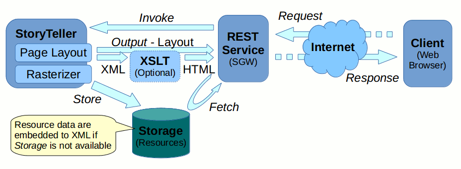
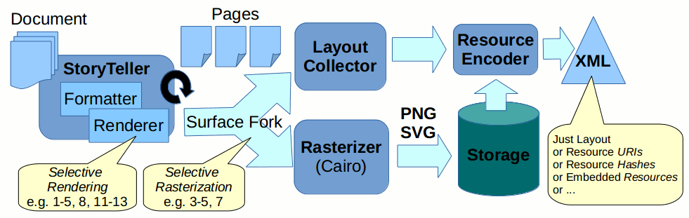
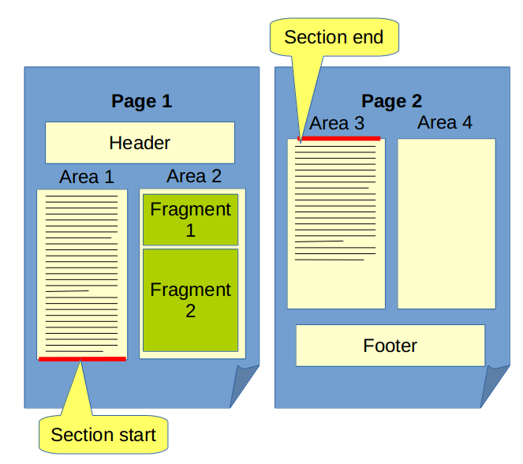

Table of Contents
=================

   * [Driver back-end](#driver-back-end)
      * [Page Layout XML](#page-layout-xml)
      * [Layout Hierarchy](#layout-hierarchy)
      * [Resources](#resources)
      * [Rasterizer](#rasterizer)
      * [Partial Rendering](#partial-rendering)
      * [Partial Rasterization](#partial-rasterization)
   * [Filter front-end](#filter-front-end)


# STL Surface Driver

This document describes a new kind of a `IDocSurface` Driver developed
for v16 release. The driver produces a paginated form of the
*StoryTeller Document* and its purpose is to support clients serving
more "dynamic" form than PDF - typically browser-based online editors
(namely the *DDE* and *AdHoc*).

Most likely some kind of a paginated HTML will be used as a presentation
format - this is formulated in requirements. Such format will probably
consist of rasterized pages (in PNG or SVG format) with additional layer
of HTML markup defining 2D layout of *Editable Areas*.

In order to make the whole solution more flexible and reusable we
proposed to decompose the driver architecture - to 
[separate content from presentation](https://en.wikipedia.org/wiki/Separation_of_presentation_and_content).
The goal is to separate code generating *Page Layout* information from
the code generating the actual *HTML presentation* as requested by a
particular client.

It basically means that the required HTML driver is actually separated to two parts:

-   *Driver back-end*
    -   collecting *layout information* for individual pages and generating some intermediate format (like
        [XML](https://en.wikipedia.org/wiki/XML),
        [JSON](https://en.wikipedia.org/wiki/JSON) or
        [YAML](https://en.wikipedia.org/wiki/YAML))
    -   rasterizing pages to a suitable image format (like [PNG](https://en.wikipedia.org/wiki/Portable_Network_Graphics)
        or [SVG](https://en.wikipedia.org/wiki/Scalable_Vector_Graphics))
-   *Filter front-end* transforming the XML to a *presentation* suitable
    for particular application (like
    [HTML](https://en.wikipedia.org/wiki/HTML) generated via
    [XSLT](https://en.wikipedia.org/wiki/XSLT))

The following schema demonstrates the overview of the whole web application:



# Driver back-end

This section describes *driver back-end* generating raw *Page Layout XML*.

The generated XML hierarchy consists basically of two parts:

-   Layout Info Hierarchy
-   Associated Resources

The following figure demonstrates the surface pipeline created in order
to generate both *Page Layout Info* and *Rasterized Pages*:



## Page Layout XML

As the *Page Layout XML* can be potentially embedded to a superior XML structure we use a unique XML namespace
`http://developer.opentext.com/schemas/storyteller/layout` mapped to prefix `stl` (`stl` prefix stands for *StoryTeller Layout*).

The `stl:root` element provides a `version` attribute in order to be able to change the XML format in future while keeping 
existing XSLT transformations backward compatible.

Example:

```xml
<stl:root xmlns:stl="http://developer.opentext.com/schemas/storyteller/layout" version="0.1">
  ...
</stl:root>
```

:exclamation:
Note that the root element is called `stl:stl` in *DocBuilder's* XML and it is very likely that we will
rename `stl:root` to `stl:stl` in future.

## Layout Hierarchy

The *layout hierarchy* part of the XML structure is basically a
hierarchy of nested building blocks:

-   Document
-   Page
-   Area
-   Span

### Document

There is always a single `stl:doc` element per requested *Page Layout*
and so it does not need a *Document ID* (or other mean to identify the
processed document). If there is a need to include more than one
document in a single request then we can introduce an `id` attribute
later on.

There is an optional `pages` attribute representing a number of all
document pages. Note that this number is not necessarily the same as a
number of `stl:page` child elements (as user may request just a subset
of pages). The attribute is optional as there may be situations when the
number of pages is not known a priori (e.g. in Stream Mode) and getting
the value would be innefficient (driver itself can be instantiated with
an optional `page_count` and only then the attribute is written to the
output).

Example:

```xml
<stl:root ...>
  <stl:doc pages="2">
    ...
  </stl:doc>
</stl:root>
```

:exclamation: 
Note that the `stl:doc` element is called `stl:document` in *DocBuilder's* XML and 
it is very likely that we will rename `stl:doc` to `stl:document` in future.

### Pages

Individual *pages* are represented as `stl:page` elements. Each
`stl:page` contains following attributes:

-   `id` ... unique identifier of associated resource (image
    representing rasterized page)
-   `index` ... zero-based index of the page inside the document
-   `w`, `h` ... dimension of the page represented in [point units
    (pt)](https://en.wikipedia.org/wiki/Point_(typography))

Example:

```xml
...
<stl:doc ...>
  <stl:page id="page000" index="0" w="595.27559055118115" h="841.88976377952758">
    ...
  </stl:page>
</stl:doc>
...
```

### Areas

There is a hierarchy of *area* elements in the *Page Layout XML*. *Area*
elements represent *Story Frames*, *Text Boxes*, *Table Cells* and
possibly *Column Sections* and *Columns* into which a story *content*
gets formatted.

In *StoryTeller* it is possible to define a *Story* as a continuous
content sequence and let it flow through various *Story Frames* and
possibly split content to several *Columns*. Therefore a single
*Section* and even a *Fragment* do not have to be necessarily continuous
on a *Page*, but can be split across several *Areas* instead.

Right now only *areas* containing any *editable fragments* are included,
but in principle any *StoryTeller* area can be included if there is a
use case for it.

*Areas* are stored to the XML as `stl:area` elements containing the
following attributes:

-   `x`, `y`, `w`, `h` ... area bounding box relative to page coordinates represented in [point units
    (pt)](https://en.wikipedia.org/wiki/Point_(typography))
-   `mtx` ... \[optional\] [affine transformation](https://en.wikipedia.org/wiki/Transformation_matrix#Affine_transformations)
    of the area represented as 6 homogeneous coordinates

So an `stl:area` element can look as follows:

```xml
...
<stl:page ...>
  <stl:area x="0" y="0" w="522" h="125" mtx="1 0 0 1 45 287.76922893356647">
    ...
  </stl:area>
</stl:page>
...
```

The `@mtx` attribute is optional and is included only if matrix
corresponding to the area represents a non-trivial transformation. Page
layout driver performs a coordinate space normalization and if the
matrix represents just a translation then the translation coefficient
gets propagated to *bounding box* and *matrix* is reset as *identity*.
So the `stl:area` above gets simplified as follows:

```xml
...
<stl:page ...>
  <stl:area x="45" y="287.76922893356647" w="522" h="125">
    ...
  </stl:area>
</stl:page>
...
```

:exclamation: 
Note that instead of a `@mtx` attribute there is a `@transform` attribute used in *DocBuilder's* XML.
It is very likely that we will rename `stl:doc` to `stl:document` in future.

### Spans

For *editable entities* the *Page Layout Driver* produces another kind
of hierarchical elements: `stl:span`.

`std:span` elements form a *content span* hierarchies inside *areas* and
currently correspond to two StoryTeller entities: *Sections* and
*Fragments*.

*Sections* correspond to *StoryTeller Substitutions* introducing one or
more editable *Fragments* to a *Story* flow. Resulting XML structure
corresponding to a *Section* forms a hierarchy of nested `stl:span`
elements, each carrying its associated *data* and *bounding box*
resulting from its content formatting inside a particular *area*.

So *Sections* and *Fragments* generate `stl:span` elementes in resulting
XML. Each `stl:span` element contains following attributes:

-   `data` ... section or fragment data string provided by an *External Content Provider*
-   `x`, `y`, `w`, `h` ... *bounding box* relative to superior
    (`stl:area` or `stl:span`) coordinates represented in 
    [point units (pt)](https://en.wikipedia.org/wiki/Point_(typography))

Notes:

Note that a single *Section* or even a single *Fragment* can overlap
several *Areas* and so the resulting XML can contain (and typically does
contain) more `stl:span` hierachies nested in various `stl:area`
elements corresponding to a single *Section*.

Specific details of how associated *data strings* of individual
`stl:span` elements look like are outside the scope of the *Page Layout
Driver* documentation. The driver just guarantees that incomming data
are stored in the resulting XML but does not really understand its
structure.

Example:

Let's say the source *Document Definition* looks as follows:

```xml
<document:definition xmlns:document="http://schemas.streamserve.com/document/2.0" ...>
  ...
  <section id="Main" displayName="Main">
    <reference id="d7ac7fce-113b8275-0e697d8f-dd14e76f" displayName="SwitchTo2Columns" uri="strs://cc/res/1">
      <property key="editable" value="false"/>
      <property key="deletable" value="true"/>
    </reference>
    <reference id="92250a21-ba1e93d5-b8d0e8af-cffc0c38" displayName="Brief" uri="strs://cc/res/2">
      <property key="editable" value="false"/>
      <property key="deletable" value="true"/>
    </reference>
    <resource id="28DC246C-61EC-9B45-91DE-A0D16AFFF3AA" displayName="Embedded text" uri="strs://cc/res/3">
      <property key="highlight" value="false"/>
      <property key="editable" value="true"/>
      <property key="deletable" value="true"/>
      <property key="Shared" value="true"/>
    </resource>
    <reference id="fe3663de-1b35631d-d7e4a2c6-542eb6dd" displayName="Erwartung" uri="strs://cc/res/4">
      <property key="editable" value="false"/>
      <property key="deletable" value="true"/>
    </reference>
  </section>
</document:definition>
```
... then resulting XML contans the following fragments:

```xml
...
<stl:page id="page000" index="0" w="595.27559055118115" h="841.88976377952758">
  <stl:area x="45" y="287.76922893356647" w="522" h="513.23077106643359">
    <stl:span data="s;Main" x="0" y="0" w="522" h="0">
      <stl:span data="r;strs://cc/res/1;d7ac7fce-113b8275-0e697d8f-dd14e76f" x="0" y="0" w="522" h="0"/>
    </stl:span>
    <stl:area x="0" y="0" w="522" h="510.81386718749985">
      <stl:area x="0" y="0" w="243" h="499.48628906249985">
        <stl:span data="s;Main" x="0" y="0" w="243" h="499.48628906249985">
          <stl:span data="r;strs://cc/res/2;92250a21-ba1e93d5-b8d0e8af-cffc0c38" x="0" y="0" w="243" h="369.1330664062499"/>
          <stl:span data="f;strs://cc/res/3;28DC246C-61EC-9B45-91DE-A0D16AFFF3AA" x="0" y="369.1330664062499" w="243" h="11.4990234375"/>
          <stl:span data="r;strs://cc/res/4;fe3663de-1b35631d-d7e4a2c6-542eb6dd" x="0" y="394.6320898437499" w="243" h="104.85419921874995"/>
        </stl:span></stl:area><stl:area x="279" y="0" w="243" h="510.81386718749985">
        <stl:span data="s;Main" x="0" y="0" w="243" h="510.81386718749985">
          <stl:span data="r;strs://cc/res/4;fe3663de-1b35631d-d7e4a2c6-542eb6dd" x="0" y="0" w="243" h="510.81386718749985"/>
        </stl:span>
      </stl:area>
    </stl:area>
  </stl:area>
</stl:page>
...
```

You can see in the example above that section data have data prefixed by
`s;`, *Story Reference Fragments* have data prefixed with `r;` and *HTML
Content Fragments* have data prefixed with `f;`. But it is important to
understand, that *Page Layout Driver* does not care about this
implementation detail, it is just some kind of a contract between *data
provider* (Correspondent Manager in this case) and *XML consumer* (XSLT
Transformation in this case). It may be a subject of a change without
changing the *Page Layout Driver* implementation and doucmentation.

Here is more advanced example showing how a whole hierarchy of objects
is reflected in page layout XML/HTML:

-   [DocBuilder definition](https://rawgit.com/opentext/storyteller/master/docplatform/distribution/py/pfdesigns/preview/Hierarchy.xml)
-   [DocDef file](https://rawgit.com/opentext/storyteller/master/docplatform/distribution/py/pfdesigns/preview/HierarchyDD.xml)
-   [Layout XML](https://rawgit.com/opentext/storyteller/master/docplatform/distribution/py/regr_output/pfdesigns/preview/HierarchyXml-py-m.layout.xml/stl.xml)
-   [Layout HTML](https://rawgit.com/opentext/storyteller/master/docplatform/distribution/py/regr_output/pfdesigns/preview/HierarchyHtml-py-m.layout.html/index.html)

Note that generally there can be an arbitrary hierarchy of `stl:area` and `stl:span` elements:

-   If *Fragments* contain *Sections* then there can be:
    -   *Sections* containing *Fragments*
    -   as well as *Fragments* containing *Sections*
-   If *Fragments* contain *Items* (like *text boxes* or *tables*) then there can be:
    -   *Areas* containing *Fragments*
    -   as well as *Fragments* containing *Areas*.

All described combinations are supported by the new version of the *Page
Layout Driver* and are visible in the example above.

:exclamation: 
Note that the `stl:span` element has a very different meaning in *DocBuilder's* XML.
It is very likely that we will address this conflict somehow in future.

### Empty Sections

Recently a new acceptance criterium was added:

> All *Sections* in a template (empty or not empty), selected via input
> data and ST/TE logic, must be identifiable by the DDE/AdHoc so that
> users can insert resources into those *Sections*

As there is always a *tree control* containing full *Sections* (even the
empty ones) and *Fragments* hierarchy we could consider the above
requirement (strictly how it is formulated) as fulfilled.

However there exists a more broader interpretation which includes more
advanced GUI techniques which must be somehow supported. It would be
great to have more explicit formulation of the requirement available. In
the meantime we can just perfom some guesswork to anticipate what is
actually required.

There is a likely possibility that client wants to insert *Fragments* to
an empty *Section* not only via tree control, but also interactively
(e.g. via Drag & Drop to a preview sheet). In such case it is necessary
to create a *Placeholder Area* on a corresponding *Page Sheet*, even
though the particular *Section* is currently empty and as such it takes
no actual place on the *Page*. It is possible that the formatted *Page*
does not even exist due to an advanced *StoryTeller* formatting logic
(e.g. *Empty Page Suppressing* rules).

Any *Section* containing one or more *Fragments* can span across several
*Areas* or even *Pages* and there can be *Remains of a Section*
containing no *Fragments* ner an *Area* border even though the *Section*
as a whole is not empty at all.

See following figure for such situation:



We believe that in situations like above clients want to present truly
*Empty Sections* differently from the *Empty Ramainders of a Section*
visible above (or probably even omit such leftovers completely). Also a
*tree -&gt; sheet synchronization* should probably ignore such empty
*Remainders* (e.g. when a user clicks to a *Section* in the tree, then
editor should probably go to a first page containing the first actual
*Fragment Sontent* instead of just jumping to an *Empty Remainder of the
Section*).

On the other hand we note that there are cases when a client wants to
mimic the *Runtime* behavior as closely as possible even in *Design
Time* (e.g. in order to debug his *Page Suppress Rules*).

That's why we believe that it is better to introduce a concept of
*Placeholder Content* as part of the contract between *Content Provider*
and *Editor*. Such content (typically an empty paragraph) can be
artificially inserted by the *Content Provider*, and is processed by the
*Document Formatter* exactly like usual and contributes to the resulting
layout XML. If such empty section they is then recognized by *Editor* as
a special kind of *Section*, then it is possible to present it specially
and provide additional features like *Drag & Drop* to a *Page Sheet*.

We believe that this approach is relatively simple and elegant way to
solve all the problems described above.

*Content Provider* can decide whether it is appropriate to insert
*Placeholder Content* or not. (e.g. *Sections* can be empty due to the
associated *Evaluation Rules*, or simply not-yet-edited by a user, all
can be done based on a configuration option or interatively based on
user request).

*Placeholder Content* makes sure that corresponding placeholders remain
retained even in case of *Page Suppress* rules - they behave exactly
like there **was** some actual *Content* in the *Section*.

In the page layout XML the corresponding hierarchy of `stl:span`
elements is generated as in the following example:

```xml
<stl:root xmlns:stl="http://developer.opentext.com/schemas/storyteller/layout" version="0.1">
  <stl:doc>
    <stl:page id="page000" index="0" w="595.27999999999997" h="841.88999999999999">
      <stl:area x="50" y="10" w="400" h="600">
        <stl:span data="s;section_group_empty" x="0" y="13.798828125" w="400" h="13.798828125"/>
        <stl:span data="s;section_empty" x="0" y="55.1953125" w="400" h="13.798828125"/>
        <stl:span data="s;section_empty_resource" x="0" y="96.591796875" w="400" h="13.798828125"/>
        <stl:span data="s;section_empty_fragment" x="0" y="137.98828125" w="400" h="13.798828125">
          <stl:span data="f;www.google.com?0;text_17" x="0" y="0" w="400" h="13.798828125"/>
        </stl:span>
        <stl:span data="s;section_storyref1" x="0" y="179.384765625" w="400" h="13.798828125">
          <stl:span data="r;www.google.com?3;storyref_1" x="0" y="0" w="400" h="13.798828125"/>
        </stl:span>
      </stl:area>
    </stl:page>
  </stl:doc>
</stl:root>
```

See the following links for the full example:

-   [Layout XML](https://rawgit.com/opentext/storyteller/master/docplatform/distribution/py/regr_output/vfdesigns/composc/corrman_adhoc_empty-layout-xml-py-m.layout.xml/stl.xml)
-   [Layout HTML](https://rawgit.com/opentext/storyteller/master/docplatform/distribution/py/regr_output/vfdesigns/composc/corrman_adhoc_empty-layout-html-py-m.layout.html/index.html)

    If on the other hand a *Client* wants to mimic the *Runtime
    Formatter Behavior* as closely as possible, then he makes sure to
    avoid using *Placeholder Content* to make an *Empty Section*
    actually empty. It could be either a separate *Preview Mode* or the
    behavior could be changed just for a specific *Section*.

### IDs

From the *Page Layout* driver standpoint the *IDs* of individual
*Sections* and *Fragments* are completely transparent - those are just
strings carried from the *IDocSurface* pipeline to the output XML.

There must be some kind of a contract between *External Content
Providers* and *Consumer* in order to give the IDs some meaning.

## Resources

*Resources* represent mainly rasterized data - it can be rasterized
*Pages* or alternatively more fine-grained structures like *Areas*. All
*Resources* are kept under the `stl:resources` element and
`stl:resource` element represents individual resources.

In current version *Resources* just represent rasterized page
backgrounds, so right now there is a one-to-one correspondence between
`stl:page` and `stl:resource` elements. Resources could in principle be
embedded directly under the `stl=page` element, but we chose to kept
them separately from *Layout* hierarchy.

There are several reasons why we decided to keep them separate in the
XML structure:

-   *Readability* - it is more human readable if we do not mix the layout hierachy information with raw image data
-   *Flexibility* - there is a possibility to request just *layout info* without any raster. 
    In such case the whole `stl:resources` section is omitted and `stl:page` structure remains intact
-   *Addressability* - if there is a resource identification schema introduced in XML then it can be easily 
    reused in HTML (resource *IDs* are used as `#ids` for CSS selectors)
-   *Implementation* - in rendering pipeline the *Layout Collector*
    collects the layout information sequentially and also *Page
    Rasterizer* creates the image rasters - both doing their job in
    parallel. It is easier to keep image data separate from page
    layout - that way it is possible to create the XML sequentially (I
    am using sequential output stream, no random access needed for
    writing).

Example:

The indirection of the resources is realized via automatically generated
*Resource IDs* used to define the correspondence between `stl:page` and
`stl:resource` elements. The resulting XML looks as follows:

```xml
<stl:root ...>
  <stl:doc>
    <stl:page id="page001" index="0" ...>
      ...
    </stl:page>
    <stl:page id="page002" index="1" ...>
      ...
    </stl:page>
  </stl:doc>
  <stl:resources count="2">
    <stl:resource id="page001" type="...">...</stl:resource>
    <stl:resource id="page002" type="...">...</stl:resource>
  </stl:resources>
</stl:root>
```

This way the page layout structure is uniform and resources may or may
not be included.

There are many variants how to actually include the resources:

-   No Resources
-   Embedded Resources
-   Externally Linked Resources

Rasterized pages are embedded as base64 encoded strings - this is just a
temporary solution, I believe that you and server team will agree on a
different transfer of raster images soon enough and the XML will contain
just IDs, URIs, hashes (you name it)

:exclamation: 
Note that semantics of the `stl:resources` element is very similar do *DocBuilder's* `stl:fixtures` 
and it is very likely that we'll rename `stl:resources` to `stl:fixtures` in future.

### No resources

Let's say a client is interested just in layout information. He needs to
know just number of all pages in a *Document* and possibly needs to
compute some statistics about what *Sections* and editable *Fragments*
are available in which *Areas* of which *Pages*.

In such case it is not necessary to rasterize the document and it is
enough to just collect and generate *Layout Info*.

The resulting XML does not contain the `stl:resources` sub-tree, it just
contains the `stl:doc` sub-tree with layout information.

Here is a full example of the *Page Layout XML* with no embedded
resources:

-   [WeeklyReport-no-resources-m.xml](https://rawgit.com/opentext/storyteller/master/docplatform/distribution/py/regr_output/pfdesigns/preview/WeeklyReport-no-resources-m.xml)

### Externally linked resources

Typical clients will be probably interested in rasterized page
backgrounds as well as in page layout information.

If a hosting platform is able to serve individual resources individally
then most efficient way is to keep resources separate and include only
links (URLs) to the XML.

There are various ways how the resource URLs are generated.

####  URL based on a hash

If hosting platform provides access to an [Content-addressable
storage](https://en.wikipedia.org/wiki/Content-addressable_storage)
then it is possible to upload each *Resource* directly to the
*Storage* and use resulting *Hash* as a basis for resource *URL*.

Such approach is very efficient. First advantage is that resources
are automatically de-duplicated right on the server side - even it
they come from completely different documents. Moreover any URL
conflicts are eliminated by design - probability of URL collisions
is so lo that it is practically ruled-out. Another (probably most
important) advantage is that server can serve resources with
relatively long expiration age and so web browsers on client side
will do all the resource caching automatically (will not request
data they already have in their cache just based on their respective
URL).

Example:

If we upload resources to *DocPlatform BlobManager* and get
corresponding [SHA-1 hash](https://en.wikipedia.org/wiki/SHA-1) for
each resource then the resulting XML looks as follows:

```xml
<stl:root ...>
  <stl:resources count="2">
    <stl:resource id="page001" type="hash">local:6a4a065e3f2ed5920f3722504bfd2d487a6b90ca</stl:resource>
    <stl:resource id="page002" type="hash">local:3a2bb2c55590d810cd56f20ac219d8c34ccb5e9e</stl:resource>
  </stl:resources>  
</stl:root>
```

Here is a full example of the *Page Layout XML* with hash-based
resource URLs:

-   [WeeklyReport-hash-svg-m.xml](https://rawgit.com/opentext/storyteller/master/docplatform/distribution/py/regr_output/pfdesigns/preview/WeeklyReport-hash-svg-m.xml)
-   [WeeklyReport-hash-png-m.xml](https://rawgit.com/opentext/storyteller/master/docplatform/distribution/py/regr_output/pfdesigns/preview/WeeklyReport-hash-png-m.xml)

####  URL based on a mask

An alternative to the hash-based URLs is a usage of some mask.

The important advantage of this approach is that generating of
individual URLs is very easy and independent on the actual resource
data. URLs are known a priori - before the actual page is
rasterized.

On the other hand there are significant disadvantages as well.
Identical resources can be represented as different URLs and also
different resources can have identical URLs in different times. With
such naming schema it is really hard to implement efficient server
side storage and client side caching.

Example:

```xml
<stl:root ...>
  <stl:resources count="2">
    <stl:resource id="page001" type="uri">wd:/page000.png</stl:resource>
    <stl:resource id="page002" type="uri">wd:/page001.png</stl:resource>
  </stl:resources>  
</stl:root>
```

Here are full examples of the *Page Layout XML* with mask based
resource URLs:

-   [WeeklyReport-link-svg-m.xml](https://rawgit.com/opentext/storyteller/master/docplatform/distribution/py/regr_output/pfdesigns/preview/WeeklyReport-link-svg-m.xml)
-   [WeeklyReport-link-png-m.xml](https://rawgit.com/opentext/storyteller/master/docplatform/distribution/py/regr_output/pfdesigns/preview/WeeklyReport-link-png-m.xml)

### Embedded resources

If the hosting platform is unable to serve resources separately then
there is a possibility to embed resources directly to the resulting XML.

Advantage is that the *page layout info* is self-contained and so the
communication protocol can be easier that way - there is just a single
response stream containing all the necessary information.

The disadvantage is that such communication is relatively inefficient.
There is no caching implemented in browsers for embedded resources. Also
some additional encoding is necessary for binary data which further
increases the size of the data to be transferred.

It depends on the actual resource format how the particular resource is
embedded to the resulting XML:

####  Binary data

If the *Resource* is stored as [binary data](https://en.wikipedia.org/wiki/Binary_data) - as it is the case
with [PNG image](https://en.wikipedia.org/wiki/Portable_Network_Graphics) format - then it is necessary 
to encode data to [ASCII](https://en.wikipedia.org/wiki/ASCII) - we can use 
the [base64 encoding](https://en.wikipedia.org/wiki/Base64) for that purpose.

It is important to understand that base64 encoding expands data size
by 4:3 ratio (33% overhead). Also resulting sequence is not very
friendly for subsequent compression (e.g.
[gzip](https://en.wikipedia.org/wiki/Gzip) is not very efficient in
deflating such data).

Example:

```xml
<stl:root ...>
  <stl:resources count="2">
    <stl:resource id="page001" type="data" mimetype="image/png" encoding="base64">iVBOR ... CYII=</stl:resource>
    <stl:resource id="page002" type="data" mimetype="image/png" encoding="base64">iVBOR ... CYII=</stl:resource>
  </stl:resources>  
</stl:root>
```

Here is a full example of the *Page Layout XML* with base64 encoded
binary PNG data:

-   [WeeklyReport-embed-png-m.xml](https://rawgit.com/opentext/storyteller/master/docplatform/distribution/py/regr_output/pfdesigns/preview/WeeklyReport-embed-png-m.xml)

####  Text data

If the *Resource* is stored as text data - as it is the case with
[SVG image](https://en.wikipedia.org/wiki/Scalable_Vector_Graphics)
format - then it can be directly include in the XML and not further
re-encoding is necessary.

Two kinds of changes were necessary in Cairo generated SVG files:

1.  For easy embedding to the hosting XML we strip the xml header
    automatically generated by Cairo.

2.  In order to be able to easily embed the resulting SVG directly
    to HTML markup we needed to unify all IDs used to identify SVG
    entities. That is why we prefix all the IDs with `p${page}-`
    prefix.

Example:

```xml
<stl:root ...>
  <stl:resources count="2">
    <stl:resource id="page001" type="data" mimetype="image/svg+xml" encoding="utf8">
      <svg xmlns="http://www.w3.org/2000/svg" 
           xmlns:xlink="http://www.w3.org/1999/xlink" 
           width="595.275591pt" height="841.889764pt" 
           viewBox="0 0 595.275591 841.889764" version="1.1">
        <defs>...</defs>
        <g id="p0-surface23">...</g>
        ...
      </svg>
    </stl:resource>
    <stl:resource id="page002" type="data" mimetype="image/svg+xml" encoding="utf8">
      <svg xmlns="http://www.w3.org/2000/svg" 
           xmlns:xlink="http://www.w3.org/1999/xlink" 
           width="595.275591pt" height="841.889764pt" 
           viewBox="0 0 595.275591 841.889764" version="1.1">
        <defs>...</defs>
        <g id="p1-surface914">...</g>
        ...
      </svg>
    </stl:resource>
  </stl:resources>  
</stl:root>
```

Here is a full example of the *Page Layout XML* with utf8 encoded text SVG data:

-   [WeeklyReport-embed-svg-m.xml](https://rawgit.com/opentext/storyteller/master/docplatform/distribution/py/regr_output/pfdesigns/preview/WeeklyReport-embed-svg-m.xml)

## Rasterizer

For page background rasterization we are using our
[Cairo](http://cairographics.org/) based *IDocSurface* driver
implementation.

The cairo library itself is capable of generating output in various
formats, namely:

-   PNG
-   SVG
-   PDF
-   Postscript
-   GDI
-   ...

For more detailed information consult the [cairo backends
documentation](http://cairographics.org/backends/).

### Formats

####  PNG

We are using the PNG output generated by the Cairo library
succesfully for several years both for regression testing (5000+
regression tests) and in production (rasterizer for HTML driver,
...).

So from this point of view using the PNG output is a preferred and
safest strategy.

####  SVG

SVG is not that well tested in our environment, so there may be some
surprises along the way.

Web team declared that SVG would be their preferred format. Of
course a great advantage is that SVG is a [vector
graphics](https://en.wikipedia.org/wiki/Vector_graphics) format so
there is no pixelation involved when zooming the image.

One concern could be a portability (not all browsers support this
format, but modern browsers get better). Web team declared that they
are using SVG succesfully for icons already, so the portability is
not an issue.

The decision is to support the SVG generation but also provide the
PNG as an alternative. This helps us to fallback to verified
solution if some problems with SVG are encountered.

### File sizes

As was described in the previous chapter - clients choose the resource
format (PNG or SVG) and a corresponding encoding is picked
automatically.

One interesting remark regarding resource file sizes (PNG generated for
96 DPI):

|  Description                                    | Total size (bytes)   | Ratio        |
|  ---------------------------------------------- | -------------------- |------------- |
|  HTML + 2 external PNG                          | 392,099              |              |
|  HTML (embedding 2 base64 encoded PNG)          | 521,852              | 33% increase |
|  Gzipped HTML (embedding 2 base64 encoded PNG)  | 374,937              | 29% decrease |
|  HTML + 2 external SVG                          | 1,064,008            |              |
|  HTML (embedding 2 utf8 encoded SVG)            | 1,085,038            | 2% increase  |
|  Gzipped HTML (embedding 2 utf8 encoded SVG)    | 217,989              | 81% decrease |
                                                                       

... so it is obvious that while SVG is much bigger than PNG, it has
certainly one more advantage:

-   it is suitable for embedding and extremely GZIP friendly (in
    comparison to base64 encoded binary data).

### ID normalization

One significant problem with cairo generated SVGs is, that internal IDs
used to represent resources inside the SVG file are generated in a
non-deterministic way.

There is used a global variable representing a seed for resource ID
generator (see [while
cairo-surface.c](http://cgit.freedesktop.org/cairo/tree/src/cairo-surface.c?id=b1192beac7#n264)
for more context):

```c
  static unsigned int _cairo_surface_allocate_unique_id (void)
  {
    static cairo_atomic_int_t unique_id;

#if CAIRO_NO_MUTEX
    if (++unique_id == 0)
      unique_id = 1;
    return unique_id;
#else
    cairo_atomic_int_t old, id;

    do {
      old = _cairo_atomic_uint_get (&unique_id);
      id = old + 1;
      if (id == 0)
        id = 1;
    } while (! _cairo_atomic_uint_cmpxchg (&unique_id, old, id));

    return id;
#endif
  }
```

It means that if a there is another instance of the driver in the same
process then they both compete for the same IDs and resulting SVG markup
contains different strings.

Such situation is unacceptable for many reasons:

-   driver testing is unnecessarily complicated (we have to compensate
    for ID changes when comparing against pre-generated masters)
-   de-duplication strategies are non-functional (when you get a
    different SVG for identical inputs, you get different hashes and
    cashing does not work)

One possibility how to fix this unfortunate situation would be to patch
the cairo implementation. But as we had to post-process the SVG anyway
(in order to prefix all the IDs with page index when doing the SVG
embedding) we decided to try an unobtrusive approach - post-process the
SVG file and normalize all the IDs.

For that purpose we are using a StreamReplacer adapter - a stream
adapter applying RexEx search and calling an external function for each
string it finds to get a string to be pasted instead.

The normalization function then looks roughly as follows:

```c++
    auto svg_id_normalizer( std::shared_ptr<ISeqStreamOutputCtrl> stream, int page )
    {
        using counter_t = std::unordered_map<std::string, int>;
        using counter_rec_t = std::pair<counter_t, int>; 
        using counters_t = std::unordered_map<std::string, counter_rec_t>;

        return stream_replacer( 
            std::move(stream), 
            g_svg_id_search_regex,
            [page = format_string("p%d-", page ), counters = counters_t()]( auto match ) mutable
            {
                auto const prefix = match[1];
                auto const type = match[2];
                auto const id = match[3];
                auto const suffix = match[4];
                STRS_ASSERT( type.length() > 0 );
                std::string new_id;
                // create string representation of the new id: 
                //   format: "{prefix}p{page}-{type}{counter}{suffix}"
                std::copy( prefix.first, prefix.second, std::back_inserter( new_id ) );
                new_id += page;
                std::copy( type.first, type.second, std::back_inserter( new_id ) );
                // lookup counter map and reuse or generate new id 
                auto& counter = counters[type];
                auto cit = counter.first.find( id );
                if ( cit == counter.first.end() )
                    cit = counter.first.insert( cit, { id, counter.second++ } );
                new_id.append( std::to_string(cit->second) );
                // append suffix
                std::copy( suffix.first, suffix.second, std::back_inserter( new_id ) );
                return new_id;
            },
            32 );
    }
```

... this way we re-generate all the IDs with new IDs prefixed by 'p' and
page-number and containing indices starting by zero.

## Partial Rendering

Interactive clients typically render just part of the document and
request individual pages lazily.

A natural extension would be to provide a possibility to select subset
of the pages to be rendered.

As part of the proof of concept we identified two approaches:

-   Set Selection ... client specifies just a set of pages to be rendered
-   Sequence Selection ... client specifies a sequence of pages to be rendered

While the *Sequence Selection* is arguably more powerfull (allows to
alter the page order and duplicate a page) we believe that the *Set
Selection* is sufficient for given requirements and has few more
advantages:

-   it is not necessary to know the number of pages up-front
-   it is easier to understand (same approach is used in print dialogue)
-   it is compatible with *Stream Mode*
-   it is possible to interpret sequentially (e.g. inside a stream

A separate question would be if the *page numbers* should be 0-based
(programmer friendly) of 1-based (more user friendly). It depends
whether the string will be directly exposed to user interface or if we
are rather defining programming API.

Example:

```xml
<stl:root xmlns:stl="http://developer.opentext.com/schemas/storyteller/layout" version="0.1">
  <stl:doc pages="6" selection="2,4">
    <stl:page id="page002" index="1" w="595.27559055118115" h="841.88976377952758">...</stl:page>
    <stl:page id="page004" index="3" w="595.27559055118115" h="841.88976377952758">...</stl:page>
  </stl:doc>
</stl:doc>
```

Note several subtle details in the example above:

-   *Set Selection* string used for partial rendering is added as
    `stl:doc/@selection` attribute
-   Number of all pages in document (represented as `stl:doc/@pages`)
    differs from number of `stl:page` elements
-   While selection string is one-based (`2,4`), page indices are
    zero-based (`1`, `3`)
-   Page IDs (`page002`, `page004`) are one-based as is the selection
    string

### Set Selection

This approach has more simple syntax and the number of document pages
nedd not be known apriori. It shiw approach suffices the current
requirements we prefer it over the *Sequence selection* described below.

All page number selections are 1-based.

|  Input (1-based)            | Output (0-based)          | Description
|  -------------------------- | ------------------------- | ------------------------------
|  ''                         | \[\]                      | no pages
|  None                       | \[0,1,2,3,4,5,6,7,8,9\]   | all pages
|  '\*'                       | \[0,1,2,3,4,5,6,7,8,9\]   | all pages
|  '2,4,6,8,10'               | \[1,3,5,7,9\]             | individual indices
|  '2,4,2,4,2'                | \[1,3\]                   | repeated indices
|  '10,8,6,4,2'               | \[1,3,5,7,9\]             | reversed individual indices
|  '2,3,4,7,8,9'              | \[1,2,3,6,7,8\]           | coalesced indices
|  '9,8,7,4,3,2'              | \[1,2,3,6,7,8\]           | reversed coalesced indices
|  '42,100'                   | \[\]                      | out-of-scope indices
|  '1-4,8-10'                 | \[0,1,2,3,7,8,9\]         | ranges
|  '4-1,10-8'                 | \[0,1,2,3,7,8,9\]         | reversed ranges
|  '1-3,7-8,4-5,9-10'         | \[0,1,2,3,4,6,7,8,9\]     | coalesced ranges
|  '6,9,4-5,8-7,2,3'          | \[1,2,3,4,5,6,7,8\]       | coalesced ranges and indices
|  '6-'                       | \[5,6,7,8,9\]             | open range
|  '20-30,100-'               | \[\]                      | out-of-scope ranges
|  ' 2,3 , 4 , 5 - 6, 9 - '   | \[1,2,3,4,5,8,9\]         | ignore whitespace
|  '2-4,4,4-2,9-'             | \[1,2,3,8,9\]             | example

Similar syntax is used in the
[InsertPages](http://onlinehelp.streamserve.com/5.6.1/en/wwhelp/wwhimpl/js/html/wwhelp.htm#href=Scripting%20reference/ScriptingFunctions.2.228.html)
StreamServe scripting function.

### Sequence Selection

This approach is more advanced (can be used for reversing or duplicating
pages), but has also disadvantages. The syntax is more complex and also
the number of document pages must be known in order to interpret
negative page indices correctly.

All page number selections are 0-based.

 |  Input (0-based)                                    | Output (0-based)                  | Description
 |  -------------------------------------------------- | --------------------------------- | --------------------------------------
 |  ''                                                 | \[\]                              | no pages
 |  None                                               | \[0,1,2,3,4,5,6,7,8,9\]           | all pages
 |  '\*'                                               | \[0,1,2,3,4,5,6,7,8,9\]           | all pages
 |  '\~'                                               | \[9,8,7,6,5,4,3,2,1,0\]           | all pages .. reversed
 |  '1,3,5,7,9'                                        | \[1,3,5,7,9\]                     | positive indices
 |  '-1,-3,-5,-7,-9'                                   | \[9,7,5,3,1\]                     | negative indices
 |  '1,-3,5,-7,9'                                      | \[1,7,5,3,9\]                     | comb. of positive and negative indices| 
 |  '42,-42'                                           | \[\]                              | out-of-scope indices
 |  '1..1,9..9'                                        | \[1,9\]                           | single-page ranges
 |  '..2,7..'                                          | \[0,1,2,7,8,9\]                   | open ranges
 |  '1..3,7..9'                                        | \[1,2,3,7,8,9\]                   | positive ranges
 |  '3..1,9..7'                                        | \[3,2,1,9,8,7\]                   | negative ranges
 |  '-1..-3,-7..-9'                                    | \[9,8,7,3,2,1\]                   | positive ranges with negative indices
 |  '-3..-1,-9..-7'                                    | \[7,8,9,1,2,3\]                   | negative ranges with negative indices
 |  '20..30,50..40,100..,-20..-30,-40..-50'            | \[\]                              | out-of-scope ranges
 |  '..-100, 100..'                                    | \[\]                              | out-of-scope open ranges
 |  '-100..100'                                        | \[0,1,2,3,4,5,6,7,8,9\]           | overflowing ranges
 |  '..-20,1..1,1..3,9..7,-3..-5,-5..-3,-9..-9,20..'   | \[1,1,2,3,9,8,7,7,6,5,5,6,7,1\]   | combination of various kinds of ranges
 |  '-100,9..,1..3,4,5..5,6,7..9,..-10,100'            | \[9,1,2,3,4,5,6,7,8,9,0\]         | combination of ranges and indices
 |  ' .. 0, 1, 2, 3 ,4 ,5 .. 6, 7 .. 8 , 9 .. '        | \[0,1,2,3,4,5,6,7,8,9\]           | ignore whitespace
 |  '1..3,3,3..1,-1'                                   | \[1,2,3,3,3,2,1,9\]               | example

If the requirements do not change we are going to implement the *Set
Selection* instead and describe the *Sequence Selection* approach here
just for completeness.

Partial Rasterization
---------------------

We have added another filtering possibility based on an explicit
requirement.

It is possible to select specific pages to be rasterized as a subset of
pages being rendered.

The selection string follows the same syntax as the one for the *Set
Selection*.

So newly it is possible to apply two levels of page filtering:

-   Partial Rendering (primary filter) - user selects a subset of all
    pages to be rendered -   this includes both page layout and rasterized page backgrounds
-   Partial Rasterization (secondary filter) - user selects a subset of
    rendered pages to be rasterized

Example:

```xml
<stl:root xmlns:stl="http://developer.opentext.com/schemas/storyteller/layout" version="0.1">
  <stl:doc pages="6" selection="2,4,6">
    <stl:page id="page002" index="1" w="595.27559055118115" h="841.88976377952758">...</stl:page>
    <stl:page id="page004" index="3" w="595.27559055118115" h="841.88976377952758">...</stl:page>
    <stl:page id="page006" index="5" w="595.27559055118115" h="841.88976377952758">...</stl:page>
  </stl:doc>
  <stl:resources selection="4">
    <stl:resource id="page004" type="uri">resource:/img/page000.png</stl:resource>
  </stl:resources>
</stl:doc>
```

Note several subtle details in the example above:

-   *Set Selection* string used for *partial rendering* is added as `stl:doc/@selection` attribute
-   Number of all pages in document (represented as `stl:doc/@pages`) differs from number of `stl:page` elements
-   While selection string is 1-based (`2,4,6`), page indices are zero-based (`1`, `3`, `5`)
-   *Page IDs* represented as `stl:page/@id` attributes (`page002`, `page004`, `page006`) are one-based
-   *Set Selection* string used for *partial rasterization* is added as `stl:resources/@selection` attribute
-   *Resource URIs* (`resource:/img/page000.png`) are generated sequentially and so their numbers 
    (`resource:/img/page000.png`) may generally differ from *resource or page IDs* (`page004`).

Filter front-end
================

This section describes the *filter* front-end of the *Page Layout
Driver* solution. This step transforms raw *Page Layout* XML data to
some kind of presentation suitable for a particular client.

There can be various kinds of transformations

-   Template Engine
-   TDT
-   XSLT
-   ...

In order to generate *Presentation HTML* from *Page Layout XML* we
recommend to use the [XSLT](https://en.wikipedia.org/wiki/XSLT)
transformation.

XSLT
----

### Example

As we do not know yet a precise requirements for the expected
presentation (presumably paginated HTML) the *XSLT* presented here is
just an example, not the final solution.

For generating HTML presentation we are using the following simple XSLT:
[preview.xslt](https://github.com/opentext/storyteller/blob/master/docplatform/distribution/py/pfdesigns/preview/preview.xslt)

The XSLT generates simple HTML presenting highlighted editable areas on
top of the rasterized page backgrounds:

```html
... 
<body>
  <div class="strs_page" id="page000" style="width: 793.700767559055px; height: 1122.51965697638px; ">
    <div class="strs_area" style="left: 59.9999985px; top: 383.692295652448px; width: 695.9999826px; height: 684.307677647552px; ">
      <div class="strs_section" title="Section Main" style="left: 0px; top: 0px; width: 695.9999826px; height: 0px; " data-section-id="Main">
        <div class="strs_fragment" title="Fragment strs://cc/res/1" style="left: 0px; top: 0px; width: 695.9999826px; height: 0px; "
             data-resource-id="d7ac7fce-113b8275-0e697d8f-dd14e76f" data-resource-uri="strs://cc/res/1">
        </div>
      </div>
      ...
    </div>
  </div>
</body>
...
```

The associated CSS stylesheet contains several static style definitions
(could be defined in an external file):

```css
...
<style>
  div.strs_page { position: relative; border-style: solid; }
  div.strs_area { position: absolute; border: 1px dashed red; margin: -1px; }
  div.strs_area:hover { background-color: RGBA(255,200,200,0.1); }
  div.strs_section { position: absolute; border: 1px dashed green; margin: -1px; }
  div.strs_section:hover { background-color: RGBA(200,255,200,0.2); }
  div.strs_fragment { position: absolute; border: 1px dashed blue; margin: -1px; }
  div.strs_fragment:hover { background-color: RGBA(200,200,255,0.3); }
  ...
</style>
...
```

(Note the negative margin compensating border width).

... and also styles representing page backgrounds are generated if the resources are embedded.

All `stl:resource` `@type` variants are supported:

####  Externally linked Resources

Externally linked PNG and SVG pages are used to define background-image style:

```html
...
<style>
  ...
  #page000 {
    background-image:url(img/page000.png);
  }
   #page001 {
    background-image:url(img/page001.png);
  }
</style>
...
```

Example:

-   [WeeklyReport-link-svg-m.html](https://rawgit.com/opentext/storyteller/master/docplatform/distribution/py/regr_output/pfdesigns/preview/WeeklyReport-link-svg-m.html)
-   [WeeklyReport-link-png-m.html](https://rawgit.com/opentext/storyteller/master/docplatform/distribution/py/regr_output/pfdesigns/preview/WeeklyReport-link-png-m.html)

####  Embedded resources

Embedded PNG pages (base64 encoded) are used to define background-image style (data uri):

```html
...
<style>
  ...
  #page000 {
    background-image:url('data:image/png;base64,iVBORw0KGgoAAAANSUhEU ... 5CYII=');
  }
   #page001 {
    background-image:url('data:image/png;base64,iVBORw0KGgoAAAANSUhEU ... 5CYII=');
  }
</style>
...
```

Example:

-   [WeeklyReport-embed-png-m.html](https://rawgit.com/opentext/storyteller/master/docplatform/distribution/py/regr_output/pfdesigns/preview/WeeklyReport-embed-png-m.html)

Embedded utf8 encoded SVG pages are included directly to the HTML markup:

```html
...
<body>
  <div class="background" id="page000" style="width: 793.700767559055px; height: 1122.51965697638px;">
    <svg xmlns="http://www.w3.org/2000/svg" xmlns:xlink="http://www.w3.org/1999/xlink" 
         width="595.275591pt" height="841.889764pt" viewBox="0 0 595.275591 841.889764" version="1.1">
      <defs>
        <g>
          <symbol overflow="visible" id="p0-glyph0-0">...</symbol>
        ...
      </defs>
      <g id="p0-surface23">
      </g>
    </svg>
    <div class="area" style="left: 0px; top: -323.692297152448px; width: 323.9999919px; height: 880.667100379155px; 
                             transform: scale(1.3333333) matrix( 1, 0, 0, 1, 45, 287.76922893356647 ) scale(0.75000001875);">
      <div class="fragment" style="left: 0px; top: 0px; width: 323.9999919px; height: 880.667100379155px;" 
           title="Main - strs://cc/res/4">
      </div>
    </div>
    ...
  </div>
</body>
```

Note the `@id` attributes used inside the SVG markup. *PageLayout*
rasterizer prefixes all the IDs with a page-number based prefix
(e.g. `p0-glyph0-0` vs `p1-glyph0-0`) to avoid collisions in the
resulting HTML.

Example:

-   [WeeklyReport-embed-svg-m.html](https://rawgit.com/opentext/storyteller/master/docplatform/distribution/py/regr_output/pfdesigns/preview/WeeklyReport-embed-svg-m.html)

####  Notes

-   All values in XML are in point units pt (just like they are internally represented in *StoryTeller*), 
    but are rescaled to pixels px during transformation
-   `div` elements' `background-image` CSS property is used for rasterized pages, 
    but could use `img` alternatively (not sure what's better)
-   Visual styling of the areas and fragments is in stylesheet, but `left`, `top`, `width`, `height` coordinates 
    are kept inline (there is no sharing whatsoever)
-   "Fragment ID" strings are simply presented as divs' `title` attributes - the value just appears as a tooltip
-   Data URLs are not very portable, various browsers have various size limit (some KBs, some MBs), 
    older browsers do not support it at all

### Testing

It is possible to let the web browser apply the transformation when
rendering an XML file. In order to do that the following stylesheet
directive can be prefixed to the *Page Layout XML*:

```xml
<?xml-stylesheet type="text/xsl" href="preview.xslt"?>
```

Alternatively one can generate HTML manually - download XSLT and XML to
a local directory and run e.g. the following command on a linux machine:

```bash
$ xsltproc preview.xslt WeeklyReport.xml > WeeklyReport.html
```

### Application

Where is the XSLT applied in runtime? It depends on what we agree.

One option is to apply the XSLT already on the server - there is going
to be a specialized *Filter* for that purpose (we'll probably use the
[libxslt](http://xmlsoft.org/libxslt/) 3rd party library for the actual
implementation).

Another possibility is to serve just raw XML and let client do the
transformation (in javascript).

The XSLT functionality is built-in all modern browsers and can be
triggered like this:

```javascript
 function transform( xml, xsl ) {
   var proc;
   if (window.ActiveXObject) {      // IE
     proc = new ActiveXObject("MSXML2.DOMDocument");
     xml.transformNodeToObject(xsl, proc);
     return result;  
   } else {                         // Other browsers
     proc = new XSLTProcessor();
     proc.importStylesheet(xsl);
     return proc.transformToDocument(xml);
  }
}
```

The best strategy depends on use cases (are there some
pure-HTML/no-javascript clients?, what browsers do we support?, etc.)

If there were just *Fat Clients* and we supported just reasonably modern
browsers then realizing transformation on server side may sound like
dragging unnecessary dependency to the server.

Here are (some of) the reasons:

-   Server code is general purpose and it's responsibility should be
    kept simple - collect and serve necessary information
-   HTML presentation (and so the XSLT) is client specific and this
    state can be easily encapsulated to the client - no need to transfer
    it to server (the less state is transferred the better)
-   It is really easy and flexible to realize XSLT transformation in
    javascript, it is functionality provided by browser (it is really
    efficient - native code - and there is no need for additional
    libraries)
-   We can leverage client's CPU power - it is more scalable to
    decentralize the logic as opposed to make everything centrally on
    the server

On the other hand there can be clients on mobile devices for which the
client-side XSLT is impossible or suboptimal option.

So the strategy is to implement the *XSLT Filter* as a server component
and make it available for REST clients. What we have to figure out is
where will the customization/stylesheet come from:

-   hard-coded
-   stored in some global registry
-   passed by client as part of the request,
-   ?

### Stylesheet Ownership

Regardless of where the XSLT will be applied in runtime there is still a
question about the XSLT code ownership.

It would be ideal if implementers of individual client applications
could take over the ownership of their respective XSLT transformations
and maintain and extend it as necessary. After all they are the ones who
know best what exact HTML presentation fits their needs. Most likely
such production ready XSLTs will look very different from the one
presented here, but right now the goal is just to get an idea how the
front-end filter could look like.
