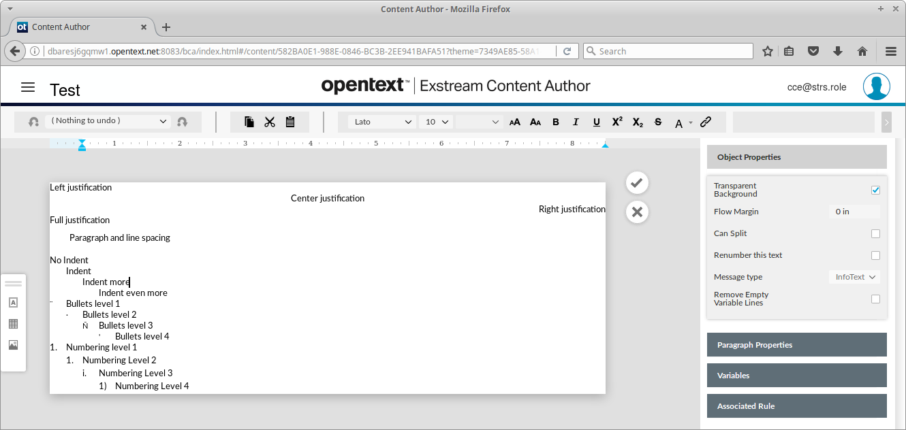

# Empower to STL Conversion

# Table of Contents

   * [Overview](#overview)
   * [Implementation](#implementation)
      * [Language](#language)
      * [Interface](#interface)
      * [Libraries](#libraries)
      * [Source code](#source-code)
      * [Usage](#usage)
   * [Technical details](#technical-details)
      * [Content Fragments](#content-fragments)
         * [Singleline Text](#singleline-text)
         * [Multiline Text](#multiline-text)
         * [Lists](#lists)
         * [Objects](#objects)
         * [Variables](#variables)
      * [Canvas Fragments](#canvas-fragments)
   * [Conclusion](#conclusion)
      * [Fixes](#fixes)
      * [Optimizations](#optimizations)
      * [Followup](#followup)

# Overview

This document describes a process of reverse-engineering the _Empower JSON_ format
and converting it to _StoryTeller Layout_ (_STL_).

An important think to note is that we got no documentation of the input format,
every insight is gained by interactively editing a fragment and comparing
the changes in persistence developed by changes in editor.

The JSON format is not very readable, it is clearly not designed like human readable
exchange format, instead it feels like a direct dump of internal implementation structures.
It means that all enumeration are just numbers, instead of strings, all lengths
are just integers in a decimal format with no units, text is just a sequence
of unicode code points, etc. This complicates the conversion, makes the whole process
more brittle and more prone to future inconsistencies when the JSON format changes.

On the other hand the Empower WYSIWYG editor looks very nice and it is relatively easy
to create a nice looking content. It reasonably limits the complexity of the fragments
(e.g. there are only two levels of object nesting) and thus makes our job easier.

The editor window looks as follows:



Currently converted _StoryTeller_ content fragments look as follows:

- **Character styles**


- **Paragraph styles**


- **Table styles**


# Implementation

This section contains some implementation related details and decisions.

## Language

We decided to implement the conversion in javascript.

There are several reasons why currently the javascript seems like a best choice:

  - It is a language for rapid prototyping and development (much faster than in C++)
  - It can form a dual-environment solution:
    - It can work as part of _StoryTeller_ scripting environment
	- It can also work in browser as a part of _Opentext_ web applications like _StoryBoard_

It is possible that we decide to reimplement the conversion in C++ (only if we find really
good reasons), but for now we consider javascript the best choice.

## Interface

Right now the interface is really simple, it is a single-method module called `emp2stl`
which has the following interface:

-   `emp2stl( json: string [, options: object] ) : string`
    - Parses _Empower JSON_ fragment and generates corresponding _STL_ fragment
	- Following `options` are currently supported:
	  - `indent` ... bool or a string used for indentation
	  - `page` ... bool determining whether page type should be generated

## Libraries

All the parsing and translation is implemented inside this module, except low-level writing
the resulting _STL XML_, for that purpose we use the 3rd party [XMLWriter](http://github.com/touv/node-xml-writer)
implementation published under MIT software licence.

## Source code

The current implementation is available in the 
[emp2stl.js](https://github.com/opentext/storyteller/blob/master/docplatform/distribution/py/pfdesigns/docbuilder/empower/emp2stl.js),
usage example is visible in a test module
[empower.js](https://github.com/opentext/storyteller/blob/master/docplatform/distribution/py/pfdesigns/docbuilder/empower/empower.js)
which is used in two _STL_ based regression tests
[basic.xml](https://github.com/opentext/storyteller/blob/master/docplatform/distribution/py/pfdesigns/docbuilder/empower/basic.xml)
and [complex.xml](https://github.com/opentext/storyteller/blob/master/docplatform/distribution/py/pfdesigns/docbuilder/empower/complex.xml).
It is worth to mention that both mentioned STL-based tests were also used for generating _STL_ fragments and rasters of all examples for this documentation.

## Usage

The usage of `emp2stl` conversion is very simple and looks as follows:

```js
    var streams = require('streams');
    var emp2stl = require('wd:/emp2stl');
    // read JSON input from a file
    var json = streams.stream('wd:/input/hello.json').read();
    // convert Empower JSON to STL 
    var stl = emp2stl(json);
    // write resulting STL to a file
    streams.stream('wd:/output/hello.xml').write(stl);
```

While this is an empty fragment generated by default (via `emp2stl(json)` call):

```xml
<stl:stl xmlns:stl="http://developer.opentext.com/schemas/storyteller/layout" version="0.1"><stl:document><stl:story name="Main"/></stl:document></stl:stl>
```

This is how it looks indented (via `emp2stl(json, {indent: '  '})` call):

```xml
<stl:stl xmlns:stl="http://developer.opentext.com/schemas/storyteller/layout" version="0.1">
  <stl:document>
    <stl:story name="Main"/>
  </stl:document>
</stl:stl>
```

And we can also generate a page & text boilerplate (via `emp2stl(json, {indent: '  ', page: true})` call):

```xml
<stl:stl xmlns:stl="http://developer.opentext.com/schemas/storyteller/layout" version="0.1">
  <stl:document>
    <stl:story name="Main"/>
  </stl:document>
  <stl:page w="8.5in" h="1in">
    <stl:text w="8.5in" h="1in" style="-stl-shape-resize: free; -stl-shape-growth: 0pt max; -stl-shape-shrink: -0pt -max" story="Main"/>
  </stl:page>
</stl:stl>
```

# Technical details

This section will contain several examples of text and graphical fragments
starting from trivial ones to more complex ones. The icremental manner helps
us to locate individual features in JSON file as well as distinguish
between individual enumeration values and codes.  

## Content Fragments

Text fragments represent an implicit text object as a top of hierarchy of objects.
They typically grow with content.

### Singleline Text

We start with singleline texts, in order to determine simple constructs
and individual _character style_ equivalents.

#### Empty Fragment

At the very beginning we start with an empty text fragment.
Even though it contains no visible content, the initial JSON boilerplate is relatively verbose -
see [empty.json](https://rawgit.com/opentext/storyteller/master/docplatform/distribution/py/pfdesigns/docbuilder/empower/input/empty.json).

##### Resulting STL

The generated _STL_ is much more concise:

<script src="//gist-it.appspot.com/github/opentext/storyteller/raw/master/docplatform/distribution/py/pfdesigns/docbuilder/empower/output/empty.xml?footer=minimal"></script>

##### Summary

<table style="background-color:#fff49c">
  <tr>
	<td>JSON input:</td>
	<td><a href="https://rawgit.com/opentext/storyteller/master/docplatform/distribution/py/pfdesigns/docbuilder/empower/input/empty.json">empty.json</a></td>
  </tr>
  <tr>
	<td>STL output:</td>
	<td><a href="https://rawgit.com/opentext/storyteller/master/docplatform/distribution/py/pfdesigns/docbuilder/empower/output/empty.xml">empty.xml</a></td>
  </tr>
  <tr>
    <td colspan="2" style="padding: 0.4rem"></td>
  </tr>
  <tr>
    <td colspan="2">StoryTeller STL render:</td>
  </tr>
  <tr>
    <td colspan="2" style="padding: 0.4rem"></td>
  </tr>
</table>

#### Plain Text

Now we start to insert a plain text just with default styling.
The only difference is in two parallel arrays `m_cChars` containing character codes
and `m_sXPos` containing some kinds of commands.

If we compare the new [hello.json](https://rawgit.com/opentext/storyteller/master/docplatform/distribution/py/pfdesigns/docbuilder/empower/input/hello.json) with previous [empty.json](https://rawgit.com/opentext/storyteller/master/docplatform/distribution/py/pfdesigns/docbuilder/empower/input/empty.json) we get the following differences:

```js
  "m_cChars": [
    0,
    0,
    1,
    0,
+   72,   // chr(72)  == 'H'
+   101,  // chr(101) == 'e'
+   108,  // chr(108) == 'l'
+   108,  // chr(108) == 'l'
+   111,  // chr(111) == 'o'
    0
  ],
  "m_sXPos": [
    -244,
    0,
    -62,
    -63,
+   0,
+   0,
+   0,
+   0,
+   0,
    -64
  ],
```

##### Resulting STL

<script src="//gist-it.appspot.com/github/opentext/storyteller/raw/master/docplatform/distribution/py/pfdesigns/docbuilder/empower/output/hello.xml?footer=minimal"></script>

##### Summary

<table style="background-color:#fff49c">
  <tr>
	<td>JSON input:</td>
	<td><a href="https://rawgit.com/opentext/storyteller/master/docplatform/distribution/py/pfdesigns/docbuilder/empower/input/hello.json">hello.json</a></td>
  </tr>
  <tr>
    <td>JSON diff:</td>
	<td><a href="http://benjamine.github.io/jsondiffpatch/demo/index.html?left=https://raw.githubusercontent.com/opentext/storyteller/master/docplatform/distribution/py/pfdesigns/docbuilder/empower/input/empty.json&right=https://raw.githubusercontent.com/opentext/storyteller/master/docplatform/distribution/py/pfdesigns/docbuilder/empower/input/hello.json">hello.diff</a></td>
  </tr>
  <tr>
	<td>STL output:</td>
	<td><a href="https://rawgit.com/opentext/storyteller/master/docplatform/distribution/py/pfdesigns/docbuilder/empower/output/hello.xml">hello.xml</a></td>
  </tr>
  <tr>
    <td colspan="2">Empower JSON render:</td>
  </tr>
  <tr>
    <td colspan="2" style="padding: 0.4rem"></td>
  </tr>
  <tr>
    <td colspan="2">StoryTeller STL render:</td>
  </tr>
  <tr>
    <td colspan="2" style="padding: 0.4rem"></td>
  </tr>
</table>

#### Font Change

And what if we change the font - the only available alternative to _Lato_ is _Wingdings_, so let's try that:

If we compare the new [font.json](https://rawgit.com/opentext/storyteller/master/docplatform/distribution/py/pfdesigns/docbuilder/empower/input/font.json) with [hello.json](https://rawgit.com/opentext/storyteller/master/docplatform/distribution/py/pfdesigns/docbuilder/empower/input/hello.json) we get the following differences:

```js
      "m_TextFonts": [
        {
          "strName": "Lato",
          "iTracking": 0,
          "clrFontColor": { "m_eColorModel": 0, "m_lColor": 0 },
          "iFontHeight10X": 100,
          "bBold": false,
          "bItalic": false,
          "bUnderline": false
        },
        {
          "oiFont": 95,
          "strName": "Lato",
          "iTracking": 0,
          "clrFontColor": { "m_eColorModel": 0, "m_lColor": 0 },
          "iFontHeight10X": 100,
          "bBold": false,
          "bUnderline": false,
          "bItalic": false,
          "bStrikeThru": false,
          "uUnderWgt": 0,
          "sUnderPos": -32768,
          "iAscent": 41,
          "iDescent": 9,
          "iLeading": 0
+       },
+       {             // a new font spec - Wingdings 12pt
+         "oiFont": 44,
+         "strName": "Wingdings",
+         "iTracking": 0,
+         "clrFontColor": { "m_eColorModel": 0, "m_lColor": 0 },
+         "iFontHeight10X": 120,
+         "bBold": false,
+         "bUnderline": false,
+         "bItalic": false,
+         "bStrikeThru": false,
+         "uUnderWgt": 0,
+         "sUnderPos": -32768,
+         "iAscent": 45,
+         "iDescent": 11,
+         "iLeading": 0
        }
      ],
      ...
      "m_cChars": [
        0,
        0,
+       2, // font index #2 (instead of #1)
        0,
        72,
        101,
        108,
        108,
        111,
        0
      ],
      "m_sXPos": [
        -244,
        0,
        -62,
        -63,
        0,
        0,
        0,
        0,
        0,
        -64
      ],
```

##### Resulting STL

<script src="//gist-it.appspot.com/github/opentext/storyteller/raw/master/docplatform/distribution/py/pfdesigns/docbuilder/empower/output/font.xml?footer=minimal"></script>

##### Summary

<table style="background-color:#fff49c">
  <tr>
	<td>JSON input:</td>
	<td><a href="https://rawgit.com/opentext/storyteller/master/docplatform/distribution/py/pfdesigns/docbuilder/empower/input/font.json">font.json</a></td>
  </tr>
  <tr>
    <td>JSON diff:</td>
	<td><a href="http://benjamine.github.io/jsondiffpatch/demo/index.html?left=https://raw.githubusercontent.com/opentext/storyteller/master/docplatform/distribution/py/pfdesigns/docbuilder/empower/input/hello.json&right=https://raw.githubusercontent.com/opentext/storyteller/master/docplatform/distribution/py/pfdesigns/docbuilder/empower/input/font.json">font.diff</a></td>
  </tr>
  <tr>
	<td>STL output:</td>
	<td><a href="https://rawgit.com/opentext/storyteller/master/docplatform/distribution/py/pfdesigns/docbuilder/empower/output/font.xml">font.xml</a></td>
  </tr>
  <tr>
    <td colspan="2">Empower JSON render:</td>
  </tr>
  <tr>
    <td colspan="2" style="padding: 0.4rem"></td>
  </tr>
  <tr>
    <td colspan="2">StoryTeller STL render:</td>
  </tr>
  <tr>
    <td colspan="2" style="padding: 0.4rem"></td>
  </tr>
</table>

Note that there is a difference between the two renders. For some reason the Empower engine seems to render
the "Hello" text, but I believe that the StoryTeller output is correct
(you can consult the [Wingdings Translator](https://lingojam.com/wingdingstranslator) ).

#### Non ASCII Characters

Let's try to insert a character outside the ASCII range,
for example the [€ symbol](http://www.fileformat.info/info/unicode/char/20ac/index.htm).

If we compare the new [euro.json](https://rawgit.com/opentext/storyteller/master/docplatform/distribution/py/pfdesigns/docbuilder/empower/input/euro.json) with [hello.json](https://rawgit.com/opentext/storyteller/master/docplatform/distribution/py/pfdesigns/docbuilder/empower/input/hello.json) we get the following differences:

```js
      "m_cChars": [
        0,
        0,
        1,
        0,
        72,
        101,
        108,
        108,
        111,
+       32,   // space character
+       1,    // font index #1
+       0,    // color index #0
+       8364, // euro character code (&#8364;)
        0
      ],
      "m_sXPos": [
        -244,
        0,
        -62,
        -63,
        0,
        0,
        0,
        0,
        0,
+       0,
+       -62,  // font change
+       -63,  // color change
+       0,
        -64
      ],
```

##### Resulting STL

<script src="//gist-it.appspot.com/github/opentext/storyteller/raw/master/docplatform/distribution/py/pfdesigns/docbuilder/empower/output/euro.xml?footer=minimal"></script>

##### Summary

<table style="background-color:#fff49c">
  <tr>
	<td>JSON input:</td>
	<td><a href="https://rawgit.com/opentext/storyteller/master/docplatform/distribution/py/pfdesigns/docbuilder/empower/input/euro.json">euro.json</a></td>
  </tr>
  <tr>
    <td>JSON diff:</td>
	<td><a href="http://benjamine.github.io/jsondiffpatch/demo/index.html?left=https://raw.githubusercontent.com/opentext/storyteller/master/docplatform/distribution/py/pfdesigns/docbuilder/empower/input/hello.json&right=https://raw.githubusercontent.com/opentext/storyteller/master/docplatform/distribution/py/pfdesigns/docbuilder/empower/input/euro.json">euro.diff</a></td>
  </tr>
  <tr>
	<td>STL output:</td>
	<td><a href="https://rawgit.com/opentext/storyteller/master/docplatform/distribution/py/pfdesigns/docbuilder/empower/output/euro.xml">euro.xml</a></td>
  </tr>
  <tr>
    <td colspan="2">Empower JSON render:</td>
  </tr>
  <tr>
    <td colspan="2" style="padding: 0.4rem"></td>
  </tr>
  <tr>
    <td colspan="2">StoryTeller STL render:</td>
  </tr>
  <tr>
    <td colspan="2" style="padding: 0.4rem"></td>
  </tr>
</table>

#### More Plain Text

Now we add more plain text in order to have more characters available for our experiments.

Again the only difference is in two parallel arrays `m_cChars` containing character codes
and `m_sXPos` containing some kinds of commands.

If we compare the new [hello_opentext.json](https://rawgit.com/opentext/storyteller/master/docplatform/distribution/py/pfdesigns/docbuilder/empower/input/hello_opentext.json) with previous [hello.json](https://rawgit.com/opentext/storyteller/master/docplatform/distribution/py/pfdesigns/docbuilder/empower/input/hello.json) we get the following differences:

```js
  "m_cChars": [
        0,
        0,
        1,
        0,
        72,   // chr(72)  == 'H'
        101,  // chr(101) == 'e'
        108,  // chr(108) == 'l'
        108,  // chr(108) == 'l'
        111,  // chr(111) == 'o'
+       32,   // chr(32)  == ' '
+       79,   // chr(79)  == 'O'
+       112,  // chr(112) == 'p'
+       101,  // chr(101) == 'e'
+       110,  // chr(110) == 'n'
+       116,  // chr(116) == 't'
+       101,  // chr(101) == 'e'
+       120,  // chr(120) == 'x'
+       116,  // chr(116) == 't'
+       33,   // chr(111) == '!'
		 0
  ],
  "m_sXPos": [
    -244,
    0,
    -62,
    -63,
    0,
    0,
    0,
    0,
    0,
+   0,
+   0,
+   0,
+   0,
+   0,
+   0,
+   0,
+   0,
+   0,
+   0,
    -64
  ],
```

##### Resulting STL

<script src="//gist-it.appspot.com/github/opentext/storyteller/raw/master/docplatform/distribution/py/pfdesigns/docbuilder/empower/output/hello_opentext.xml?footer=minimal"></script>

##### Summary

<table style="background-color:#fff49c">
  <tr>
	<td>JSON input:</td>
	<td><a href="https://rawgit.com/opentext/storyteller/master/docplatform/distribution/py/pfdesigns/docbuilder/empower/input/hello_opentext.json">hello_opentext.json</a></td>
  </tr>
  <tr>
    <td>JSON diff:</td>
	<td><a href="http://benjamine.github.io/jsondiffpatch/demo/index.html?left=https://raw.githubusercontent.com/opentext/storyteller/master/docplatform/distribution/py/pfdesigns/docbuilder/empower/input/hello.json&right=https://raw.githubusercontent.com/opentext/storyteller/master/docplatform/distribution/py/pfdesigns/docbuilder/empower/input/hello_opentext.json">hello_opentext.diff</a></td>
  </tr>
  <tr>
	<td>STL output:</td>
	<td><a href="https://rawgit.com/opentext/storyteller/master/docplatform/distribution/py/pfdesigns/docbuilder/empower/output/hello_opentext.xml">hello_opentext.xml</a></td>
  </tr>
  <tr>
    <td colspan="2">Empower JSON render:</td>
  </tr>
  <tr>
    <td colspan="2" style="padding: 0.4rem"></td>
  </tr>
  <tr>
    <td colspan="2">StoryTeller STL render:</td>
  </tr>
  <tr>
    <td colspan="2" style="padding: 0.4rem"></td>
  </tr>
</table>

#### Font Size

OK, _Wingdings_ font is not very readable, let's experiment with font sizes instead.

If we compare the new [sizes.json](https://rawgit.com/opentext/storyteller/master/docplatform/distribution/py/pfdesigns/docbuilder/empower/input/sizes.json) with previous [hello_opentext.json](https://rawgit.com/opentext/storyteller/master/docplatform/distribution/py/pfdesigns/docbuilder/empower/input/hello_opentext.json) we get the following differences:

```js
      "m_TextFonts": [
	    ...
+        },
+        {  // new font specs - Lato 12pt
+          "oiFont": 111,
+          "strName": "Lato",
+          "iTracking": 0,
+          "clrFontColor": { "m_eColorModel": 0, "m_lColor": 0 },
+          "iFontHeight10X": 120,
+          "bBold": false,
+          "bUnderline": false,
+          "bItalic": false,
+          "bStrikeThru": false,
+          "uUnderWgt": 0,
+          "sUnderPos": -32768,
+          "iAscent": 49,
+          "iDescent": 11,
+          "iLeading": 0
+        },
+        {  // new font specs - Lato 14pt
+          "oiFont": 127,
+          "strName": "Lato",
+          "iTracking": 0,
+          "clrFontColor": { "m_eColorModel": 0, "m_lColor": 0 },
+          "iFontHeight10X": 140,
+          "bBold": false,
+          "bUnderline": false,
+          "bItalic": false,
+          "bStrikeThru": false,
+          "uUnderWgt": 0,
+          "sUnderPos": -32768,
+          "iAscent": 57,
+          "iDescent": 12,
+          "iLeading": 0
+       }
      ],
        ...
      "m_cChars": [
        0,
        0,
        1,      // Font index #1
        0,
        72,
        101,
        108,
        108,
        111,
        32,
+       2,      // Font index #2
        79,
        112,
        101,
        110,
+       3,      // Font index #3
        116,
        101,
        120,
        116,
+       1,      // Font index #1
        33,
      ],
      "m_sXPos": [
       -244,
        0,
        -62,    // font change
        -63,    // color change
        0,
        0,
        0,
        0,
        0,
        0,
+       -62,    // font change
        0,
        0,
        0,
        0,
+       -62,    // font change
        0,
        0,
        0,
        0,
+       -62,    // font change
        0,
        -64
      ],
```

##### Resulting STL

<script src="//gist-it.appspot.com/github/opentext/storyteller/raw/master/docplatform/distribution/py/pfdesigns/docbuilder/empower/output/sizes.xml?footer=minimal"></script>

##### Summary

<table style="background-color:#fff49c">
  <tr>
	<td>JSON input:</td>
	<td><a href="https://rawgit.com/opentext/storyteller/master/docplatform/distribution/py/pfdesigns/docbuilder/empower/input/sizes.json">sizes.json</a></td>
  </tr>
  <tr>
    <td>JSON diff:</td>
	<td><a href="http://benjamine.github.io/jsondiffpatch/demo/index.html?left=https://raw.githubusercontent.com/opentext/storyteller/master/docplatform/distribution/py/pfdesigns/docbuilder/empower/input/hello_opentext.json&right=https://raw.githubusercontent.com/opentext/storyteller/master/docplatform/distribution/py/pfdesigns/docbuilder/empower/input/sizes.json">sizes.diff</a></td>
  </tr>
  <tr>
	<td>STL output:</td>
	<td><a href="https://rawgit.com/opentext/storyteller/master/docplatform/distribution/py/pfdesigns/docbuilder/empower/output/sizes.xml">sizes.xml</a></td>
  </tr>
  <tr>
    <td colspan="2">Empower JSON render:</td>
  </tr>
  <tr>
    <td colspan="2" style="padding: 0.4rem"></td>
  </tr>
  <tr>
    <td colspan="2">StoryTeller STL render:</td>
  </tr>
  <tr>
    <td colspan="2" style="padding: 0.4rem"></td>
  </tr>
</table>

#### Text Colors

Let's look at the text colors. If we make the middle `ell` characters of the word `Hello` red, green and blue
we can see changes in `m_Colors`, `m_cChars` and `m_sXPos` arrays.

If we compare the new [colors.json](https://rawgit.com/opentext/storyteller/master/docplatform/distribution/py/pfdesigns/docbuilder/empower/input/colors.json) with [hello_opentext.json](https://rawgit.com/opentext/storyteller/master/docplatform/distribution/py/pfdesigns/docbuilder/empower/input/hello_opentext.json) we get the following differences:

```js
     "m_Colors": [
        { "m_eColorModel": 0, "m_lColor": 0 },
        { "m_eColorModel": 0, "m_lColor": 12648192 },
        { "m_eColorModel": 0, "m_lColor": 255 },       // RGB color model, red (#ff0000)
+       { "m_eColorModel": 0, "m_lColor": 65280 },     // RGB color model, green (#00ff00)
+       { "m_eColorModel": 0, "m_lColor": 16711680 }   // RGB color model, blue (#0000ff)
      ],
       "m_cChars": [
         0,
         0,
         1,
-        0,
+        2,    // color index #2
         72,
         101,
         108,
         108,
         111,
+        0,
         32,
+        3,    // color index #3
         79,
         112,
         101,
         110,
+        4,    // color index #4
         116,
         101,
         120,
         116,
+        0,    // color index #0
         33,
         0
      ],
      "m_sXPos": [
         -244,
         0,
         -62,
         -63,  // color change
         0,
         0,
         0,
         0,
         0,
+        -63,  // color change
         0,
+        -63,  // color change
         0,
         0,
         0,
         0,
+        -63,  // color change
         0,
         0,
         0,
         0,
+        -63,  // color change
         0,
         -64
      ],
```

##### Resulting STL

<script src="//gist-it.appspot.com/github/opentext/storyteller/raw/master/docplatform/distribution/py/pfdesigns/docbuilder/empower/output/colors.xml?footer=minimal"></script>

##### Summary

<table style="background-color:#fff49c">
  <tr>
	<td>JSON input:</td>
	<td><a href="https://rawgit.com/opentext/storyteller/master/docplatform/distribution/py/pfdesigns/docbuilder/empower/input/colors.json">colors.json</a></td>
  </tr>
  <tr>
    <td>JSON diff:</td>
	<td><a href="http://benjamine.github.io/jsondiffpatch/demo/index.html?left=https://raw.githubusercontent.com/opentext/storyteller/master/docplatform/distribution/py/pfdesigns/docbuilder/empower/input/hello_opentext.json&right=https://raw.githubusercontent.com/opentext/storyteller/master/docplatform/distribution/py/pfdesigns/docbuilder/empower/input/colors.json">colors.diff</a></td>
  </tr>
  <tr>
	<td>STL output:</td>
	<td><a href="https://rawgit.com/opentext/storyteller/master/docplatform/distribution/py/pfdesigns/docbuilder/empower/output/colors.xml">colors.xml</a></td>
  </tr>
  <tr>
    <td colspan="2">Empower JSON render:</td>
  </tr>
  <tr>
    <td colspan="2" style="padding: 0.4rem"></td>
  </tr>
  <tr>
    <td colspan="2">StoryTeller STL render:</td>
  </tr>
  <tr>
    <td colspan="2" style="padding: 0.4rem"></td>
  </tr>
</table>

#### Superscript & Subscript

Another feature to exploit is a change or _text decoration_ to _superscript_ or _subscript_.

If we compare the new [valign.json](https://rawgit.com/opentext/storyteller/master/docplatform/distribution/py/pfdesigns/docbuilder/empower/input/valign.json) with previous [hello_opentext.json](https://rawgit.com/opentext/storyteller/master/docplatform/distribution/py/pfdesigns/docbuilder/empower/input/hello_opentext.json) we get the following differences:

```js
      "m_TextFonts": [
	    ...
+        {  // new synthesized font specs - Lato 8pt
+          "oiFont": 79,
+          "strName": "Lato",
+          "iTracking": 0,
+          "clrFontColor": { "m_eColorModel": 0, "m_lColor": 0 },
+          "iFontHeight10X": 80,
+          "bBold": false,
+          "bUnderline": false,
+          "bItalic": false,
+          "bStrikeThru": false,
+          "uUnderWgt": 0,
+          "sUnderPos": -32768,
+          "iAscent": 33,
+          "iDescent": 7,
+          "iLeading": 0
         }
      ],
        ...
     "m_cChars": [
       0,
        0,
        1,
        0,
        72,
        101,
        108,
        108,
        111,
        32,
+       0,
+       0,
        79,
        112,
        101,
        110,
+       0,
+       0,
+       0,
        116,
        101,
        120,
        116,
+       0,
        33,
        0
      ],
      "m_sXPos": [
        -244,
        0,
        -62,
        -63,
        0,
        0,
        0,
        0,
        0,
        0,
+       -240,  // superscript start
+       0,     // ?
+       0,     // ?
        0,
        0,
        0,
+       -59,   // superscript end
+       -239,  // subscript start
        0,
        0,
        0,
        0,
        0,
+       -58,   // subscript end
        0,
        -64
      ],
```


##### Resulting STL

<script src="//gist-it.appspot.com/github/opentext/storyteller/raw/master/docplatform/distribution/py/pfdesigns/docbuilder/empower/output/valign.xml?footer=minimal"></script>

##### Summary

<table style="background-color:#fff49c">
  <tr>
	<td>JSON input:</td>
	<td><a href="https://rawgit.com/opentext/storyteller/master/docplatform/distribution/py/pfdesigns/docbuilder/empower/input/valign.json">valign.json</a></td>
  </tr>
  <tr>
    <td>JSON diff:</td>
	<td><a href="http://benjamine.github.io/jsondiffpatch/demo/index.html?left=https://raw.githubusercontent.com/opentext/storyteller/master/docplatform/distribution/py/pfdesigns/docbuilder/empower/input/hello_opentext.json&right=https://raw.githubusercontent.com/opentext/storyteller/master/docplatform/distribution/py/pfdesigns/docbuilder/empower/input/valign.json">valign.diff</a></td>
  </tr>
  <tr>
	<td>STL output:</td>
	<td><a href="https://rawgit.com/opentext/storyteller/master/docplatform/distribution/py/pfdesigns/docbuilder/empower/output/valign.xml">valign.xml</a></td>
  </tr>
  <tr>
    <td colspan="2">Empower JSON render:</td>
  </tr>
  <tr>
    <td colspan="2" style="padding: 0.4rem"></td>
  </tr>
  <tr>
    <td colspan="2">StoryTeller STL render:</td>
  </tr>
  <tr>
    <td colspan="2" style="padding: 0.4rem"></td>
  </tr>
</table>

#### Hyperlink

Let's append a hyperlink - attach the [http://www.opentext.com](http://www.opentext.com) address to word "Opentext".

If we compare the new [hyperlink.json](https://rawgit.com/opentext/storyteller/master/docplatform/distribution/py/pfdesigns/docbuilder/empower/input/hyperlink.json) with previous [hello_opentext.json](https://rawgit.com/opentext/storyteller/master/docplatform/distribution/py/pfdesigns/docbuilder/empower/input/hello_opentext.json) we get the following differences:

```js
      ...
      "m_TextFonts": [
	    ...
+       {  // new font spec #2 (underline)
+         "oiFont": 95,
+         "strName": "Lato",
+         "iTracking": 0,
+         "clrFontColor": { "m_eColorModel": 0, "m_lColor": 0 },
+         "iFontHeight10X": 100,
+         "bBold": false,
+         "bUnderline": true,
+         "bItalic": false,
+         "bStrikeThru": false,
+         "uUnderWgt": 0,
+         "sUnderPos": -32768,
+         "iAscent": 41,
+         "iDescent": 9,
+         "iLeading": 0
        }
      ],
      "m_Colors": [
	    ...
        { "m_eColorModel": 0, "m_lColor": 12845056 } // new color spec #3 (blue #0000c4)
      ],
      "m_cChars": [
        0,
        0,
        1,
        0,
        72,
        101,
        108,
        108,
        111,
        32,
+       0,    // link index #0
+       0,    // padding zero
+       2,    // font index #2
+       3,    // color index #3
        79,
        112,
        101,
        110,
        116,
        101,
        120,
        116,
+       1,    // font index #1
+       0,    // color index #0
+       0,    // padding zero
+       0,    // padding zero
        33,
        0
      ],
      "m_sXPos": [
        -244,
        0,
        -62,
        -63,
        0,
        0,
        0,
        0,
        0,
        0,
+       -252, // hyperlink start
        0,
+       -62,  // font change
+       -63,  // color change
        0,
        0,
        0,
        0,
        0,
        0,
        0,
        0,
+       -62,  // font change
+       -63,  // color change
+       -109, // hyperlink end
+       0,
+       0,
        -64
      ],
	  ...
      "m_Links": [
+       {          // link spec #0
+         "eLinkType": 0,
+         "msLink": "http://www.opentext.com",
+         "oiVariable": -1,
+         "bNewWindow": true
+       }
      ],
```

##### Resulting STL

<script src="//gist-it.appspot.com/github/opentext/storyteller/raw/master/docplatform/distribution/py/pfdesigns/docbuilder/empower/output/hyperlink.xml?footer=minimal"></script>

##### Summary

<table style="background-color:#fff49c">
  <tr>
	<td>JSON input:</td>
	<td><a href="https://rawgit.com/opentext/storyteller/master/docplatform/distribution/py/pfdesigns/docbuilder/empower/input/hyperlink.json">hyperlink.json</a></td>
  </tr>
  <tr>
    <td>JSON diff:</td>
	<td><a href="http://benjamine.github.io/jsondiffpatch/demo/index.html?left=https://raw.githubusercontent.com/opentext/storyteller/master/docplatform/distribution/py/pfdesigns/docbuilder/empower/input/hello_opentext.json&right=https://raw.githubusercontent.com/opentext/storyteller/master/docplatform/distribution/py/pfdesigns/docbuilder/empower/input/hyperlink.json">hyperlink.diff</a></td>
  </tr>
  <tr>
	<td>STL output:</td>
	<td><a href="https://rawgit.com/opentext/storyteller/master/docplatform/distribution/py/pfdesigns/docbuilder/empower/output/hyperlink.xml">hyperlink.xml</a></td>
  </tr>
  <tr>
    <td colspan="2">Empower JSON render:</td>
  </tr>
  <tr>
    <td colspan="2" style="padding: 0.4rem"></td>
  </tr>
  <tr>
    <td colspan="2">StoryTeller STL render:</td>
  </tr>
  <tr>
    <td colspan="2" style="padding: 0.4rem"></td>
  </tr>
</table>

### Multiline Text

Multiline texts help us to understand a concept of _paragraphs_ and associated
_paragraph styles_ as well as _lists_ (_bullets_ and _numbering_). 

#### Plain Paragraphs

Now instead of just a single line of text we can split the "Hello Opentext!" phrase
to several paragraphs. This way we can investigate concept of _paragraphs_ along with
associated _paragraph style_ properties.

If we compare the new [paragraphs.json](https://rawgit.com/opentext/storyteller/master/docplatform/distribution/py/pfdesigns/docbuilder/empower/input/paragraphs.json) with previous [hello_opentext.json](https://rawgit.com/opentext/storyteller/master/docplatform/distribution/py/pfdesigns/docbuilder/empower/input/hello_opentext.json) we get the following differences:

```js
      "m_ParaValues": [
        {
          "m_iEditAreaNdx": -1,
          "iNumbering": 0,
          "iDefaultTab": 250,
          "iBulletFont": -1
        },
+       {
+         "m_iEditAreaNdx": -1,
+         "iNumbering": 0,
+         "iDefaultTab": 250,
+         "iBulletFont": -1,
+         "eUserSetNumber": 0
+       },
+       {
+         "m_iEditAreaNdx": -1,
+         "iNumbering": 0,
+         "iDefaultTab": 250,
+         "iBulletFont": -1,
+         "eUserSetNumber": 0
+       }
      ],
	  ...
      "m_cChars": [
        0,
        0,
        1,
        0,
        72,
        101,
        108,
        108,
        111,
+       0,     // padding zero
+       0,     // padding zero
         79,
        112,
        101,
        110,
        116,
        101,
        120,
        116,
+       0,     // padding zero
+       0,     // padding zero
        33,
        0
      ],
      "m_sXPos": [
        -244,  // paragraph break
        0,     // paragraph style spec #0
        -62,
        -63,
        0,
        0,
        0,
        0,
        0,
+       -244,  // paragraph break
+       1,     // paragraph style spec #1 
        0,
        0,
        0,
        0,
        0,
        0,
        0,
        0,
+       -244,  // paragraph break
+       2,     // paragraph style spec #2
        0,
        -64
      ],
``` 

It means that _paragraph styles_ are not shared like other kinds of specs
(_fonts_ or _colors_) - each paragraph has its own _paragraph style spec_
even though the specs are identical. We do not know if that is a property
of the JSON format itself, or just a current behavior of the _Empower editor_.

##### Resulting STL

The _emp2stl_ convertor generates the following STL equivalent:

<script src="//gist-it.appspot.com/github/opentext/storyteller/raw/master/docplatform/distribution/py/pfdesigns/docbuilder/empower/output/paragraphs.xml?footer=minimal"></script>

##### Summary

<table style="background-color:#fff49c">
  <tr>
	<td>JSON input:</td>
	<td><a href="https://rawgit.com/opentext/storyteller/master/docplatform/distribution/py/pfdesigns/docbuilder/empower/input/paragraphs.json">paragraphs.json</a></td>
  </tr>
  <tr>
    <td>JSON diff:</td>
	<td><a href="http://benjamine.github.io/jsondiffpatch/demo/index.html?left=https://raw.githubusercontent.com/opentext/storyteller/master/docplatform/distribution/py/pfdesigns/docbuilder/empower/input/hello_opentext.json&right=https://raw.githubusercontent.com/opentext/storyteller/master/docplatform/distribution/py/pfdesigns/docbuilder/empower/input/paragraphs.json">paragraphs.diff</a></td>
  </tr>
  <tr>
	<td>STL output:</td>
	<td><a href="https://rawgit.com/opentext/storyteller/master/docplatform/distribution/py/pfdesigns/docbuilder/empower/output/paragraphs.xml">paragraphs.xml</a></td>
  </tr>
  <tr>
    <td colspan="2">Empower JSON render:</td>
  </tr>
  <tr>
    <td colspan="2" style="padding: 0.4rem"></td>
  </tr>
  <tr>
    <td colspan="2">StoryTeller STL render:</td>
  </tr>
  <tr>
    <td colspan="2" style="padding: 0.4rem"></td>
  </tr>
</table>

#### Font Color

Let's investigate how font color changes interact with paragraph breaks.
What if we select all three paragraphs of text and set the font color to red?

If we compare the new [par_color.json](https://rawgit.com/opentext/storyteller/master/docplatform/distribution/py/pfdesigns/docbuilder/empower/input/par_color.json) with previous [paragraphs.json](https://rawgit.com/opentext/storyteller/master/docplatform/distribution/py/pfdesigns/docbuilder/empower/input/paragraphs.json) we get the following differences:

```js
      "m_Colors": [
        { "m_eColorModel": 0, "m_lColor": 0 },
        { "m_eColorModel": 0, "m_lColor": 12648192 },
        { "m_eColorModel": 0, "m_lColor": 255 }
      ],
      "m_cChars": [
        0,
        0,
        1,
+       2,  // color index #2
        72,
        101,
        108,
        108,
        111,
        0,
        0,
         79,
        112,
        101,
        110,
        116,
        101,
        120,
        116,
        0,
        0,
        33,
        0
      ],
```

The only change is the color index at the start of the text content.
It means that cyurrent color spans across all the three paragraphs
- there is no need to reestablish the font color for each individual
paragraph separately.

Another interesting thing is that unlike the _paragraph specs_ the
_color specs_ are reused - a red color spec already existed so there
were no need to append another `m_Color` item - the color index #2
was reused.

##### Resulting STL

The _emp2stl_ convertor generates the following STL equivalent:

<script src="//gist-it.appspot.com/github/opentext/storyteller/raw/master/docplatform/distribution/py/pfdesigns/docbuilder/empower/output/par_color.xml?footer=minimal"></script>

##### Summary

<table style="background-color:#fff49c">
  <tr>
	<td>JSON input:</td>
	<td><a href="https://rawgit.com/opentext/storyteller/master/docplatform/distribution/py/pfdesigns/docbuilder/empower/input/par_color.json">par_color.json</a></td>
  </tr>
  <tr>
    <td>JSON diff:</td>
	<td><a href="http://benjamine.github.io/jsondiffpatch/demo/index.html?left=https://raw.githubusercontent.com/opentext/storyteller/master/docplatform/distribution/py/pfdesigns/docbuilder/empower/input/paragraphs.json&right=https://raw.githubusercontent.com/opentext/storyteller/master/docplatform/distribution/py/pfdesigns/docbuilder/empower/input/par_color.json">par_color.diff</a></td>
  </tr>
  <tr>
	<td>STL output:</td>
	<td><a href="https://rawgit.com/opentext/storyteller/master/docplatform/distribution/py/pfdesigns/docbuilder/empower/output/par_color.xml">par_color.xml</a></td>
  </tr>
  <tr>
    <td colspan="2">Empower JSON render:</td>
  </tr>
  <tr>
    <td colspan="2" style="padding: 0.4rem"></td>
  </tr>
  <tr>
    <td colspan="2">StoryTeller STL render:</td>
  </tr>
  <tr>
    <td colspan="2" style="padding: 0.4rem"></td>
  </tr>
</table>

#### Horizontal Alignment

Now let's look at a paragraph style  property - alignment. What if we
change the _Horizontal Alignment_ of the individual paragraphs
to _Full_, _Right_ and _Center_ respectively?

If we compare the new [par_color.json](https://rawgit.com/opentext/storyteller/master/docplatform/distribution/py/pfdesigns/docbuilder/empower/input/par_color.json) with previous [paragraphs.json](https://rawgit.com/opentext/storyteller/master/docplatform/distribution/py/pfdesigns/docbuilder/empower/input/paragraphs.json) we get the following differences:

```js
      "m_ParaValues": [
        {
          "m_iEditAreaNdx": -1,
          "iNumbering": 0,
          "iDefaultTab": 250,
          "iBulletFont": -1,
+         "iJustification": 3  // full alignment
        },
        {
          "m_iEditAreaNdx": -1,
          "iNumbering": 0,
          "iDefaultTab": 250,
          "iBulletFont": -1,
          "eUserSetNumber": 0,
+         "iJustification": 1  // right alignment
        },
        {
          "m_iEditAreaNdx": -1,
          "iNumbering": 0,
          "iDefaultTab": 250,
          "iBulletFont": -1,
          "eUserSetNumber": 0,
+         "iJustification": 2  // center alignment
        }
      ],
```

... so we see that the only property changes is the `iJustification` member
of _paragraph style spec_.

##### Resulting STL

The _emp2stl_ convertor generates the following STL equivalent:

<script src="//gist-it.appspot.com/github/opentext/storyteller/raw/master/docplatform/distribution/py/pfdesigns/docbuilder/empower/output/par_halign.xml?footer=minimal"></script>

##### Summary

<table style="background-color:#fff49c">
  <tr>
	<td>JSON input:</td>
	<td><a href="https://rawgit.com/opentext/storyteller/master/docplatform/distribution/py/pfdesigns/docbuilder/empower/input/par_halign.json">par_halign.json</a></td>
  </tr>
  <tr>
    <td>JSON diff:</td>
	<td><a href="http://benjamine.github.io/jsondiffpatch/demo/index.html?left=https://raw.githubusercontent.com/opentext/storyteller/master/docplatform/distribution/py/pfdesigns/docbuilder/empower/input/paragraphs.json&right=https://raw.githubusercontent.com/opentext/storyteller/master/docplatform/distribution/py/pfdesigns/docbuilder/empower/input/par_halign.json">par_halign.diff</a></td>
  </tr>
  <tr>
	<td>STL output:</td>
	<td><a href="https://rawgit.com/opentext/storyteller/master/docplatform/distribution/py/pfdesigns/docbuilder/empower/output/par_halign.xml">par_halign.xml</a></td>
  </tr>
  <tr>
    <td colspan="2">Empower JSON render:</td>
  </tr>
  <tr>
    <td colspan="2" style="padding: 0.4rem"></td>
  </tr>
  <tr>
    <td colspan="2">StoryTeller STL render:</td>
  </tr>
  <tr>
    <td colspan="2" style="padding: 0.4rem"></td>
  </tr>
</table>


#### Indent

The similar situation is when we modify _Indentation_ of individual paragraphs:

If we compare the new [par_color.json](https://rawgit.com/opentext/storyteller/master/docplatform/distribution/py/pfdesigns/docbuilder/empower/input/par_color.json) with previous [paragraphs.json](https://rawgit.com/opentext/storyteller/master/docplatform/distribution/py/pfdesigns/docbuilder/empower/input/paragraphs.json) we get the following differences:

```js
      "m_ParaValues": [
        {                        // no indent
          "m_iEditAreaNdx": -1,
          "iNumbering": 0,
          "iDefaultTab": 250,
          "iBulletFont": -1
        },
        {
          "m_iEditAreaNdx": -1,
          "iNumbering": 0,
          "iDefaultTab": 250,
          "iBulletFont": -1,
          "eUserSetNumber": 0,
+         "iLeftIndent": 250    // indent 0.25 in 
        },
        {
          "m_iEditAreaNdx": -1,
          "iNumbering": 0,
          "iDefaultTab": 250,
          "iBulletFont": -1,
          "eUserSetNumber": 0,
+         "iLeftIndent": 500   // indent 0.5 in
        }
      ],
      ],
```

... so we see that the only property changes is the `iJustification` member
of _paragraph style spec_.

##### Resulting STL

The _emp2stl_ convertor generates the following STL equivalent:

<script src="//gist-it.appspot.com/github/opentext/storyteller/raw/master/docplatform/distribution/py/pfdesigns/docbuilder/empower/output/par_indent.xml?footer=minimal"></script>

##### Summary

<table style="background-color:#fff49c">
  <tr>
	<td>JSON input:</td>
	<td><a href="https://rawgit.com/opentext/storyteller/master/docplatform/distribution/py/pfdesigns/docbuilder/empower/input/par_indent.json">par_indent.json</a></td>
  </tr>
  <tr>
    <td>JSON diff:</td>
	<td><a href="http://benjamine.github.io/jsondiffpatch/demo/index.html?left=https://raw.githubusercontent.com/opentext/storyteller/master/docplatform/distribution/py/pfdesigns/docbuilder/empower/input/paragraphs.json&right=https://raw.githubusercontent.com/opentext/storyteller/master/docplatform/distribution/py/pfdesigns/docbuilder/empower/input/par_indent.json">par_indent.diff</a></td>
  </tr>
  <tr>
	<td>STL output:</td>
	<td><a href="https://rawgit.com/opentext/storyteller/master/docplatform/distribution/py/pfdesigns/docbuilder/empower/output/par_indent.xml">par_indent.xml</a></td>
  </tr>
  <tr>
    <td colspan="2">Empower JSON render:</td>
  </tr>
  <tr>
    <td colspan="2" style="padding: 0.4rem"></td>
  </tr>
  <tr>
    <td colspan="2">StoryTeller STL render:</td>
  </tr>
  <tr>
    <td colspan="2" style="padding: 0.4rem"></td>
  </tr>
</table>


### Lists

This section investigates a very popular construct for which was the _STL syntax_
largely updated relatively recently - lists. It includes _bullets_ as well as single-level
and multi-level _numbering_.

#### Bullets

We'll start with bullets at they are stateless and relatively simple - there is no counter
associated.

If we compare the new [par_bullets.json](https://rawgit.com/opentext/storyteller/master/docplatform/distribution/py/pfdesigns/docbuilder/empower/input/par_bullets.json) with previous [paragraphs.json](https://rawgit.com/opentext/storyteller/master/docplatform/distribution/py/pfdesigns/docbuilder/empower/input/paragraphs.json) we get the following differences:

```js
      "m_ParaValues": [
        {
          "m_iEditAreaNdx": -1,
+         "iNumbering": 1,
          "iDefaultTab": 250,
+         "iBulletFont": 2,    // font index #2
+         "iNumberIndent": 1,
+         "iLeftIndent": 250,
+         "pszNumberString": 168,
+         "bUserSetType": false,
+         "iNumberColor": 0
        },
        {
          "m_iEditAreaNdx": -1,
+         "iNumbering": 1,
          "iDefaultTab": 250,
+         "iBulletFont": 2,   // font index #2
          "eUserSetNumber": 0,
+         "iNumberIndent": 1,
+         "iLeftIndent": 250,
+         "pszNumberString": 168,
+         "bUserSetType": false,
+         "iNumberColor": 0
        },
        {
          "m_iEditAreaNdx": -1,
+         "iNumbering": 1,
          "iDefaultTab": 250,
+         "iBulletFont": 2,   // font index #2
          "eUserSetNumber": 0,
+         "iNumberIndent": 1,
+         "iLeftIndent": 250,
+         "pszNumberString": 168,
+         "bUserSetType": false,
+         "iNumberColor": 0
        }
      ],
      "m_TextFonts": [
	    ...
        {
          "strName": "Lato",
          "iTracking": 0,
          "clrFontColor": { "m_eColorModel": 0, "m_lColor": 0 },
          "iFontHeight10X": 100,
          "bBold": false,
          "bItalic": false,
          "bUnderline": false
        },
        {
          "oiFont": 95,
          "strName": "Lato",
          "iTracking": 0,
          "clrFontColor": { "m_eColorModel": 0, "m_lColor": 0 },
          "iFontHeight10X": 100,
          "bBold": false,
          "bUnderline": false,
          "bItalic": false,
          "bStrikeThru": false,
          "uUnderWgt": 0,
          "sUnderPos": -32768,
          "iAscent": 41,
          "iDescent": 9,
          "iLeading": 0
        },
+       {                      // font spec #2 used for bullets
+         "oiFont": 79,
+         "strName": "Lato",
+         "iTracking": 0,
+         "clrFontColor": { "m_eColorModel": 0, "m_lColor": 0 },
+         "iFontHeight10X": 80,
+         "bBold": false,
+         "bUnderline": false,
+         "bItalic": false,
+         "bStrikeThru": false,
+         "uUnderWgt": 0,
+         "sUnderPos": -32768,
+         "iAscent": 33,
+         "iDescent": 7,
+         "iLeading": 0
+       }
      ],

```

##### Resulting STL

The _emp2stl_ convertor generates the following STL equivalent:

<script src="//gist-it.appspot.com/github/opentext/storyteller/raw/master/docplatform/distribution/py/pfdesigns/docbuilder/empower/output/par_bullets.xml?footer=minimal"></script>

##### Summary

<table style="background-color:#fff49c">
  <tr>
	<td>JSON input:</td>
	<td><a href="https://rawgit.com/opentext/storyteller/master/docplatform/distribution/py/pfdesigns/docbuilder/empower/input/par_bullets.json">par_bullets.json</a></td>
  </tr>
  <tr>
    <td>JSON diff:</td>
	<td><a href="http://benjamine.github.io/jsondiffpatch/demo/index.html?left=https://raw.githubusercontent.com/opentext/storyteller/master/docplatform/distribution/py/pfdesigns/docbuilder/empower/input/paragraphs.json&right=https://raw.githubusercontent.com/opentext/storyteller/master/docplatform/distribution/py/pfdesigns/docbuilder/empower/input/par_bullets.json">par_bullets.diff</a></td>
  </tr>
  <tr>
	<td>STL output:</td>
	<td><a href="https://rawgit.com/opentext/storyteller/master/docplatform/distribution/py/pfdesigns/docbuilder/empower/output/par_bullets.xml">par_bullets.xml</a></td>
  </tr>
  <tr>
    <td colspan="2">Empower JSON render:</td>
  </tr>
  <tr>
    <td colspan="2" style="padding: 0.4rem"></td>
  </tr>
  <tr>
    <td colspan="2">StoryTeller STL render:</td>
  </tr>
  <tr>
    <td colspan="2" style="padding: 0.4rem"></td>
  </tr>
</table>

#### Numbering

Now we use _numbering_ instead of _bullets_ and let's see how it changes the JSON poersistence.

If we compare the new [par_numbering.json](https://rawgit.com/opentext/storyteller/master/docplatform/distribution/py/pfdesigns/docbuilder/empower/input/par_numbering.json) with previous [par_bullets.json](https://rawgit.com/opentext/storyteller/master/docplatform/distribution/py/pfdesigns/docbuilder/empower/input/par_bullets.json) we get the following differences:

```js
      "m_ParaValues": [
        {
          "m_iEditAreaNdx": -1,
+         "iNumbering": 2,
          "iDefaultTab": 250,
+         "iBulletFont": -1,
          "iNumberIndent": 1,
          "iLeftIndent": 250,
+         "pszNumberString": [ 49, 46 ],
          "bUserSetType": false,
+         "iNumberColor": 0,
+         "bUserSetColor": false,
+         "eNumberType": 0,
+         "eUserSetNumber": 0,
+         "iNumberValue": 1
        },
        {
          "m_iEditAreaNdx": -1,
+         "iNumbering": 2,
          "iDefaultTab": 250,
+         "iBulletFont": -1,
          "eUserSetNumber": 0,
          "iNumberIndent": 1,
          "iLeftIndent": 250,
+         "pszNumberString": [ 50, 46 ],
          "bUserSetType": false,
+         "iNumberColor": 0,
+         "bUserSetColor": false,
+         "eNumberType": 0,
+         "iNumberValue": 2
        },
        {
          "m_iEditAreaNdx": -1,
+         "iNumbering": 2,
          "iDefaultTab": 250,
+         "iBulletFont": -1,
          "eUserSetNumber": 0,
          "iNumberIndent": 1,
          "iLeftIndent": 250,
+         "pszNumberString": [ 51, 46 ],
          "bUserSetType": false,
+         "iNumberColor": 0,
+         "bUserSetColor": false,
+         "eNumberType": 0,
+         "iNumberValue": 3
        }
      ],
```
... we can se that the content did not change at all, the only changed properties
are inside the paragraph style specs. One interesting aspect is that numbering values
(the `iNumberValue` field) including the formatted marker text (the `pszNumberString`field)
are part of the persistence. It seems like the numbering is pre-computed
and is not changed in runtime. That would significantly reduce usability of this feature,
so we believe that there would be some other numbering mode which was not revealed
in our experiments. For now we just use predefined masks for individual numbering
levels and let _StoryTeller_ do it's numbering. Such approach, we believe, is most reasonable,
even though it leads to a different numbering behavior.

##### Resulting STL

The _emp2stl_ convertor generates the following STL equivalent:

<script src="//gist-it.appspot.com/github/opentext/storyteller/raw/master/docplatform/distribution/py/pfdesigns/docbuilder/empower/output/par_numbering.xml?footer=minimal"></script>

##### Summary

<table style="background-color:#fff49c">
  <tr>
	<td>JSON input:</td>
	<td><a href="https://rawgit.com/opentext/storyteller/master/docplatform/distribution/py/pfdesigns/docbuilder/empower/input/par_numbering.json">par_numbering.json</a></td>
  </tr>
  <tr>
    <td>JSON diff:</td>
	<td><a href="http://benjamine.github.io/jsondiffpatch/demo/index.html?left=https://raw.githubusercontent.com/opentext/storyteller/master/docplatform/distribution/py/pfdesigns/docbuilder/empower/input/par_bullets.json&right=https://raw.githubusercontent.com/opentext/storyteller/master/docplatform/distribution/py/pfdesigns/docbuilder/empower/input/par_numbering.json">par_numbering.diff</a></td>
  </tr>
  <tr>
	<td>STL output:</td>
	<td><a href="https://rawgit.com/opentext/storyteller/master/docplatform/distribution/py/pfdesigns/docbuilder/empower/output/par_numbering.xml">par_numbering.xml</a></td>
  </tr>
  <tr>
    <td colspan="2">Empower JSON render:</td>
  </tr>
  <tr>
    <td colspan="2" style="padding: 0.4rem"></td>
  </tr>
  <tr>
    <td colspan="2">StoryTeller STL render:</td>
  </tr>
  <tr>
    <td colspan="2" style="padding: 0.4rem"></td>
  </tr>
</table>

#### Nested Numbering

Now we can try numbering nested in multiple levels.

If we compare the new [par_numbering_indent.json](https://rawgit.com/opentext/storyteller/master/docplatform/distribution/py/pfdesigns/docbuilder/empower/input/par_numbering_indent.json) with previous [par_numbering.json](https://rawgit.com/opentext/storyteller/master/docplatform/distribution/py/pfdesigns/docbuilder/empower/input/par_numbering.json) we get the following differences:

```js
      "m_ParaValues": [
        {
          "m_iEditAreaNdx": -1,
          "iNumbering": 2,
          "iDefaultTab": 250,
          "iBulletFont": -1,
          "iNumberIndent": 1,
          "iLeftIndent": 250,
          "pszNumberString": [ 49, 46 ],
          "bUserSetType": false,
          "iNumberColor": 0,
          "bUserSetColor": false,
          "eNumberType": 0,
          "eUserSetNumber": 0,
          "iNumberValue": 1
        },
        {
          "m_iEditAreaNdx": -1,
          "iNumbering": 2,
          "iDefaultTab": 250,
          "iBulletFont": -1,
          "eUserSetNumber": 0,
+         "iNumberIndent": 2,
+         "iLeftIndent": 500,
+         "pszNumberString": [ 49, 46 ],
          "bUserSetType": false,
          "iNumberColor": 0,
          "bUserSetColor": false,
          "eNumberType": 0,
+         "iNumberValue": 1
        },
        {
          "m_iEditAreaNdx": -1,
          "iNumbering": 2,
          "iDefaultTab": 250,
          "iBulletFont": -1,
          "eUserSetNumber": 0,
+         "iNumberIndent": 3,
+         "iLeftIndent": 750,
+         "pszNumberString": [ 105, 46 ],
          "bUserSetType": false,
          "iNumberColor": 0,
          "bUserSetColor": false,
          "eNumberType": 0,
+         "iNumberValue": 1
        }
      ],
```
... so we can see that the level of numbering is defined in the `iNumberIndent`
field, there is also independent `iLeftIndent` field defining the indentation
and then there is `iNumberValue` field defining the actual numbering value along
with the `pszNumberString` representing the resulting formatted numbering marker.

##### Resulting STL

The _emp2stl_ convertor generates the following STL equivalent:

<script src="//gist-it.appspot.com/github/opentext/storyteller/raw/master/docplatform/distribution/py/pfdesigns/docbuilder/empower/output/par_numbering_indent.xml?footer=minimal"></script>

##### Summary

<table style="background-color:#fff49c">
  <tr>
	<td>JSON input:</td>
	<td><a href="https://rawgit.com/opentext/storyteller/master/docplatform/distribution/py/pfdesigns/docbuilder/empower/input/par_numbering_indent.json">par_numbering_indent.json</a></td>
  </tr>
  <tr>
    <td>JSON diff:</td>
	<td><a href="http://benjamine.github.io/jsondiffpatch/demo/index.html?left=https://raw.githubusercontent.com/opentext/storyteller/master/docplatform/distribution/py/pfdesigns/docbuilder/empower/input/par_numbering.json&right=https://raw.githubusercontent.com/opentext/storyteller/master/docplatform/distribution/py/pfdesigns/docbuilder/empower/input/par_numbering_indent.json">par_numbering_indent.diff</a></td>
  </tr>
  <tr>
	<td>STL output:</td>
	<td><a href="https://rawgit.com/opentext/storyteller/master/docplatform/distribution/py/pfdesigns/docbuilder/empower/output/par_numbering_indent.xml">par_numbering_indent.xml</a></td>
  </tr>
  <tr>
    <td colspan="2">Empower JSON render:</td>
  </tr>
  <tr>
    <td colspan="2" style="padding: 0.4rem"></td>
  </tr>
  <tr>
    <td colspan="2">StoryTeller STL render:</td>
  </tr>
  <tr>
    <td colspan="2" style="padding: 0.4rem"></td>
  </tr>
</table>

### Objects

In this section we will investigate insertion of nested objects like
_image_, _text frame_ and _table_.

#### Image

Image feels like the simplest of the three objects, so we will start with it.

If we compare the new [image.json](https://rawgit.com/opentext/storyteller/master/docplatform/distribution/py/pfdesigns/docbuilder/empower/input/image.json) with previous [hello.json](https://rawgit.com/opentext/storyteller/master/docplatform/distribution/py/pfdesigns/docbuilder/empower/input/hello.json) we get the following differences:

```js
      "m_cChars": [
        0,
        0,
        1,
        0,
        72,
        101,
        108,
        108,
        111,
+       32,  // space character
+       0,
+       0,
+       0,
+       0,
        0
      ],
      "m_sXPos": [
        -244,
        0,
        -62,
        -63,
        0,
        0,
        0,
        0,
        0,
+       0,
+       -251,    // object start
+       0,       // object index #0
+       -106,    // object end
+       0,
        -64
      ],
      "m_oiLayer": 0,
+     "m_pObjs": [
+       {                      // image spec #0 
+         "m_oiID": 4,
+         "m_UNITSPERINCH": 1000,
+         "m_bPen": 0,
+         "m_pDbBitmap": { "m_oiDB": 3, "m_strCASId": "Y3hyOi8_aWQ9Y2ZlMDkwN2Ut...OGZhYw==" },
+         "m_oiLayer": 0,
+         "m_rectPosition": { "left": 0, "top": 0, "bottom": 708, "right": 3802 }
+       }
+     ],
+     "m_Objs": [
+       { "m_iObjType": 6, "m_eAnchor": 6 } // object type 6 => image
+     ],
```
We can see that there is an object reference in the content stream
and then there is an object specification which says that the type
of the object is _image_ (`m_iObjType` = 6) and there is _CAS Resource ID_
stores in the `m_strCASId` field.

##### Resulting STL

The _emp2stl_ convertor generates the following STL equivalent:

<script src="//gist-it.appspot.com/github/opentext/storyteller/raw/master/docplatform/distribution/py/pfdesigns/docbuilder/empower/output/image.xml?footer=minimal"></script>

##### Summary

<table style="background-color:#fff49c">
  <tr>
	<td>JSON input:</td>
	<td><a href="https://rawgit.com/opentext/storyteller/master/docplatform/distribution/py/pfdesigns/docbuilder/empower/input/image.json">image.json</a></td>
  </tr>
  <tr>
    <td>JSON diff:</td>
	<td><a href="http://benjamine.github.io/jsondiffpatch/demo/index.html?left=https://raw.githubusercontent.com/opentext/storyteller/master/docplatform/distribution/py/pfdesigns/docbuilder/empower/input/hello.json&right=https://raw.githubusercontent.com/opentext/storyteller/master/docplatform/distribution/py/pfdesigns/docbuilder/empower/input/image.json">image.diff</a></td>
  </tr>
  <tr>
	<td>STL output:</td>
	<td><a href="https://rawgit.com/opentext/storyteller/master/docplatform/distribution/py/pfdesigns/docbuilder/empower/output/image.xml">image.xml</a></td>
  </tr>
  <tr>
    <td colspan="2">Empower JSON render:</td>
  </tr>
  <tr>
    <td colspan="2" style="padding: 0.4rem"></td>
  </tr>
  <tr>
    <td colspan="2">StoryTeller STL render:</td>
  </tr>
  <tr>
    <td colspan="2" style="padding: 0.4rem"></td>
  </tr>
</table>

#### Text Frame

Now we try to replace the image with a nested text frame.

If we compare the new [text.json](https://rawgit.com/opentext/storyteller/master/docplatform/distribution/py/pfdesigns/docbuilder/empower/input/text.json) with previous [hello.json](https://rawgit.com/opentext/storyteller/master/docplatform/distribution/py/pfdesigns/docbuilder/empower/input/hello.json) we get the following differences:

```js
      "m_cChars": [
        0,
        0,
        1,
        0,
        72,
        101,
        108,
        108,
        111,
+       32, // space
+       0,
+       0,
+       0,
+       0,
+       33, // exclamation mark
        0
      ],
      "m_sXPos": [
        -244,
        0,
        -62,
        -63,
        0,
        0,
        0,
        0,
        0,
+       0,
+       -251, // object start
+       0,    // object index #0
+       -106, // object end
+       0,
+       0,
        -64
      ],
      "m_pObjs": [
+       {        // text spec #0 
+         "m_bAutoSizeX": false,
+         "m_bAutoSizeY": true,
+         "m_rectPosition": { ... },
+         "m_pEditableProps": { ... },
+         ...
+         "m_ParaValues": [ ... ],
+         "m_TextFonts": [ ... ],
+         "m_Colors": [ ... ],
+         "m_cChars": [ ... ],
+         "m_sXPos": [ ... ],
+         ...
+       }
      ],
     "m_Objs": [
+       { "m_iObjType": 14, "m_eAnchor": 6 } // object type 14 => text
      ],
```
Note that the structure of the nested text object is quite similar
to the top level structure of the whole content fragment.

##### Resulting STL

The _emp2stl_ convertor generates the following STL equivalent:

<script src="//gist-it.appspot.com/github/opentext/storyteller/raw/master/docplatform/distribution/py/pfdesigns/docbuilder/empower/output/text.xml?footer=minimal"></script>

##### Summary

<table style="background-color:#fff49c">
  <tr>
	<td>JSON input:</td>
	<td><a href="https://rawgit.com/opentext/storyteller/master/docplatform/distribution/py/pfdesigns/docbuilder/empower/input/text.json">text.json</a></td>
  </tr>
  <tr>
    <td>JSON diff:</td>
	<td><a href="http://benjamine.github.io/jsondiffpatch/demo/index.html?left=https://raw.githubusercontent.com/opentext/storyteller/master/docplatform/distribution/py/pfdesigns/docbuilder/empower/input/image.json&right=https://raw.githubusercontent.com/opentext/storyteller/master/docplatform/distribution/py/pfdesigns/docbuilder/empower/input/text.json">text.diff</a></td>
  </tr>
  <tr>
	<td>STL output:</td>
	<td><a href="https://rawgit.com/opentext/storyteller/master/docplatform/distribution/py/pfdesigns/docbuilder/empower/output/text.xml">text.xml</a></td>
  </tr>
  <tr>
    <td colspan="2">Empower JSON render:</td>
  </tr>
  <tr>
    <td colspan="2" style="padding: 0.4rem"></td>
  </tr>
  <tr>
    <td colspan="2">StoryTeller STL render:</td>
  </tr>
  <tr>
    <td colspan="2" style="padding: 0.4rem"></td>
  </tr>
</table>

#### Table

The last object type is _table_. Presumably it will be most advanced structure,
so let's look into the details.

If we compare the new [table.json](https://rawgit.com/opentext/storyteller/master/docplatform/distribution/py/pfdesigns/docbuilder/empower/input/table.json) with previous [hello.json](https://rawgit.com/opentext/storyteller/master/docplatform/distribution/py/pfdesigns/docbuilder/empower/input/hello.json) we get the following differences:

```js
      "m_ParaValues": [
        {
          "m_iEditAreaNdx": -1,
          "iNumbering": 0,
          "iDefaultTab": 250,
          "iBulletFont": -1
        },
+       {  // second paragraph spec
+         "m_iEditAreaNdx": -1,
+         "iNumbering": 0,
+         "iDefaultTab": 250,
+         "iBulletFont": -1,
+         "eUserSetNumber": 0
+       },
+       {  // third paragraph spec
+         "m_iEditAreaNdx": -1,
+         "iNumbering": 0,
+         "iDefaultTab": 250,
+         "iBulletFont": -1,
+         "eUserSetNumber": 0
+       }
        ...
      "m_cChars": [
        0,
        0,
        1,
        0,
        72,
        101,
        108,
        108,
        111,
+       0, // padding zeros
+       0,
+       0,
+       0,
+       0,
+       0,
+       0,
+       0,
+       33, // exclamation mark
        0
      ],
      "m_sXPos": [
        -244,
        0,
        -62,
        -63,
        0,
        0,
        0,
        0,
        0,
+       -244, // paragraph break
+       1,    // paragraph style #1
+       -251, // object start
+       0,    // object id #0
+       -106, // object end
+       0,
+       -244, // paragraph break
+       2,    // paragraph style #2
+       0,
        -64
      ],
      "m_pObjs": [
+      {         // table spec #0
+         "iDbDrawObjVersion": -174,
+         "m_oiID": 2,
+         "m_rectPosition": { ... },
+         ...
+         "m_pEditableProps": { ... },
+         ...
+         "m_Cells": [
+           {
+             "m_pTextDraw": { ... }
+             "m_iColumn": 0,
+             "m_iRow": 0,
+             ...
+           },
+           {
+             "m_pTextDraw": { ... }
+             "m_iColumn": 1,
+             "m_iRow": 0,
+             ...
+           }
+         ],
+         "m_Columns": [ ... ],
+         "m_Rows": [ ... ],
+         ...
+       }
      ],
      "m_Objs": [
+       { "m_iObjType": 5, "m_eAnchor": 6 } // object type 5 => table
      ],
	  ...
```

We can see that each table contains _Column_ definitions, _Row_ definitions and
_Cell_ definitions, where each cell contains a single _text_ - a structure
very similar to _text frame_ known from previous sections.

##### Resulting STL

The _emp2stl_ convertor generates the following STL equivalent:

<script src="//gist-it.appspot.com/github/opentable/storyteller/raw/master/docplatform/distribution/py/pfdesigns/docbuilder/empower/output/table.xml?footer=minimal"></script>

##### Summary

<table style="background-color:#fff49c">
  <tr>
	<td>JSON input:</td>
	<td><a href="https://rawgit.com/opentable/storyteller/master/docplatform/distribution/py/pfdesigns/docbuilder/empower/input/table.json">table.json</a></td>
  </tr>
  <tr>
    <td>JSON diff:</td>
	<td><a href="http://benjamine.github.io/jsondiffpatch/demo/index.html?left=https://raw.githubusercontent.com/opentable/storyteller/master/docplatform/distribution/py/pfdesigns/docbuilder/empower/input/hello.json&right=https://raw.githubusercontent.com/opentable/storyteller/master/docplatform/distribution/py/pfdesigns/docbuilder/empower/input/table.json">table.diff</a></td>
  </tr>
  <tr>
	<td>STL output:</td>
	<td><a href="https://rawgit.com/opentable/storyteller/master/docplatform/distribution/py/pfdesigns/docbuilder/empower/output/table.xml">table.xml</a></td>
  </tr>
  <tr>
    <td colspan="2">Empower JSON render:</td>
  </tr>
  <tr>
    <td colspan="2" style="padding: 0.4rem"></td>
  </tr>
  <tr>
    <td colspan="2">StoryTeller STL render:</td>
  </tr>
  <tr>
    <td colspan="2" style="padding: 0.4rem"></td>
  </tr>
</table>

### Variables

@TBD

## Canvas Fragments

This type of fragments represents a canvas area containing one or more absolutely positioned
objects like _images_, _tables_ or _text frames_.

@TBD

# Conclusion

Thanks to the interactive editor it was relatively easy to reverse-engineer at least some
of the features of _Empower JSON_ format and convert them to _STL_. On the other hand
it would be really complicated to implement the opposite direction without deeper
knowledge of the _Empower JSON_ format. There are still too many fields we do not
understand and some of them point outside the JSON persistence (there are some database
indexes, resource package identifiers, etc).

We believe that this document can serve as further demonstration of strengths and advantages
of _StoryTeller Layout (STL)_ exchange format. The fact that it is carefully designed
to be human readable and understandable makes a conversion from different formats
a relatively quick and straightforward task.

## Fixes

This proof of concept helped to fix few minor issues in _DocBuilder_ implementation
(incorrect brush propagation, lack of support for vertical alignment, inline tables, ...),
but other than that the _STL_ format proved to be mature enough to support
almost all the features necessary for this non-trivial task.

## Optimizations

There is a non-trivial mapping between a flat sequence of font and color changes
in _Empower JSON_ and more general and powerful hierarchy of `span` elements in _STL_.
So far we did not complicate the implementation - the convertor only collects,
merges and matches CSS individual properties and generates a flat `span` sequence.

Of course we could make it more optimized and maintainable by heuristically
creating a synthesized `span` hierarchy when `span` elements could split to more
levels, coalesce by matching properties and form a hierarchy when more frequently
changed CSS properties deeper at the bottom and less frequently changed properties
at the top of the synthesized span hierarchy.

For example the following sub-optimal STL sequence:

```xml
<stl:p>
  <stl:span style="font-family: Arial; font-size: 10pt">H</stl:span>
  <stl:span style="font-family: Arial; font-size: 11pt">e</stl:span>
  <stl:span style="font-family: Arial; font-size: 12pt; font-weight: bold">l</stl:span>
  <stl:span style="font-family: Arial; font-size: 13pt; font-weight: bold">l</stl:span>
  <stl:span style="font-family: Arial; font-size: 14pt">o</stl:span>
</stl:p>
```

... could be transformed to the following `span` hierarchy:

```xml
<stl:p style="font-family: Arial">
  <stl:span style="font-size: 10pt">H</stl:span>
  <stl:span style="font-size: 11pt">e</stl:span>
  <stl:span style="font-weight: bold">
    <stl:span style="font-size: 12pt">l</stl:span>
    <stl:span style="font-size: 13pt">l</stl:span>
  </span>
  <stl:span style="font-size: 14pt">o</stl:span>
</stl:p>
```
Such optimization could be an interesting programming task, but we consider it
outside the scope of this document. It would be better to expose it as a completely
separate service independent on _emp2stl_ conversion - called something like _STL optimizer_.

## Followup

It is hard to tell without a documentation and more experience with _Empower product_,
but we believe that the _Empower Editor_ used for this proof of concept was a stripped
down version, which is relatively limited in comparison with full web-based editor.
The only types of objects were _text frames_, _tables_ and _images_. It is likely
that we extend the current implementation of the conversion with more object types
like _barcodes_ etc. in near future.

As the _Empower JSON_ format is clearly not designed for document exchange between products
and probably it is not guaranteed to be backward compatible, we can consider an alternative
to bypass the JSON serialization and implement _STL_ import and export directly to the
_Empower web editor_. That way we would get rid of an unnecessary level of indirection
and could achieve more stable and maintainable code. On the other hand the JSON intercode
serves as an important persistence layer which helps the components to be more
independent (we can test our _Emp2STL_ conversion as a separate component independently
of the web editor or other components of the _Empower_ infrastructure). So the final
decision about the arrangement is yet to come.

