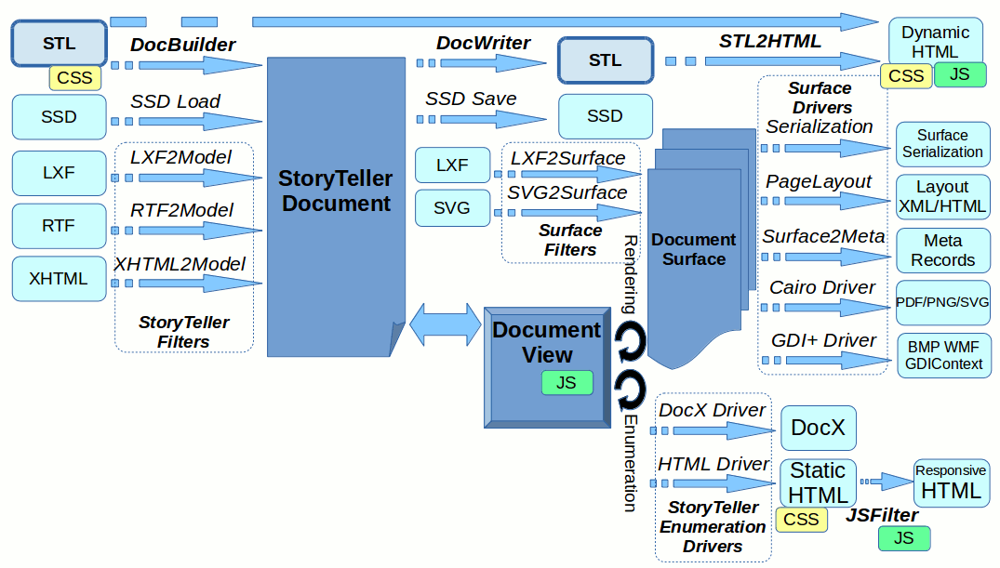

# StoryTeller STL Framework

This document describes design goals as well as implementation details of the new DocPlatform components called 
*Document Builder* and *Document Writer* and a new XML-based layout definition format called *STL*.

Users can interactively and/or programmatically create and modify an instance of *StoryTeller Document* 
and they can possibly serialize it in a form of an *SSD storage file* for later use or modification. 

Such approach works very well for users working completely in OpenText/StreamServe ecosystem. Users create 
and maintain StoryTeller designs exclusively in the *StoryTeller Design Tool* and need no special exchange formats.

But there are users combining other tools (e.g. *Microsoft Word*), with *StoryTeller* process. Currently they 
have little possibilities how to integrate the tools except for inefficient and error prone runtime conversion. 

*Document Builder* together with *Document Writer* should bring a new possibility to easily convert, 
maintain and migrate *StoryTeller Documents* from/to other formats. It adds relatively simple, 
human readable and editable exchange format in a form of well specified XML hierarchy and also provides 
tools to import and export the format to/from *StoryTeller Document* instance.

The following schema demonstrates an overview of the StoryTeller input/output infrastructure and highlights 
the role of *DocBuilder Components*:

The detailed development documentation consists of two section documenting *Builder* and *Writer* 
components separately.

# Python implementation

There already exists a different implementation of *DocBuilder* and *DocWriter* which serves us very well 
for at least some of the use cases (regression testing, test design conversion and maintenance, ...). 

Unfortunately there are several reasons why this version is not suitable for production use:

-   Implemented in python
-   Not designed for production use
-   XML structure was incrementally updated and so is not designed very well

In order to address the issues we decided to implement a new *DocBuilder* version, but now implemented completely in C++, 
intended for production usage with a special care invested to well designed XML structure. 

To disambiguate the new builder component with the old one we call the new builder *DocBuilder++*.

# Design goals

The main design goal is to develop a well defined XML definition format suitable for automatic creation,
conversion and maintenance of *StoryTeller Documents* while human readable and editable at the same time.

## Why XML

There are many persistence formats available, more modern (and often preferred) alternatives
to [XML](https://en.wikipedia.org/wiki/XML) like for example [JSON](https://en.wikipedia.org/wiki/JSON),
[YAML](https://en.wikipedia.org/wiki/YAML) or [S-expression](https://en.wikipedia.org/wiki/S-expression).
So why we choosen the good old XML?

There are several reasons why we think XML is a best choice for our particular use case:

-   We integrate to already XML-friendly infrastructure
    -   Reasonable implementation support (parsers, writers, XPath processors, ...)
    -   Existing configuration files
    -   Existing data files
-   Our data is already XML-based
    -   Input data are frequently XML
    -   We have a powerfull support for XML transformations (TDT, XSLT, ...)
-   We want to represent markup-based structures (story content, ...)
-   We want to embed XML-based structures (data, XHTML content, ...)
-   There is a great support for namespaces in XML (avoid clashes with anything directly embedded)
-   Our format is inspired by [XHTML](https://en.wikipedia.org/wiki/XHTML) and
    [SVG](https://en.wikipedia.org/wiki/Scalable_Vector_Graphics) we want to make it familiar to HTML/CSS/SVG users.

So for the reasons mentioned above we feel that a XML serialization is a best format for our use-case.
That being said we implement the components to be independent on actual syntax of the persistence
(e.g. *DocBuilder++* is an implementation of the `IInputHandler` interface which represents a SAX-like 
handler abstraction, but is by no means XML specific in any way), so it is possible to switch 
the persistence syntax any time if there is such a need.

## High level abstraction

We are not trying to expose a one-to-one mapping of StoryTeller internals to an XML structure, rather 
we are definitng a new interface which is more friendly and intuitive where possible (for example 
while content hyperlinks are implemented internally as StoryTeller Switch objects, we are exposing 
them to users as `stl:scope` with `hyperlink` attribute as we believe that it is more intuitive 
to hide the implementation details).

# More details

-   [STL Use cases](usecases.md)
-   [STL Syntax](syntax.md)
-   [STL Surface Driver](driver.md)
-   [XML Processing](xp.md)
-   DocBuilder++
-   DocWriter++
