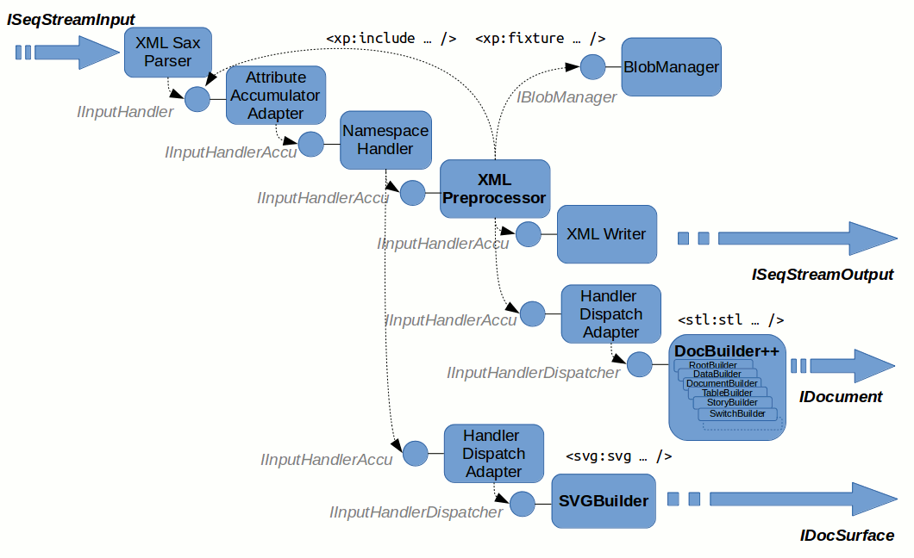

# XML Parsing Framework

We made significant changes to XML Parsing framework during *DocBuilder++* implementation.

Following enhancements were made on top of existing ([expat](http://expat.sourceforge.net/) based) XML Parser:

-   Attribute parsing
-   Attribute accumulation
-   Handler dispatch mechanism
-   Namespace support
-   Preprocessing

There are many components implemented to support concepts listed above.
Now it is possible to build various pipelines to supporting variety of
high-level tasks like:

-   XML preprocessor for arbitrary XML structure
-   XHTML SAX parsing
-   Base64 encoding/decoding
-   STL parsing for DocBuilder++
-   SVG image parsing
-   ...

Following schema demonstrates how such pipelines are built:



In following sections we describe individual components and concepts in more detail.

## Attribute parsing

The first issue was that the `IInputHandler` interface representing a simple SAX handler used inside *DocPlatform* 
for internal XML parsing completely lacked support for [XML attributes](http://www.w3schools.com/xml/xml_attributes.asp):

```c++
    class IInputHandler 
        : public NonCopyable
    {
    public:
        virtual void start( APIStringView tag ) = 0;
        virtual bool end( APIStringView tag ) = 0;
        virtual void data( APIStringView data ) = 0;
    };
```

So far it was not necessary (e.g. the SSD serialization does not use XML attributes as it is not intended to be human readable). 
But *DocBuilder++* goals are very difrferent, we are going to design user convenient and readable kind of XML structure 
and a lack of attributes would greatly hurt this goal.

We also added support for XML comments as such information can be valuable in some scenarios.

So after the described extensions the interface looks as follows:

```c++
    class IInputHandler 
        : public NonCopyable
    {
    public:
        virtual void start( APIStringView tag ) = 0;
        virtual void attr( APIStringView name, APIStringView value ) = 0;
        virtual bool end( APIStringView tag ) = 0;
        virtual void data( APIStringView data ) = 0;
        virtual void comment( APIStringView data ) = 0;
    };
```

## Attribute accumulation

After the previous extension the `IInputHandler` interface is very convenient for XML parser as an *event producer*. 
So when we update the XML Parser side (namely the `ExpatAPI::start_element_callback()` method) it
would seem that we are mostly done:

```c++
    void ExpatAPI::start_element_callback(void *userData, const XML_Char* name, const XML_Char** atts)
    {
        ExpatAPI* userData_( reinterpret_cast<ExpatAPI*>(userData) );
        IInputHandler& handler = userData_->m_handler;
        {
            auto const& tag = local_convert( userData_->m_name, name );
            handler.start( tag );
        }
        for( ; *atts; atts += 2 )  
        {
            auto const& id = local_convert( userData_->m_name, atts[0] );
            auto const& value = local_convert( userData_->m_value, atts[1] );
            handler.attr( id, value );
        }
    }
```

## Handler dispatch mechanism

But from the consumer perspective the resulting situation is not very convenient. SAX implementations typically need a random
access to some form of an attribute map, so the `IInputHandler` interface is actually very low-level and sequential nature 
of events would make the handler implementers' job cumbersome and relatively hard.

Also it is relatively complicated to handle XML namespace mapping correctly.
As one would expect it is necessary to maintain a map of XML *namespace aliases* and *namespace URIs* 
for each element and such *XML namespace stack* must be propagated recursively down the XML tree.
It would be waste of time and development resources to implement it at several places - in individual *SAX handler* implementations.
That is why we had to implemented a centralized service thich maintains all namespace declarations 
and helps other components to keep track of current namespace, map *namespace aliases* to *namespace URIs* 
and other namespace related tasks.

Another common situation is that a *SAX Handler* does not implement all events on it's own, instead there is typically 
a group of *sub-handlers* - each specialized for just a part of XML hierarchy - and then there is a *dispatcher* 
delegating individual events to appropriate handlers.

So we introduced a completely new interface `IInputHandlerDispatch` to address the described issues:

```c++
struct NamespaceSpec
{
	APIStringView prefix;
	APIStringView uri;
};

typedef std::vector<NamespaceSpec> NamespaceStack;

struct NamespacedName
{
	APICharCPtr name;
	NamespaceSpec ns;
};

typedef std::pair<NamespacedName, APICharCPtr> NamespacedAttribute;
typedef std::vector<NamespacedAttribute> NamespacedAttributes;

class IInputHandlerDispatch
	: public NonCopyable
{
public:
	virtual std::unique_ptr<IInputHandlerDispatch> start( NamespacedName const& name, NamespacedAttributes const& attrs ) = 0;
	virtual void end( NamespacedName const& name, NamespacedAttributes const& attrs ) = 0;
	virtual void data( APIStringView data ) = 0;
	virtual void comment( APIStringView data ) = 0;

	virtual void finalize() = 0;
};
```

And to make an easy bridge between *Parser side* and *Handler side* we created an adapter implementation - a component 
with following responsibilities:

-   Handling `xmlns` namespace declarations and maintaining namespace map
-   Map aliased tag names to `NamespacesName` structures
-   Accumulate incoming attributes and map their aliased names to NamespacedAttributes
-   Optionally accumulate subsequent `IInputHandler::data()` call;s to a single `IInputHandlerDispatch::data()` call 
-   Maintain a stack of `IInputHandlerDispatcher` instances and delegate calls to a current one 

Following factory function creates the `IInputHandler` -> `IInputHandlerDispatch` adapter:

```c++
std::shared_ptr<IInputHandler> create_input_handler_dispatch_adapter(
	std::shared_ptr<IInputHandlerDispatch> dispatch,
	NamespaceStack namespaces = {},
	bool filter_ns_attributes = false,
	bool accumulate_data = false);
```

... so now the XML parsing is much more convenient for handler implementers - instead of dealing with low-level stuff 
(XML namespace handling, attribute mappint, ...) they can focus on their actual responsibility. Note that 
the `IInputHandlerDispatch::start()` method can create a new handler instance and so the implementation 
can be easily separated to individual sub-handler implementations and so be more distributed and maintainable.  

## Namespace Support

### Namespaces used in STL

The namespace URI used for *STL definition* is `http://developer.opentext.com/schemas/storyteller/layout`.

In all examples presented in development documentation we use the `stl` alias which stands for *StoryTeller Layout*. 
But user can use an arbitrary alternative alias or even use 
a [default XML namespace](https://www.w3.org/TR/1999/REC-xml-names-19990114/#defaulting).

Naturally for embedded *TDT transformation* we use the TDT namespace 
`http://developer.opentext.com/schemas/storyteller/transformation/tdt` with `tdt` alias.

Also note that the described rule applies to *STL definition* but not to preprocessing directives. 
The namespace URI used for preprocessor is `http://developer.opentext.com/schemas/storyteller/xmlpreprocessor`. 
In all examples presented here we use the `xp` alias which stands for *XML Preprocessor* 
(user can freely use an arbitrary alternative alias).

Following directives are handled during preprocessing phase and so the namespaces are handled specially:

-   `xp:fixture` ... Each *fixture* - even if it is directly included XML sub-hierarchy - is treated as a separate stream. 
    So even though it may look like it is handled recursively within the same *XML parser* instance, in fact it is handled 
    separately and current *XML namespace stack* is not propagated. Each such *XML sub-document* is actually loaded 
    by a separate *XML Parser* instance exactly like if it was not embedded but externally linked via an `src` attribute.
-   `xp:include` ... This directive is interpreted even before the namespace stack is maintained. It means that users 
    can for example include an XML fragment using a *namespace prefix* without asociating the prefix with actual *XML namespace*. 
    Such *namespace prefix* is not interpreted by *DocBuilder* until the fixture is *included* at some place. Then it is 
    interpreted as if the included content was physically present at the place of the `xp:include` preprocessor directive. 
    So the particular *namespace stack* is propagated to each included sub-tree and a single *namespace prefix*
    used inside a fixture can possibly mean different *namespaces* at different places.

You can see various combinations of XML namespaces inside a single definition file in this example:

-   [Namespace Definition](https://github.com/opentext/storyteller/blob/master/docplatform/distribution/py/pfdesigns/docbuilder/namespaces.xml?h=pfi01/develop/docbuilder)

# XHTMLParser

For clients creating document definition based on an XHTML content
template it can be very convenient to have a possibility to include
blocks of XHTML content directly into the *STL definition file* without
a possibility to create a *Content Substitution* (such indirection in a
form of a substitution would be an unnecessary overkill because such
clients actually do not need any dynamic runtime behavior, they just
need a convenient way to include a content in non-native format).

The only problem was that *XHTMLParser* was not suitable for this task. It was able to process a stream containing XHTML markup, 
but it was not possible to integrate it in a running XML parsing session.

So we have refactored the existing `XHTMLHandler` to implement the `IInputHandlerDispatch` interface and so be usable 
as a SAX handler for our (Expat based) XMLParser.

Then we also extended the `IDocModelFilter` interface to provide the
handler interface. Any *DocModel* filter now implements the
`GetInputHandler` method with following signature:

```c++
    virtual std::shared_ptr<IInputHandlerDispatch> GetInputHandler( 
		IResourceContext& resources,
		ILayoutItemFactory const& factory,
		std::shared_ptr<IContentInserter> inserter) = 0;
```

This method can return `nullptr` if a Sax-like interface is not
supported. As the Sax-like interface will be most likely supported only
by the XHtml filter, this approach is maybe not an optimal one. Maybe
there is a better place to expose the Sax filter functionality and so
the whole integration may be a subject for a future change.

# Base64 decoder

For fixtures embedding we provide a possibility of [Base64 encoding](https://en.wikipedia.org/wiki/Base64) and so it is necessary
to decode such streams in *DocBuilder++*.

Although there already was a *Base64 Decoder* implementaion available in *DocPlatform* (the `TStreamBase64In` template)
implementing the `ISeqStreamInput` interface) it was not very usable in this context.

What we really needed in this context was a `ISeqStreamOutput` interface implementaion. That is why I have implemented a new
`TStreamBase64DecodeOut` template.

It was based on a 3rd party [libb64 library](http://libb64.sourceforge.net/) released into 
the [Public Domain](https://en.wikipedia.org/wiki/Public_domain) "License".

So now we have following *Base64* related *Stream Adapters*:

-   `TStreamBase64Out` (`ISeqStreamOutputCtrl`) ... *Base64 Encoding*
    output stream adapter
-   `TStreamBase64In` (`ISeqStreamInput`) ... *Base64 Decoding* input
    stream adapter
-   `TStreamBase64DecodeOut` (`ISeqStreamOutput`) ... **\[NEW\]**
    *Base64 Decoding* output stream adapter

# STL parsing

## DocBuilder++

As the parsing of a document format like *STL* is relatively complex
task, it would be very hard to implement with a single SAX Handler
implementation.

To make it more distributed and maintainable we are using a Handler
dispatch mechanism described above and implementing a variety of
handlers.

The list of handlers (builders) consists of:

-   `RootBuilder`
-   `DataBuilder`
-   `DocumentBuilder`
-   `StoryBuilder`
-   `LayoutBuilder`
-   `ChartBuilder`
-   ...

## STL2HTML

As a proof of concept of interactive HTML document we are experimenting
with a conversion of STL definition directly to interactive and dynamic
HTML.

For business graphics we use [d3](https://d3js.org/) and [NVD3](http://nvd3.org/) libraries to produce interactive charts.

# SVG image parsing

As the chart libraries used for interactive and dynamic HTML document
are all using SVG image format, we had to add (at least a limited)
support for SVG-based images in *StoryTeller*.

The SVG support is still a work-in-progress, but we are already
supporting enough SVG features to visualize NVD3-generated charts in
pring output line PDF.

We are implementing a hierarchy of handlers and naturally we are using
the XML Parsing framework described in this document.
