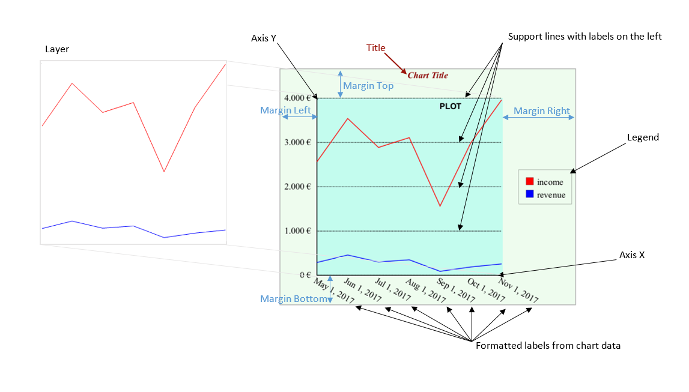

# STL definition syntax

Table of Contents
=================

   * [Overview](#overview)
   * [STL Root](#stl-root)
   * [Whitespace handling](#whitespace-handling)
   * [Styling](#styling)
   * [Document Design](#document-design)
   * [Content Entities](#content-entities)
   * [Content Items](#content-items)
   * [Layout Items](#layout-items)
   * [Runtime Behavior](#runtime-behavior)

# Overview

This document describes an XML syntax of *STL definition file*. The syntax can be validated programmatically 
against the following [XSD schema](https://github.com/opentext/storyteller/blob/master/docplatform/forsetup/docbuilder/xmlschema/stl.xsd).

Top level structure consists of a root `<stl:stl>` element and four optional sub-elements defining *fixtures*, *data*, *styling* 
and a *document*.

# STL Root

One of the *DocBuilder++* design goals was to unify its XML structure with the output format of the [Page Layout Driver](driver.md). 

> :exclamation: 
> Note that the driver was implemented before we started the *DocBuilder++* design, 
> so there are some notable differences in syntax. Also the fact is that *Page Layout Driver* output 
> represents a *paginated/rendered form of a document* while the *DocBuilder++* format represents 
> a *document design structure* so they have many high-level and low-level differences. 
> That being said we still believe that it is possible to unify both formats to a single common syntax, which will ultimately 
> cover all the existing usecases and even will generate new ones. 

It means that we reused the `http://developer.opentext.com/schemas/storyteller/layout` XML namespace and `stl` alias 
(but renamed `root` element to `stl`) and so the root of the XML structure looks as follows:

<script src="//gist-it.appspot.com/github/opentext/storyteller/raw/master/docplatform/distribution/py/pfdesigns/docbuilder/empty.xml?footer=minimal"></script>

There are three optional sub-elements under the `stl:stl` element, we will:

-   `stl:fixtures` ... contains linked or embedded data streams (see
    `xp:fixture` in preprocessing)
-   `stl:data` ... contains data definition (a `stl:template` and one or
    more `stl:source` and `stl:transformation` elements)
-   `stl:document` ... it represents hierarchical document definition

## Data

To make it usable in even more use cases, we decided to integrate data
aspect to the *DocBuilder++* format. It means that it is possible to
define a `stl:data` XML element with following subelements:

-   `stl:template` ... a single *Data Template*
-   `stl:source` ... one or more *Data Sources* (with various `key`
    attribute)
-   `stl:transformation` ... one or more *TDT Definitions* (with various
    `key` attribute)

Any entity can be either directly included in the definition file, or
referenced via `uri` attribute.

Top level of the data section can look as follows:

```xml
<stl:stl xmlns:stl="http://developer.opentext.com/schemas/storyteller/layout" version="0.1">
  <stl:data>
    <stl:source>
      ...
    </stl:source>
    <stl:template>
      ...
    </stl:template>
    <stl:transformation>
      ...
    </stl:transformation>
  </stl:data>
</stl:stl>
```

`stl:template` as well as `stl:source` elements can contain arbitrary
XML structure but `stl:transformation` must contain a valid *TDT
Definitions*. For more details how a *TDT Data Transformation* is
defined and implemented - see the *TDT Documentation*.

Following examples show a definition of *Data Source*, *Data Template*
and *Transformation* a possibility to include or reference individual
definitions as well as preview resulting *Data Instances*.

In all four case we also demonstrate a possibility to create an *STL*
defining just *TDT Data Transformation* - it means that no
`stl:document` definition is necessary for a meaningful *STL
definition*.

### Book Reviews

In this example user defines a *Data Template* representing a simple
HTML hierarchy containing annotated values (represented as XDC tags). It
is then possible to Transforma a *Data Source* and save resulting *Data
Instance* to an XML or HTML file.

All three entities - `stl:source`, `stl:template` and
`stl:transformation` are directly included in the definition file.

-   [STL](https://github.com/opentext/storyteller/blob/master/docplatform/distribution/py/pfdesigns/docbuilder/data-xml.xml)
-   [XML Data Instance](https://rawgit.com/opentext/storyteller/master/docplatform/distribution/py/regr_output/pfdesigns/docbuilder/data-xml-xml-m.data.xml)
-   [HTML Data Instance](https://rawgit.com/opentext/storyteller/master/docplatform/distribution/py/regr_output/pfdesigns/docbuilder/data-xml-xml-m.data.html)

### Dual Transformation

In this example we demonstrate a possibility of scenario when we process
various formats of *Data Sources* and create a unified way to process
them - create a single *Document Design* presenting *Data Instances*
unified to a single format represented as a single *Data Template*.

The data part of the *STL file* can look as follows:

<script src="//gist-it.appspot.com/github/opentext/storyteller/raw/master/docplatform/distribution/py/pfdesigns/docbuilder/dual-data.xml?footer=minimal"></script>

It is clearly visible that there is a single `stl:template` in the
definition but two kinds of `stl:source` and `stl:transformation` pairs.
This way we can process two formats of source data changing just the
active *TDT key*.

-   BBC
    -   [Data Source](https://github.com/opentext/storyteller/blob/master/docplatform/distribution/py/pfdesigns/docbuilder/bbc-data.xml)
    -   [TDT Definition](https://github.com/opentext/storyteller/blob/master/docplatform/distribution/py/pfdesigns/docbuilder/bbc-trans.xml)
    -   [Data Instance](https://rawgit.com/opentext/storyteller/master/docplatform/distribution/py/regr_output/pfdesigns/docbuilder/data-bbc-py-m.data.xml)
-   CRO
    -   [Data Source](https://github.com/opentext/storyteller/blob/master/docplatform/distribution/py/pfdesigns/docbuilder/cro-data.xml)
    -   [TDT Definition](https://github.com/opentext/storyteller/blob/master/docplatform/distribution/py/pfdesigns/docbuilder/cro-trans.xml)
    -   [Data Instance](https://rawgit.com/opentext/storyteller/master/docplatform/distribution/py/regr_output/pfdesigns/docbuilder/data-cro-py-m.data.xml)

### TDT-based document creation

Some examples of *TDT-based document creation* are described in the
*STL/SSDX Framework Documentation*, chapter *DocBuilder utilization*.

# Whitespace handling

Generally we try not to mix elements with text data at a single level of
the *STL* format. That way any inter-element whitespace (created for
example when the XML document is pretty printed) can be treated as
sequence of discardable entities and safely ignored.

A different situation is for *Story* definition format - it is
represented as a sequence of *Mixed Content Elements*. It means that
there are *Elements* and *Content Data* mixed at the same level of XML
hierarchy and we have to provide some level of a clever normalization so
we make the syntax more robust for cases like XML pretty-print but also
provide users with powerful enough means to create content they need
(including whitespaces).

Consider the following example:

```xml
<stl:story>
  <stl:p>
    This is a single-line text
  </stl:p>
</stl:story>
```

... user probably does not expect a newline followed by several spaces
to be inserted to a Story.

On the other hand in the following case:

```xml
<stl:story>
  <stl:p>Author: <stl:field xpath="/data/author/name"/></stl:p>
</stl:story>
```

... it is most probable that user expects the space after the colon to
be preserved.

That is why we need some clever XML content normalization to provide an
intuitive and user friendly behavior.

To achieve such a goal we consider the following two algorithms:

-   `normalize-space`
-   `split-trim-join`
-   `normalize-space-auto-trim`

For detailed discussion about whitespace treatment possibilities see the
[XML Whitespace article](http://wiki.tei-c.org/index.php/XML_Whitespace)
on the [Text Encoding Initiative
Wiki](http://wiki.tei-c.org/index.php/Main_Page).

## normalize-space algorithm

XPath `normalize-space` algorithm does basically the following:

-   replace all whitespace characters with spaces
-   trim all leading and trailing space characters
-   collapse all space sequences to a single space

This is relatively simple c++ implementation:

```cpp
void normalize_data( 
    std::string& data, bool trim_left = true, bool trim_right = true, bool collapse = true )
{
    auto const not_a_space = [](char ch) { return ch != ' '; };
    // replace all whitespaces with spaces in-place
    std::transform( 
      std::begin(data), 
      std::end(data), 
      std::begin(data), 
      []( char ch ) { return std::isspace(ch) ? ' ' : ch; } );
    // trim all leading and trailing space characters
    if ( trim_right ) {
      data.erase( 
        std::find_if(std::rbegin(data), std::rend(data), not_a_space).base(),
        std::end(data) );
    }
    if ( trim_left ) {
      data.erase( 
        std::begin(data), 
        std::find_if(std::begin(data), std::end(data), not_a_space));
    }
    // collapse each space sequences to a single space
    if ( collapse ) {
      data.erase( std::unique( 
        std::begin(data),
        std::end(data),
        []( char c1, char c2 ){ return (c1==' ' && c2==' '); }),
        std::end(data) );
    }
}
```

The advantage is that the algorithm and easy to understand and well
known and frequently used (available in any XPath and XSLT processor).
On the other hand we believe that such significant input modification
may not be necessary.

That is why we also consider and alternative approach.

## split-trim-join algorithm

We call the algorithm `split-trim-join` and it works as follows:

-   split content to individual lines
-   replace all whitespace characters with spaces
-   for very first line - trim all trailing space characters
-   for very last line - trim all leading characters
-   for all remaining lines - trim all leading and trailing space
    characters

This is a c++ implementation:

``` c++
void normalize_data( std::string& data )
{
    auto const not_a_space = [](auto c) { return c != ' '; };
    auto const replace_with_space = [](auto chars) { 
        return [chars](auto ch) { 
          return contains_char(chars, ch) ? ' ' : ch; };
    };

    auto const trim_left = [not_a_space](auto begin, auto end) {
        return std::find_if(++begin, end, not_a_space);
    };

    auto const trim_right = [not_a_space](auto begin, auto end) {
        return std::find_if( 
            std::reverse_iterator<APIString::iterator>(begin), 
            std::reverse_iterator<APIString::iterator>(end), 
            not_a_space).base();
    };

    auto const next_split = [](auto begin, auto end) {
        return std::find(begin, end, '\n');
    };

    auto const limit = std::end(data);
    auto left = std::begin(data);
    std::transform(left, limit, left, replace_with_space("\t\r\f\v"));

    auto split = next_split(left, limit);
    // no trimming if there is just a single string
    if (split != limit) {
        // first token is not left-trimmed
        auto cursor = trim_right( split, left );
        auto right = cursor;
        while(true) {
            left = trim_left(split, limit);
            split = next_split(left, limit);
            if (split == limit) {
                // last token is not right-trimmed
                cursor = std::copy(left, limit, cursor);
                break;
            }
            right = trim_right(split, left);
            cursor = std::copy(left, right, cursor);
        }
        data.erase(cursor, limit);
    }
}
```

## normalize-space-auto-trim

We believe that the normalization algorithm should better preserve
users' intention and so we are also experimenting with a slightly
modified version of the XPath `normalize-space`.

The only difference is that we trim leading and trailing whitespace just
in text-only elements. If there is a mixture of data and sub-elements at
a single level then we are trying to preserve a single space where
appropriate:

```xml
...
<stl:story>
  <stl:p> Both leading and trailing spaces are trimmed </stl:p>
  <stl:p> Just the leading space is trimmed here <stl:span/> and just the trailing space is trimmed here </stl:p>
</stl:story>
...
```

Consider the following encoding:

```xml
...
<stl:story>
  <stl:p>  The <stl:span style="font-style:italic"> cat </stl:span> ate  the <stl:span style="font-weight:bold">grande croissant</stl:span>. I didn't!
  </stl:p>
</stl:story>
...
```

By convention, it is presumed that this encodes a passage that could
have been equivalently encoded as follows:

```xml
...
<stl:story>
  <stl:p>
    The 
    <stl:span style="font-weight:italic">cat</stl:span>
    ate the 
    <stl:span style="font-weight:bold">croissant</stl:span>. 
    I didn't!
  </stl:p>
</stl:story>
...
```

The algorithm to normalize space in mixed content is:

-   Collapse all white space, then trim:
    -   trim leading space on the first text node in an element and
    -   trim trailing space on the last text node in an element,
    -   trim both if a text node is both first and last, i.e., is the
        only text node in the element.

The result is as if the encoding had been

```xml
...
<stl:story>
  <stl:p>The <stl:span style="font-style:italic">cat</stl:span> ate the <stl:span style="font-weight:bold">grande croissant</stl:span>. I didn't!</stl:p>
</stl:story>
...
```

Note: The normalization process would have corrupted the text had the
encoder put spaces inside the `stl:span` elements, like this:

```xml
...
<stl:story>
  <stl:p>The<stl:span style="font-style:italic"> cat </stl:span>ate the<stl:span style="font-weight:bold"> grande croissant </stl:span>. I didn't!</stl:p>
</stl:story>
...
```

The resulting text would be:

The<i>cat</i>ate the<b>grande croissant</b>. I didn't!

So an encoder should assume that an element that includes nothing but
text *will* get trimmed.

#### Example

Following example demonstrates that such normalization works relatively
well and is very intuitive:

##### STL Definition

<script src="//gist-it.appspot.com/github/opentext/storyteller/raw/master/docplatform/distribution/py/pfdesigns/docbuilder/whitespace.xml?footer=minimal"></script>

##### Resulting Document

<a href="https://rawgit.com/opentext/storyteller/master/docplatform/code/javascript/stleditor/index.html?stl=https://raw.githubusercontent.com/opentext/storyteller/master/docplatform/distribution/py/pfdesigns/docbuilder/whitespace.xml"></a>

# Styling

For *load-time styling* in Docbuilder++ we use a subset of
[CSS](https://en.wikipedia.org/wiki/Cascading_Style_Sheets) syntax.

**CSS** stands for \*C\*ascading \*S\*tyle \*S\*heets.

CSS describes how individual document elements are to be formatted and
rendered.

CSS saves a lot of work. It can control the layout of multiple objects
in multiple documents all at once.

## CSS Application

CSS can be added to HTML elements in 3 ways:

-   *Inline* ... by using the style attribute in HTML elements
-   *Internal* ... by using a `stl:style` element before `stl:document`
-   *External* ... by using an external CSS file

The most common way to add CSS, is to keep the styles in separate CSS
files. However, here we will start with inline and internal styling,
because this is easier to demonstrate.

### Inline CSS

Setting the style of a particular document element (like `stl:ellipse`, `stl:block`, `stl:p` or `stl:span`),
can be done with the `style` attribute. 

The `style` attribute has the following syntax:

```xml
<stl:p style="text-align:center;">
  Centered content ...
</stl:p>
```

### Internal CSS

An internal CSS is used to define a style for a single *STL definition*.

An internal CSS is defined in the top-level section of a definition file, before `stl:document` element.

```xml
<stl:stl xmlns:stl="http://developer.opentext.com/schemas/storyteller/layout" version="0.1">
  <stl:style>
    .centered {
      text-align:center;
    }
  </stl:style>
  <stl:document>
    <stl:story>
      <stl:p class="centered">
        Centered content ...
      </stl:p>
    </stl:story>
    ...
  </stl:document>
</stl:stl>
```

### External CSS

An external style sheet is used to define the style for many DocBuilder++ documents.

With an external style sheet, you can change the look of an entire library of documents by changing a single file!

```xml
<stl:stl xmlns:stl="http://developer.opentext.com/schemas/storyteller/layout" version="0.1">
  <stl:style src="wd:/default.css"/>
  <stl:document>
    <stl:story>
      <stl:p class="centered">
        Centered content ...
      </stl:p>
    </stl:story>
    ...
  </stl:document>
</stl:stl>
```

## CSS Properties

While CSS is very rich and powerful language, only a very limited subset
is supported by DocBuilder++.

It is possible that we'll extend the support in future, but right now
from the whole variety of [CSS selectors](http://www.w3schools.com/cssref/css_selectors.asp) only
[.class selectors](http://www.w3schools.com/cssref/sel_class.asp) are supported.

This way we can find out how far we get with such a limited
functionality without closing some doors for future.

For example there may be an XSLT, TDT or other transformation converting
*STL definition file* directly to HTML output. And if we limit our users
to use only `.class` CSS selectors then we may be able to reuse a single
CSS stylesheet between *DocBuilder++* and *HTML output* without any
additional changes. On the other hand if we add a support for *element
name* selectors or *parent-child* selectors then we accidentally expose
the structure of our document (element names and hierarchy) and make
such stylesheets incompatible and inapplicable for HTML output (without
a necessary stylesheet transformation).

Also the set of supported CSS properties is limited to the ones we are
able to convert to StoryTeller document model. The list of currently
supported properties is documented in following sections.

If there is an unsupported property in the associated stylesheet the
DocBulder threats it as error. An alternative approach would be to
ignore such properties, but for now we decided to be more strict and
make possible extensions in future based on a feedback we get. Such
narrow contract is typically easier to implement (we do not need to
handle some cases like DocBuilder -&gt; HTML conversion specially), is
less surprising for users (user gets the error at loading time instead
of delivering thousands of incorectly formatted documents because of a
typo in a stylesheet) and is easily extensible in future (without
worrying that we break backward compatibility).

### Length Units

CSS offers a number of different units for expressing length. Some
of them are currently supported in *DocBuilder++* and so can be used
throughout *STL definition* markup:

-   `pt` ... Absolute length in points (1px = 1/72th of 1in)
-   `px` ... Absolute length in pixels (1px = 1/96th of 1in)
-   `in` ... Absolute length in inches (1in = 96px = 2.54cm)
-   `pc` ... Absolute length in picas (1pc = 12 pt)
-   `mm` ... Absolute length in millimeters
-   `cm` ... Absolute length in centimeters
-   `em` ... Relative to the font-size of the element (2em means 2 times the size of the current font)
-   `%` ... Relative to the length of same property of parent element

For more detailed CSS unit description see the [W3C documentation](https://www.w3.org/Style/Examples/007/units.en.html).

### Color Definition

Right now a six-digit (`#rrggbb`) and three-digit (`#rgb`) forms of hex format RGB color are implemented:

```xml
<stl:text x="20pt" y="20pt" w="260pt" h="180pt" style="fill:#0effff; stroke:#4b0082;">
  <stl:story>
    This is a
    <stl:span style="background-color:#d2691e; color:#0f0;">
      colored
    </stl:span>
    text.
  </stl:story>
</stl:text>
```

... and also [CSS3 Extended Color Keywords](https://www.w3.org/TR/css3-color/#svg-color) are supported:

```xml
<stl:text x="20pt" y="20pt" w="260pt" h="180pt" style="fill:lightcyan; stroke:indigo;">
  <stl:story>
    This is a
    <stl:span style="background-color:chocolate; color:lime">
      colored
    </stl:span> text.
  </stl:story>
</stl:text>
```

... and finally decimal `rgb()` and `rgba()` notations are supported:

```xml
<stl:text x="20pt" y="20pt" w="260pt" h="180pt" style="fill:rgb(224,255,255); stroke:rgba(75,0,130,1.0);">
  <stl:story>
    This is a
    <stl:span style="background-color:rgba(210,105,30,1.0); color:rgb(0,255,0);">
      colored
    </stl:span>
    text.
  </stl:story>
</stl:text>
```

For genericity and user convenience we should implement a support for full
[CSS color](https://www.w3.org/TR/css3-color/#colorunits) in future
(e.g. decimal `hsl` and `hsla` notations).

### Pen Definition

-   `border` (color) ... maps to *Pen* property
-   `stroke` (color) ... maps to *Pen.Brush.Color* property
-   `stroke-width` (length) ... maps to the *Pen.Thickness* property
-   `stroke-linecap` (`butt`, `dashed`, `dotted`) ... maps to the *Pen.LineCap* property
-   `stroke-linejoin` (`miter`, `round`, `bevel`) ... maps to the *Pen.LineJoin* property
-   `stroke-opacity` (numeric) ... maps to *Pen.Brush.Color.Alpha* property
-   `stroke-dasharay` (sequence of lengths) ... maps to *Pen.DashStyle* property
     (`SOLID`, `DASH`, `DOT`, `DASHDOT`, `DASHDOTDOT`)
-   `opacity` ... (number) ... maps to *Pen.Color.Alpha* property

### Brush definition

-   `background-color` (color) ... maps to *Brush.Color* property
-   `fill` (color) ... maps to *Brush.Color* property
-   `fill-opacity` (number) ... maps to *Brush.Color.Alpha* property
-   `opacity` (number) ... maps to *Brush.Color.Alpha* property

### Drawing Style Definition

Any *layout item* (`stl:text`, `stl:input`, `stl:table`, `stl:rect`,`stl:circle`, ...) defining a `style` attribute 
can use following optional CSS properties modifying item's *drawing style*:

-   `border-collapse` ... NOOP
-   `border` (width + style + color) ... maps to *DrawingStyle.Pen* property
    -   `border-top`
    -   `border-bottom`
    -   `border-left`
    -   `border-right`
-   `margin` (one to four lengths) ... maps to *DrawingStyle.OuterMargin* property
    -   `margin-top` (length)
    -   `margin-bottom` (length)
    -   `margin-left` (length)
    -   `margin-right` (length)
-   `padding` (one to four lengths) ... maps to *DrawingStyle.InnerMargin* property
    -   `padding-top` (length)
    -   `padding-bottom` (length)
    -   `padding-left` (length)
    -   `padding-right` (length)
-   `fill-rule` (`winding`, `evenodd`) ... maps to *DrawingStyle.WindingFill*

Right now only a solid Fill (*Brush*) and Stroke (*Pen*) is generated for given color.

In future we are going to support more advanced *Fill* and *Stroke* definitions, via inline [CSS Style](https://www.w3.org/TR/SVG/styling.html#StylingWithCSS):

```xml
<stl:line x1="40pt" x2="120pt" y1="100pt" y2="100pt"
          style="stroke: black; stroke-width: 20pt; stroke-linecap: round;"/>
```

There are also following additional *drawing style* related properties with no direct mapping to HTML CSS,
so we used a CSS extension with `-stl-` "vendor" prefix:

-   `-stl-content-rescale`
-   `-stl-shape-resize`
-   `-stl-placement-ratio`
-   `-stl-alignment`
-   `-stl-wrapping`
-   `-stl-formatting`

### Paragraph Style Definition

Content elements defining a `style` attribute for paragraphs (`stl:p`, `stl:list` and `stl:block`)
can use following optional CSS properties modifying current *paragraph style*:

-   `text-align` (`left`, `right`, `center`, `justify`) ... maps to *Alignment* property
-   `margin-top` (length) ... maps to the *ParagraphSpacingBefore* property
-   `margin-bottom` (length) ... maps to the *ParagraphSpacingAfter* property
-   `margin-left` (length) ... maps to the *LeftIndent* property
-   `margin-right` (length) ... maps to the *RightIndent* property
-   `text-indent` (length) ... maps to the *FirstIndent* property
-   `line-height` (length) ... maps to *LineSpacing* property with *LineSpacingMode* set to *LS_RELATIVE*
-   `page-break-before` (`always` or `auto`) ... `always` sets *StartPosition* property to *SP_PAGE* 
     (`auto` leaves it as *SP_ANYWHERE*)
-   `page-break-after` (`avoid` or `auto`) `avoid` sets *KeepWithNext* property to 1 (`auto` leaves it 0)
-   `orphans` (integral) ... maps to the *KeepTogetherFirst* property
-   `widows` (integral) ... maps to the *KeepTogetherLast* property
-   `direction` (`ltr`, `rtl`) ... maps to *Direction* property
-   `column-count` (integral), `column-width` (length), `column-gap` (length) ... maps to *ColumnSection* command

There are also following additional *paragraph style* related properties with no direct mapping to HTML CSS,
so we used a CSS extension with `-stl` "vendor" prefix:

-   `-stl-shaping` (string)
-   `-stl-tabs` tab definition string (see *Tab Stops* section below)
-   `-stl-outline-level` (numeric)

### Character Style Definition

Content elements defining a `style` attribute (`stl:p`, `stl:list`, `stl:block` and `stl:span`) can use following optional CSS properties modifying current *character style*:

-   `font`
    -   `font-family` (string) ... maps to *Font.Name* property
    -   `font-size` (length) ... maps to *Font.Size* property
    -   `font-weight` (`bold` or `normal`) ... maps to *Font.Bold* boolean property
    -   `font-style` (`italic` or `normal`) ... maps to *Font.Italic* boolean property
    -   `font-variant` (`normal` or `small-caps`) ... maps to *Font.Smallcaps* boolean property
-   `text-decoration` (`line-through`, `underline` or `none`) ... maps to *Font.Underline* and *Font.Strikethrough* boolean properties
-   `vertical-align` (`baseline`, `sub` or `super`) ... maps to *Font.Superscript* and *Font.Subscript* boolean properties
-   `word-break` (`keep-all` or `break-all`) ... maps to *Hyphenation* property
-   `color` (color) ... maps to *Foreground.Color* property
-   `background-color` (color) ... maps to *Background.Color* property
-   `text-anchor` ... NOOP
-   `opacity` (numeric) ... maps to *Foreground.Color.Alpha* property

Then there is an attribute `lang` definition language for whole element subtree

## CSS Parser

As an initial implementation of the CSS parser we used regex-based [CCSS library](https://github.com/jdeng/ccss) based on
[css-parse](https://github.com/reworkcss/css-parse) and [css-stringify](https://github.com/reworkcss/css-stringify) libraries, all released under MIT licence.

The parsing code was very much rewritten, but we still consider a possibility to use more powerfull engine like [LibCSS](http://www.netsurf-browser.org/projects/libcss/).

# Document Design

## Document

In principle it would be possible to define several documents and for example share a single data definition among them.

But right now user can define just a single `stl:document` element in the *STL file*. It's structure consists of a list of (shared) *Stories* represented as `stl:story` elements and a sequence of *Page Types* represented as `stl:page` elements.

Following listing shows how the top level XML structure can look like:

```xml
<stl:stl xmlns:stl="http://developer.opentext.com/schemas/storyteller/layout" version="0.1">
  ...
  <stl:document>
    <stl:story>
      ...
    </stl:story>
    <stl:page w="300pt" h="500pt">
      ...
    </stl:page>
  </stl:document>
</stl:stl>
```

There can be a support for multiple `stl:document` definitions in future but right now only none or a single `stl:document` is supported.

## Document Structure

Right now there is no *DocBuilder++* support for advanced document structure.

Currently users can create individual `stl:page` elements (representing *Page Types* and *Page References* at the same time) and add an optional `occurrence` attribute to each such page.

The `occurrence` attribute value can be one of the following:

-   `optional` ... there can be `0` or `1` page instance
-   `once-or-more` ... there can be `1` or more page instances
-   `repeatable` ... there can be `0`, `1` or more page instances
-   `<numeric value>` ... there will be exactly the specific number of
    page instances

If there is no `occurrence` attribute then the page will be instantiated exactly once.

## Page

The `stl:page` represents a definition of a single *Page Type*. Right
now the sequence of *Page Types* leads to a flat *Document Structure*
referencing each individual *Page Type* with appropriate *Occurrence*.
It is possible that in future we extend the format with an optional
explicit *Document Structure* definition.

Single (repeatable) *Page Type* definition looks as follows:

```xml
...
  <stl:page w="300pt" h="500pt" occurrence="repeatable">
    ...
  </stl:page>
...
```

Each page typically contains a hierarchy of various *Layout Items* (like *texts*, *images*, *fragments* etc).

Following sections describe various *Layout Items* which user can include in `stl:page` hierarchy as *page objects* or inside native `stl:story` sequence as *inline* or *paragraph objects*.

## Story

A single *Story* represents a linear content sequence sometimes containing one or more inline of paragraph layout objects (*texts*, *tables*, ...) as well as data objects (*switches*, *repeaters*, *substitutions*) or other content objects (*commands*, *hyperlinks*, ...).

### Story Format

Story can be specified in various formats, right now a *Native
DocBuilder++* and [XHTML](https://en.wikipedia.org/wiki/XHTML) format is
supported. It is possible that other content formats (like
[RTF](https://en.wikipedia.org/wiki/Rich_Text_Format)) will be supported
in future.

Following listing shows a very simple example of a native content:

```xml
...
  <stl:story>
    <stl:p>This is a private (and native) story...</stl:p>
  </stl:story>
...
```

And here is an example of an XHTML content:

```xml
...
  <stl:story format="XHTML">
    <body>
      <p>This is a <b>shared</b> <i>story</i>...</p>
    </body>
  </stl:story>
...
```

Current XHTML filter implementation has many bugs and limitations but it
is still a usable piece of software and integrating it with
*DocBuilder++* can fulfill at least some possible usecases.

Hopefully we'll manage to replace the XHTML filter with more decent
implementation in future.

### Story Ownership

Just like in *StoryTeller Document* a *Story* can be either *shared* or
*private*.

*Shared Stories* are owned directly by *Document* and so are defined at
the `stl:document` level of the *STL definition*.

A Shared Story has no effect on the formatted document until it gets
referenced by some formatting object (be it a *text* or a *story
reference* from the same or a different document).

Shared stories can be referenced via `index` or a `name`:

```xml
...
  <stl:document>
    <stl:story name="Shared">
      <stl:p>This is a shared story...</stl:p>
    </stl:story>
    ...
    <stl:page w="300pt" h="500pt">
      <stl:text x="120pt" y="20pt" w="60pt" h="60pt" story="Shared" style="stroke:#00ff00"/>
      ...
    </stl:page>
  </stl:document>
...
```

Some objects (e.g. *texts*, *switches*, *repeaters*) can define their
*Private Story* right inside their corresponding XML element:

```xml
...
  <stl:text x="10pt" y="10pt" w="100pt" h="100pt" style="stroke:#0000ff">
    <stl:story>
      <stl:p>This is a private story...</stl:p>
    </stl:story>
  </stl:text>
...
```

#### Example

Following example demonstrates various *Story* ownership modes and
formats:

##### STL Definition

<script src="//gist-it.appspot.com/github/opentext/storyteller/raw/master/docplatform/distribution/py/pfdesigns/docbuilder/story.xml?footer=minimal"></script>

##### Resulting Document

<a href="https://rawgit.com/opentext/storyteller/master/docplatform/code/javascript/stleditor/index.html?stl=https://raw.githubusercontent.com/opentext/storyteller/master/docplatform/distribution/py/pfdesigns/docbuilder/story.xml"></a>

### Semantic Tags & Styling

It is possible to associate a *Semantic Tag* with any `stl:story` (even
one inside an `stl:scope`) and use the consequent associations for
styling.

User can associate a *Stylesheet* with a *StoryTeller Document* via
`stl:stylesheet` directive. The associated *Stylesheet* is identified
via a *Resource URI* representing either an *external* or *embedded* XML
stream.

An *External Stylesheet* can be associated as follows:

```xml
<stl:stl xmlns:stl="http://developer.opentext.com/schemas/storyteller/layout" version="0.1">
  ...
  <stl:document>
    <stl:stylesheet key="VW" src="wd:/stylesheets/vw.xml"/>
    <stl:stylesheet key="AUDI" src="wd:/stylesheets/audi.xml"/>
    <stl:stylesheet key="SKODA" src="wd:/stylesheets/skoda.xml"/>
    <stl:story tag="LetterBody">
      ...
    </stl:story>
    ...
  </stl:document>
</stl:stl>
```

And *Embedded Stylesheet* associations can look like this:

```xml
<stl:stl xmlns:xp="http://developer.opentext.com/schemas/storyteller/xmlpreprocessor" 
         xmlns:stl="http://developer.opentext.com/schemas/storyteller/layout" version="0.1">
  <stl:fixtures>
    <xp:fixture key="link:/stylesheets/vw.xml">
      <stylesheet name="VW Brand Stylesheet">
        <style selector="LetterBody">
          <character>
            <font>
              <name>Trebuchet MS</name>
            </font>
          </character>
          ...
        </style>    
        ...
      </stylesheet>
    </xp:fixture>
    <xp:fixture key="link:/stylesheets/audi.xml">
      <stylesheet name="Audi Brand Stylesheet">
        ...
      </stylesheet>
    </xp:fixture>
    <xp:fixture key="link:/stylesheets/skoda.xml">
      <stylesheet name="Skoda Brand Stylesheet">
        ...
      </stylesheet>
    </xp:fixture>
  </stl:fixtures>
  <stl:document>
    <stl:stylesheet key="VW" src="link:/stylesheets/vw.xml"/>
    <stl:stylesheet key="AUDI" src="link:/stylesheets/audi.xml"/>
    <stl:stylesheet key="SKODA" src="link:/stylesheets/skoda.xml"/>
    <stl:story tag="LetterBody">
      ...
    </stl:story>
    ...
  </stl:document>
</stl:stl>
```

#### Example

Following example demonstrates an embedded stylesheet and it's
application to a story:

##### STL Definition

<script src="//gist-it.appspot.com/github/opentext/storyteller/raw/master/docplatform/distribution/py/pfdesigns/docbuilder/styles.xml?footer=minimal"></script>

##### Resulting Document

<a href="https://rawgit.com/opentext/storyteller/master/docplatform/code/javascript/stleditor/index.html?stl=https://raw.githubusercontent.com/opentext/storyteller/master/docplatform/distribution/py/pfdesigns/docbuilder/story.xml"></a>

# Content Entities

## Paragraph

Users can use `stl:p` element to create a paragraph.

Any `stl:p` element can optionally re-define any /paragraph style/ attribute.

/Paragraph style/ properties are specified for every single paragraph and do not get propagated 
to potentially nested paragraphs (e.g. paragraphs inside a nested switch).

#### Example

This example demonstrates a variety of `stl:p` attributes:

##### STL Definition

<script src="//gist-it.appspot.com/github/opentext/storyteller/raw/master/docplatform/distribution/py/pfdesigns/docbuilder/paragraph.xml?footer=minimal"></script>

##### Resulting Document

<a href="https://rawgit.com/opentext/storyteller/master/docplatform/code/javascript/stleditor/index.html?stl=https://raw.githubusercontent.com/opentext/storyteller/master/docplatform/distribution/py/pfdesigns/docbuilder/story.xml"></a>

## Span

Users can use `stl:span` element to change style for enclosed content.
Style changes are propagated even to stories associated with nested
`repeaters` or `switches`.

The fact is that there is no support for hierachical *Span* entities
inside the *StoryTeller Document Model* (story content contains just
special *style-change* commands changing the current style for all
subsequent content in that particular story), but we believe that
supporting more HTML-like style support is more user friendly than
exposing the internal representation.

Any `stl:span` element can optionally re-define any *character style*
attribute.

You can change style of a text span as follows:

```xml
...
<stl:story>
  <stl:p>This is a <stl:span style="font-weight:bold">bold</stl:span> text</stl:p>
</stl:story>
...
```

Spans can be nested and associated styles can be arbitrarily combined:

```xml
...
<stl:story>
  <stl:p>
    This one contains a span with custom
    <stl:span style="font-family:Arial">
      font and
      <stl:span style="font-size:20pt">
        size
      </stl:span>
    </stl:span>
    .
  </stl:p>
</stl:story>
...
```

and toggled:

```xml
...
<stl:story>
  <stl:p>
    <stl:span style="font-weight:bold; font-style:italic">
      Style properties can be
      <stl:span style="font-weight:normal">individually</stl:span>
      <stl:span style="font-style:normal">toggled</stl:span>.
    </stl:span>
  </stl:p>
</stl:story>
...
```

## Block

A `stl:block` can span over several `stl:p` paragraphs as follows:

```xml
...
<stl:story>
  <stl:block style="font-family:Courier New">
    <stl:p>This is a monospace styled paragraph</stl:p>
    <stl:p>And this one is monospace too</stl:p>
  </stl:block>
</stl:story>
...
```

*DocBuilder++ Engine* makes sure that changed styles get propagated to
nested stories:

```xml
...
<stl:story>
  <stl:block style="font-family:Courier New">
    <stl:p>
      Span can <stl:span style="font-style:italic">span</stl:span> over several paragraphs and it's style propagates to nested sub-stories:
    </stl:p>
    <stl:p>
      <stl:switch xpath="true">
        <stl:case>
          <stl:story>a) <stl:span style="font-weight:bold">native</stl:span> story</stl:story>
        </stl:case>
      </stl:switch>
    </stl:p>
    <stl:p>
      <stl:repeater xpath="/data">
        <stl:story format="XHTML"><html><body>b) <b>XHTML</b> story</body></html></stl:story>
      </stl:repeater>
    </stl:p>
    <stl:p>
      <stl:content xpath="'&lt;html&gt;&lt;body&gt;c) &lt;b&gt;rich&lt;/b&gt; substitution&lt;/body&gt;&lt;/html&gt;'"/>
    </stl:p>
  </stl:block>
</stl:story>
...
```

#### Example

This example demonstrates the usage of a *Span*:

##### STL Definition

<script src="//gist-it.appspot.com/github/opentext/storyteller/raw/master/docplatform/distribution/py/pfdesigns/docbuilder/span.xml?footer=minimal"></script

##### Resulting Document

<a href="https://rawgit.com/opentext/storyteller/master/docplatform/code/javascript/stleditor/index.html?stl=https://raw.githubusercontent.com/opentext/storyteller/master/docplatform/distribution/py/pfdesigns/docbuilder/story.xml"></a>

## Lists

A relatively frequent use-case is to create a bulleted or numbered list. 
STL definition provides an `stl:list` element and also several `-stl-list-`
prefixed CSS properties for that purpose.

The fact is that there is no *List* object implemented internally in *StoryTeller Document Model* 
(list definitions are internally represented as *ListStyleSpec* resources and referenced 
from individual paragraphs), but we believe that supporting more HTML-like list creation 
is more user-friendly than exposing the internal *StoryTeller* representation (a nice size-effect
of such approach is that it also significantly simplifies a direct STL -> HTML conversion).

It means that users can generally create an arbitrary hierarchy of
nested `stl:list` elements (each element representing a definition of
the whole list) containing `stl:p` sub-elements with or without associated bullet/numbering 
style definition (each sub-element represents either a single list item or it is a plain 
paragraph with no bullet/numbering).

The _Bullets & Numbering_ syntax is described in a [separate document](numbering.html).

#### Example

This example demonstrates the usage of *Lists*:

##### STL Definition

<script src="//gist-it.appspot.com/github/opentext/storyteller/raw/master/docplatform/distribution/py/pfdesigns/docbuilder/numbering/kitchen-sink.xml?footer=minimal"></scrip

##### Resulting Document

<a href="https://rawgit.com/opentext/storyteller/master/docplatform/code/javascript/stleditor/index.html?stl=https://raw.githubusercontent.com/opentext/storyteller/master/docplatform/distribution/py/pfdesigns/docbuilder/story.xml"></a>

## Breaks

Users can use an `stl:break` command to explicitly break formatting of a
current *line* or *area*. *Line breaks* can be created as follows:

```xml
...
<stl:story>
  <stl:p>
    This is a text
    <stl:break type="line"/>mixed with line-breaks
    <stl:break/>and so broken to several
    <stl:break/>lines.
  </stl:p>
  <stl:p>
    Here we even create
    <stl:break/>several
    <stl:break/>
    <stl:break/>empty
    <stl:break/>
    <stl:break/>lines.
  </stl:p>
</stl:story>
...
```

*Area breaks* can help users to create a single paragraph spanning
across several areas:

```xml
...
<stl:story>
  <stl:p>
    This is another paragraph - this time it contains an area break. 
    The break comes right here: {<stl:break type="area"/>}
    ... and so this text comes to the next area and because 
    of another area break: {<stl:break type="area"/>} 
    ... this text comes to yet another one.
  </stl:p>
</stl:story>
...
```

#### Example:

This example demonstrates various kinds of *Break commands*:

##### STL Definition

<script src="//gist-it.appspot.com/github/opentext/storyteller/raw/master/docplatform/distribution/py/pfdesigns/docbuilder/breaks.xml?footer=minimal"></scrip

##### Resulting Document

<a href="https://rawgit.com/opentext/storyteller/master/docplatform/code/javascript/stleditor/index.html?stl=https://raw.githubusercontent.com/opentext/storyteller/master/docplatform/distribution/py/pfdesigns/docbuilder/story.xml"></a>

## Tab Stops

There is another type of command - `stl:tab`, which can be used for
creation of [Tab Stops](https://en.wikipedia.org/wiki/Tab_stop).

Users can simply mix individual `stl:tab` commands with rest of the text
and utilize default *Tab Stop* definitions as follows:

```xml
...
<stl:story>
  <stl:p>
    (left)<stl:tab/>(middle)<stl:tab/>(right)
  </stl:p>
</stl:story>
...
```

Or they can define their own set of tab definitions for each individual
paragraph. Tab stop definition is a plain string with the following
syntax:

The `tabs` attribute colon separated list of tab definitions:
`<tdef>:...:<tdef>` where single definition is a semicolon list:
`<indent>;<alignment>;<leader>`:

-   `indent` (numeric)
-   `alignment` optional (`left`, `right`, `center`, `decimal`)
-   `leader` optional leader character

This is an example of custom *Tab Stop* definition:

```xml
...
<stl:story>
  <stl:p tabs="100pt:200pt">
    (left)<stl:tab/>(middle)<stl:tab/>(right)
  </stl:p>
</stl:story>
...
```

Users can even utilize an `stl:list` for a common *Tab Stop* definition:

```xml
...
<stl:story>
  <stl:list list-mask="%0!1.&#9;" tabs="20pt:250pt;decimal;.">
    <stl:p>Item<stl:tab/> 25,- CZK</stl:p>
    <stl:p>Item<stl:tab/> 138,- CZK</stl:p>
    <stl:p>Item<stl:tab/> 11 324,- CZK</stl:p>
    <stl:p>Item<stl:tab/> 15,- CZK</stl:p>
    <stl:p>Item<stl:tab/> 123 344,- CZK</stl:p>
  </stl:list>
</stl:story>
...
```

#### Example:

This example demonstrates usage of *Tab Stops*:

##### STL Definition

<script src="//gist-it.appspot.com/github/opentext/storyteller/raw/master/docplatform/distribution/py/pfdesigns/docbuilder/tabs.xml?footer=minimal"></script

##### Resulting Document

<a href="https://rawgit.com/opentext/storyteller/master/docplatform/code/javascript/stleditor/index.html?stl=https://raw.githubusercontent.com/opentext/storyteller/master/docplatform/distribution/py/pfdesigns/docbuilder/story.xml"></a>

### Commands

TBD

### TOC styles

TBD

# Content Items

Any *Content Item* can have following optional properties:

-   `name`
-   `description`
-   ...

## Mapping overview

There is untrivial mapping between STL elements and internal *DocModel*
entities. Here is the overview:

-   *Substitution*
    -   Rich data substitution ... `<stl:content xpath="..." />`
    -   Repository substitution ... `<stl:content uri="..." />`
    -   Extern content substitution ...
        `<stl:content uri="..." selector="..." />`
    -   Data substitution ... `<stl:field xpath="..." />`
    -   Field (page-of-pages, page-type, ...) ...
        `<stl:field type="..." />`
    -   Metadata lookup ... `<stl:field key="..." />`
    -   Translation substitution ... `<stl:translation phrase="..." />`
-   *Switch*
    -   Translation switch ...
        `<stl:translation><stl:phrase locale="..." />...</stl:translation>`
    -   Data switch ...
        `<stl:switch xpath="..."><stl:case key="..." />...<stl:switch>`
    -   Interactive form ... `<stl:scope relation="...">...</stl:scope>`
    -   Hyperlink ...
        `<stl:scope hyperlink="..." screentip="...">...</stl:scope>`
    -   Story reference ... `<stl:scope story="..." />`

## Substitution

A substitution serves as an item to be *substituted* with some
externally retrieved content or data. There are various kinds and
flavors of substitutions, each behaving bit differently from users'
perspective. Instead of presenting all kinds of substitutions as a
single `stl:substitution` element, we expose individual kinds of
substitutions as separate elements:

-   `<stl:field .../>`
-   `<stl:content .../>`
-   `<stl:translation .../>`

### Data Source

*Data Substitution* evaluates a given [XPath](https://en.wikipedia.org/wiki/XPath) and retrieves a string value from *Data Instance*:

```xml
...
<stl:story>
  <stl:p>
    <stl:field xpath="concat( 'Mr. ', /data/page[@number=2]/heading )"/>
  </stl:p>
</stl:story>
...
```

### Field

*Field Substitution* evaluates a special value like current page number or number of pages in current document.

```xml
...
<stl:story>
  <stl:p>
    <stl:field type="page-number"/>
    <stl:field type="number-of-pages"/>
  </stl:p>
</stl:story>
...
```
### External Content & Repository

*External Content Substitution* loads an external document (e.g. *SSD*, *DocBuilder++* or *RTF*) into a cache and evaluates a specific story based on a specified `src` attribute content a *Moniker* selector:

```xml
...
<stl:fixtures>
  <xp:fixture key="link:/fragments/content.xml">
    <stl:stl xmlns:stl="http://developer.opentext.com/schemas/storyteller/layout" version="0.1">
      <stl:document>
        <stl:story name='Main'>
          <stl:p>[ Published <stl:span style="font-style:italic">story</stl:span> inside an embedded fragment ]</stl:p>
        </stl:story>
      </stl:document>
    </stl:stl>
  </xp:fixture>
</stl:fixtures>
...
<stl:story>
  <stl:p>
    <stl:content uri='wd:/Fragment.rtf' selector='/story[1]'/>
    <stl:content uri='wd:/Fragment.ssd' selector='/story[3]'/>
    <stl:content uri='link:/fragments/content.xml' selector='/story[@name="Main"]'/>
  </stl:p>
</stl:story>
...
```

*Repository Substitution* directly converts comlete content of an
external document (e.g. HTML) with no caching:

```xml
...
<stl:story>
  <stl:p>
    <stl:content uri="wd:/Fragment.html"/>
  </stl:p>
</stl:story>
...
```

### Translation

*Translation Substitution* realizes special `phrase -> value` lookup.

```xml
...
<stl:story>
  <stl:p>
    <stl:translation phrase="Label1"/>
  </stl:p>
</stl:story>
...
```

### Examples

####  Kitchen sink

This example demonstrates various kinds of *Substitutions*:

##### STL Definition

<script src="//gist-it.appspot.com/github/opentext/storyteller/raw/master/docplatform/distribution/py/pfdesigns/docbuilder/subst.xml?footer=minimal"></script

##### Resulting Document

<a href="https://rawgit.com/opentext/storyteller/master/docplatform/code/javascript/stleditor/index.html?stl=https://raw.githubusercontent.com/opentext/storyteller/master/docplatform/distribution/py/pfdesigns/docbuilder/story.xml"></a>


#### External section references

So far we kept the tools for creating design and filling external content separate. Users can use the *StoryTeller Editor* to create a document design and put any number of *Section References* to it and then a (possibly different) user can open the *StoryBoeard* web application and fill individual *Sections* with actual content (a mixture of HTML text and images).

But what if the business user wants to reorder the existing *Section
References*, delete existing ones or even create new ones from
scratch? Would not it be nice if there was an easy way to extend the
*StoryBoard* web editor with such functionality?

One possible approach is to learn the *StoryBoard* (at least a
subset of) *STL file* syntax. Imagine we provide a set of predefined
*DocBuilder++* templates containing all the layout but not the main
story. Such designs could look like the following:

```xml
<stl:stl xmlns:xp="http://developer.opentext.com/schemas/storyteller/xmlpreprocessor" 
         xmlns:stl="http://developer.opentext.com/schemas/storyteller/layout" version="0.1">
  <stl:document>
    <xp:include src="wd:/sections-story.xml" />
    <stl:page w="370pt" h="500pt">
    <!-- Two Text Frames (observe a shared story) -->
      <stl:text x="20pt" y="50pt" w="150pt" h="430pt" style="fill:#ffddcc" story="Sections"/>
      <stl:text x="200pt" y="50pt" w="150pt" h="430pt" style="fill:#ffddcc" story="Sections"/>
    </stl:page>
  </stl:document>
</stl:stl>
```

... note that the main story is not present, but rather externally included.

Let's say we have the following *Section definitions* (`section_html`, `section_tables`, `section_image` and
    `section_mixed`):

```xml
<definition name="DocDefSections" templateVersion="1" templateName="DocDefSections">
  <section id="section_html">
    <resource displayName="Text" path="Fragment.html" type="html" uri="www.example.com/text">
      ...
    </resource>
  </section>
  <section id="section_tables">
    <resource displayName="Tables" path="tables.html" type="html" uri="www.example.com/tables">
      ...
    </resource>
  </section>
  <section id="section_image">
    <resource displayName="Image" path="ducks.png" type="image" uri="www.example.com/image">
      ...
    </resource>
  </section>
  <section id="section_mixed">
    ...
  </section>
</definition>
```

Then the *StoryBoard web editor* could let user edit the sequence of 
the sections and based on his choice generate the actual content of
the main story, for example as follows:

```xml
<stl:story name="Sections" xmlns:stl="http://developer.opentext.com/schemas/storyteller/layout" version="0.1">
  <stl:content uri="strssec:section_html" />
  <stl:content uri="strssec:section_tables" />
  <stl:content uri="strssec:section_image" />
  <stl:content uri="strssec:section_mixed" />
</stl:story>
```

... and *DocBuilder* interpreting the *STL definition file* would
simply do the right thing - it would generate a *Document Design*
containing main *Story* with appropriate sequence of *Section
References*. *Document Formatter* would then retrieve the
corresponding content for each *Section Reference* and generate the
resulting *Document Instance*.

There is also an alternative approach - utilizing *Extenal Content
Substitution* and postponing interpretation of the dynamic story to
runtime. The top level design could look as follows:

```xml
<stl:stl xmlns:xp="http://developer.opentext.com/schemas/storyteller/xmlpreprocessor" 
         xmlns:stl="http://developer.opentext.com/schemas/storyteller/layout" version="0.1">
  <stl:fixtures>
    <xp:fixture key="link:/story-fragment.xml">
      <stl:stl xmlns:stl="http://developer.opentext.com/schemas/storyteller/layout" version="0.1">
        <stl:document>
          <xp:include src="wd:/sections-story.xml" />
        </stl:document>
      </stl:stl>
    </xp:fixture>
  </stl:fixtures>

  <stl:document>
    <stl:story name="ExternContent">
      <stl:content uri="link:/story-fragment.xml" selector="/story[1]"/>
    </stl:story>

     <stl:page w="370pt" h="500pt">
      <!-- Two Text Frames (observe a shared story) -->
      <stl:text x="20pt" y="50pt" w="150pt" h="430pt" style="fill:#ffddcc" story="ExternContent"/>
      <stl:text x="200pt" y="50pt" w="150pt" h="430pt" style="fill:#ffddcc" story="ExternContent"/>
    </stl:page>
  </stl:document>
</stl:stl>
```

There is a disadvantage that the dynamic story is created in runtime
with each formatting invoke (obviously there can be some caching
involved, but in principle it can be slower than `xp:include` based
solution). On the other hand there is a big advantage that the main
document definition does not have to be *DocBuilder-based*, it is
possible to have an SSD created in StoryTeller editor and reference
a single *DocBuilder-based story* via external content substitution.
This way we can gradually extend existing documents without
supporting full DocBuilder syntax

-   instead we may just incrementally extend *StoryBoard* editor with just additions necessary to fulfill given use cases.

See the following links for details:

-   [Main STL](https://github.com/opentext/storyteller/blob/master/docplatform/distribution/py/pfdesigns/docbuilder/sections.xml)
-   [Story STL](https://github.com/opentext/storyteller/blob/master/docplatform/distribution/py/pfdesigns/docbuilder/sections-story.xml)
-   [Section Definition](https://rawgit.com/opentext/storyteller/master/docplatform/distribution/py/pfdesigns/docbuilder/sections-docdef.xml) (referencing [HTML text](https://rawgit.com/opentext/storyteller/master/docplatform/distribution/py/pfdesigns/docbuilder/Fragment.html), [Tables](https://rawgit.com/opentext/storyteller/master/docplatform/distribution/py/pfdesigns/docbuilder/tables.html) and [Image](https://rawgit.com/opentext/storyteller/master/docplatform/distribution/py/pfdesigns/docbuilder/ducks.png))
-   [Resulting Page Layout HTML](https://rawgit.com/opentext/storyteller/master/docplatform/distribution/py/regr_output/pfdesigns/docbuilder/sections-py-m.layout.html/index.html)

## Repeater

*Repeater* can repeat it's content several times based on an associated data query.

Data query is specified as `xpath` attribute.

There are two kinds of a repeater:

-   `paragraph` repeater ... each iteration creates one or more paragraphs
-   `inline` repeater ... all iterations are hosted inside a single paragraph

### Paragraph Repeater

```xml
...
<stl:story>
  <stl:p>
    Paragraph Repeater:
    <stl:repeater xpath="/data/character">
      <stl:story>
        <stl:p>Character Name: <stl:field xpath="name"/></stl:p>
      </stl:story>
    </stl:repeater>
  </stl:p>
</stl:story>
...
```

### Inline Repeater

```xml
...
<stl:story>
  <stl:p>
    Inline Repeater:
    <stl:repeater xpath="/data/character">
      <stl:story><stl:field xpath="substring(name, 0, 2)"/>, </stl:story>
    </stl:repeater>
  </stl:p>
</stl:story>
...
```

### Example

This example demonstrates the usage of a *Repeater*:

##### STL Definition

<script src="//gist-it.appspot.com/github/opentext/storyteller/raw/master/docplatform/distribution/py/pfdesigns/docbuilder/repeater.xml?footer=minimal"></script>

##### Resulting Document

<a href="https://rawgit.com/opentext/storyteller/master/docplatform/code/javascript/stleditor/index.html?stl=https://raw.githubusercontent.com/opentext/storyteller/master/docplatform/distribution/py/pfdesigns/docbuilder/whitespace.xml"></a>

## Switch & Scope

### Switch

*Switch* can select a single variant of a sub-content based on an associated data query.

Data query is specified as `xpath` attribute. There is a `stl:switch`
element with nested `stl:case` elements. Each nested `stl:case` element
has a unique `key` attribute which is matched to a result of the data
query. There can be a single `stl:case` element with no `key` attribute
- it is picked by default if no better match is found.

```xml
...
<stl:story>
  <stl:p>
    There 
    <stl:switch xpath="count(/data/character)">
      <stl:case key="0">
        <stl:story>were no characters</stl:story>
      </stl:case>
      <stl:case key="1">
        <stl:story>was one character</stl:story>
      </stl:case>
      <stl:case>
        <stl:story>were <stl:field xpath="count(/data/character)"/> characters</stl:story>
      </stl:case>
    </stl:switch>
    at the party.
  </stl:p>
</stl:story>
...
```

Any `stl:case` can reference a *shared referencable story* which has
been previously defined, this was a single content definition can be
shared several times as in the following example:

```xml
...
<stl:story name="Shared #1" type="referencable">
  was just a handful of characters
</stl:story>
...
<stl:story>
  <stl:p>
    There
    <stl:switch xpath="count(/data/character)">
      <stl:case key="0">
        <stl:story>were no characters</stl:story>
      </stl:case>
      <stl:case key="1" story="Shared #1"/>
      <stl:case key="2" story="Shared #1"/>
      <stl:case key="3" story="Shared #1"/>
      <stl:case key="4" story="Shared #1"/>
      <stl:case>
        <stl:story>were <stl:field xpath="count(/data/character)"/> characters</stl:story>
      </stl:case>
    </stl:switch>
    at the party.
  </stl:p>
</stl:story>
...
```

### Scope

*Scope* is internally represented as a switch but is slightly different
from user standpoint because it has just a single (default) case. Thus
the whole `stl:case` indirection is not necessary and associated
sub-content can be nested directly under the `stl:scope` element.

A scope can be used for nesting a separate story (native or XHTML)
inside a hosting story:

```xml
...
<stl:story>
  <stl:p>
    This is a scope containing
    <stl:scope>
      <stl:story>
        <stl:span style="font-style:italic">inline native content</stl:span>
      </stl:story>
    </stl:scope>
    or
    <stl:scope>
      <stl:story format="XHTML"><body><i>inline XHTML content.</i></body></stl:story>
    </stl:scope>
  </stl:p>
</stl:story>
...
```

An `stl:scope` can also be used as a *hyperlink*:

```xml
...
<stl:story>
  <stl:p>
    And this is a scope with associated
    <stl:scope hyperlink="http://www.python.org" screentip="Python Web">
      <stl:story>
        <stl:span style="text-decoration:underline; color:#0000ff">hyperlink</stl:span>
      </stl:story>
    </stl:scope>.
  </stl:p>
</stl:story>
...
```

... or as a *form* if it associates content with a *data relation*:

```xml
...
<stl:story>
  <stl:p>
    This scope associates
    <stl:scope relation="/data/relation">
      <stl:story>
        <stl:span style="font-style:italic">/data/relation</stl:span>
      </stl:story>
    </stl:scope>
    relation.
  </stl:p>
</stl:story>
...
```

Scope can be also used as a direct story reference:

```xml
<stl:story name="Shared #2" type="referencable">
  <stl:p>
    { This is a 
    <stl:span style="font-style:italic">shared</stl:span>
    story }
  </stl:p>
</stl:story>
...
<stl:story>
  <stl:p>
    And this is a scope representing story reference: 
    <stl:scope story="Shared #2"/>
  </stl:p>
</stl:story>
...
```

And finally - users can use scope to associate semantic tags with
content ranges. If a stylesheet is associated with the document, then
semantic tags can be utilized for dynamic styling:

```xml
<stl:stylesheet>
  <stylesheet name="First set of tests">
    <style selector="hilighted">
      <character>
        <foreground>RGB(255,64,255)</foreground>
        <background>RGBA(128,255,128)</background>
      </character>
    </style>    
  </stylesheet>
</stl:stylesheet>
...
<stl:document>
  <stl:story>
    <stl:p>
      Here we reference styles via
      <stl:scope>
        <stl:story tag="hilighted">semantic tags</stl:story>
      </stl:scope>.
    </stl:p>
  </stl:story>
  ...
</stl:document>
...
```

#### Example

This example demonstrates the usage of a *Switch*:

##### STL Definition

<script src="//gist-it.appspot.com/github/opentext/storyteller/raw/master/docplatform/distribution/py/pfdesigns/docbuilder/switch.xml?footer=minimal"></script>

##### Resulting Document

<a href="https://rawgit.com/opentext/storyteller/master/docplatform/code/javascript/stleditor/index.html?stl=https://raw.githubusercontent.com/opentext/storyteller/master/docplatform/distribution/py/pfdesigns/docbuilder/whitespace.xml"></a>

# Layout Items

Any *Layout Item* can have following optional properties:

-   `name`
-   `description`
-   `x`, `y`, `w`, `h`
-   `class`
-   `style`
-   `transform`
-   `hyperlink`
-   `screentip`
-   ...

## Text

The `stl:text` element can represent either a *Text Box* or a *Text
Frame* depending on the ownership of associated story (it can either
define it's own story or be associated with an existing shared story).

Following listing demonstrates a *Text Box* defining it's own private
story:

```xml
...
<stl:text x="20pt" y="20pt" w="60pt" h="60pt" style="fill:#aabbcc">
  <stl:story>
    <stl:p>This is a private (and native) story...</stl:p>
  </stl:story>
</stl:text>
...
```

And this listing demonstrates a *Text Frame* referending a shared story:

```xml
...
<stl:text x="120pt" y="20pt" w="60pt" h="60pt" story="Main" style="stroke:#00ff00"/>
...
```

#### Example

For *Text Box* and *Text Frame* demonstration we can use identical
example like for stories:

##### STL Definition

<script src="//gist-it.appspot.com/github/opentext/storyteller/raw/master/docplatform/distribution/py/pfdesigns/docbuilder/story.xml?footer=minimal"></script>

##### Resulting Document

<a href="https://rawgit.com/opentext/storyteller/master/docplatform/code/javascript/stleditor/index.html?stl=https://raw.githubusercontent.com/opentext/storyteller/master/docplatform/distribution/py/pfdesigns/docbuilder/whitespace.xml"></a>

## Image

The `stl:image` element allows to create an *Image Item* on a *Page*
(inside an `stl:page` element) or as an inline item inside a *story*
(`stl:story` element).

Following code creates an absolutely positioned and sized *Image* on a
*Page*:

```xml
...
<stl:page>
  <stl:image x="20pt" y="120pt" w="60pt" h="60pt" src="wd:/ducks.png" style="fill:#aaffff"/>
  ...
</stl:page>
...
```

Following code creates a relatively positioned and auto-sized inline
*Image* inside a *Story*:

```xml
...
<stl:story>
  <stl:p>
    <stl:image src="wd:/ducks.png" style="stroke:#ff0000"/>
  </stl:p>
</stl:story>
...
```

Following code creates an inline *Image* from XHTML embedded [Data URI](https://en.wikipedia.org/wiki/Data_URI_scheme):

```xml
...
<stl:story format="XHTML">
  <body style="font-family: Arial">
    <p>
      HTML with embedded image: 
      
    </p>
  </body>
</stl:story>
...
```

Following code creates an *Image* showing 3rd page from a multipage
TIFF:

```xml
...
<stl:page>
  <stl:image x="20pt" y="20pt" w="100pt" h="50pt" src="wd:/multipage.tiff" page="2"/>
  ...
</stl:page>
...
```

#### Example

For demonstration of *Image item* variants we can look at the following
example:

##### STL Definition

<script src="//gist-it.appspot.com/github/opentext/storyteller/raw/master/docplatform/distribution/py/pfdesigns/docbuilder/image.xml?footer=minimal"></script>

##### Resulting Document

<a href="https://rawgit.com/opentext/storyteller/master/docplatform/code/javascript/stleditor/index.html?stl=https://raw.githubusercontent.com/opentext/storyteller/master/docplatform/distribution/py/pfdesigns/docbuilder/whitespace.xml"></a>

## Fragment

The `stl:fragment` element creates a *Fragment Item* on a *Page* (inside
an `stl:page` element) or as an inline item inside a *story*
(`stl:story` element).

Fragments can be either *external* referenced via an *Absolute Moniker*
like in this case:

```xml
...
<stl:fragment x="20pt" y="220pt" w="80pt" h="80pt" transform="scale(10)" category="load-time" src="wd:/fragment.lxf!/item[1]" style="stroke:#ff0000"/>
...
```

... or embedded using *symlink* moniker:

```xml
...
<stl:fixtures>
  <xp:fixture key="link:/fragments/embedded.xml">
    <stl:stl xmlns:stl="http://developer.opentext.com/schemas/storyteller/layout" version="0.1">
      <stl:document>
        <stl:page w="120pt" h="120pt">
          ...
        </stl:page>
      </stl:document>
    </stl:stl>
  </xp:fixture>
</stl:fixtures>
...
<stl:document>
  ...
  <stl:fragment x="120pt" y="220pt" category="load-time" src="link:/fragments/embedded.xml!/item[1]" style="fill:#ffaaff"/>
</stl:document>
...
```

Fragments can be absolute positioned on a page:

```xml
...
<stl:page w="120pt" h="120pt">
  <stl:fragment x="20pt" y="20pt" category="load-time" src="link:/fragments/embedded.xml!/item[1]" style="fill:#ffaaff"/>
</stl:page>
...
```

... or relatively positioned as inline object inside a story:

```xml
...
<stl:story>
  <stl:p>
    <stl:fragment category="load-time" src="link:/fragments/embedded.xml!/item[1]" style="fill:#ffaaff"/>
  </stl:p>
</stl:story>
...
```

#### Example

Folowing example demonstrates definition of *Referenced* and *Embedded*
*Fragments* on a *Page* and inside a *Story*:

##### STL Definition

<script src="//gist-it.appspot.com/github/opentext/storyteller/raw/master/docplatform/distribution/py/pfdesigns/docbuilder/fragment.xml?footer=minimal"></script>

##### Resulting Document

<a href="https://rawgit.com/opentext/storyteller/master/docplatform/code/javascript/stleditor/index.html?stl=https://raw.githubusercontent.com/opentext/storyteller/master/docplatform/distribution/py/pfdesigns/docbuilder/whitespace.xml"></a>

## Shape

### Line & Polyline

Following open shapes are supported:

-   `stl:line` ... single straight line from start point (`x1`, `y1`) to
    end point (`x2`, `y2`)
-   `stl:polyline` ... sequence of lines connecting points defined by
    `points` attribute

```xml
...
<stl:page w="600pt" h="800pt">
  <stl:line style="stroke:#ff0000" x1="420pt" y1="450pt" x2="550pt" y2="400pt" />
  <stl:polyline style="stroke:#0000ff" points="200,340 240,340 240,380 280,380 280,420 320,420 320,460" />
</stl:page>
...
```

### Rectangle, Circle, Ellipse, Polygon

A variety of closed shapes is also supported:

-   `stl:rect` ... rectangle
-   `stl:circle` ... circular shape specified by center point (`cx`,
    `cy`) and radius `r`
-   `stl:ellipse` ... elliptic shape specified by center point (`cx`,
    `cy`) and radii (`rx` and `ry`)
-   `stl:polygon` ... closed shape made of straight lines connecting
    points defined by the `points` attribute

User can optionally associate a story with any closed shape. Then the
story (either shared or private) gets formatted inside the closed shape.

```xml
...
<stl:page w="600pt" h="800pt">
  <stl:rect style="fill:#aaffff" x="20pt" y="20pt" w="200pt" h="100pt" story="Main"/>
  <stl:ellipse style="fill:#ffaaff" cx="350pt" cy="70pt" rx="100pt" ry="50pt" story="Main"/>
  <stl:polygon style="fill:#ccffcc" points="250 150 450 200 550 300 300 350" story="Main"/>
  <stl:circle style="fill:#ccccff" cx="120pt" cy="450pt" r="80pt" story="Main"/>
</stl:page>
...
```
#### Example:

For demonstration of various shape variants we can look at the following
example:

##### STL Definition

<script src="//gist-it.appspot.com/github/opentext/storyteller/raw/master/docplatform/distribution/py/pfdesigns/docbuilder/shape.xml?footer=minimal"></script>

##### Resulting Document

<a href="https://rawgit.com/opentext/storyteller/master/docplatform/code/javascript/stleditor/index.html?stl=https://raw.githubusercontent.com/opentext/storyteller/master/docplatform/distribution/py/pfdesigns/docbuilder/whitespace.xml"></a>

## Path

There is also a support for very powerfull and generic SVG-like path.

The `stl:path` element has `data` attribute containing a SVG Path Data
sequence containing commands like `moveto`, `lineto` and `curveto` and
can look as follows:

```xml
...
<stl:page w="600pt" h="800pt">
  <stl:path fill="#ff0000" data="M10 610 H 100 V 700 H 10 Z"/>
</stl:page>
...
```

The following commands are available for path data:

-   `M` ... moveto
-   `L` ... lineto
-   `H` ... horizontal lineto
-   `V` ... vertical lineto
-   `C` ... curveto
-   `S` ... smooth curveto
-   `Q` ... quadratic Bézier curve
-   `T` ... smooth quadratic Bézier curveto
-   `A` ... elliptical Arc
-   `Z` ... closepath

All of the commands above can also be expressed with lower letters.
Capital letters means absolutely positioned, lower cases means
relatively positioned.

### References:

-   [SVG Path Specification](https://www.w3.org/TR/SVG/paths.html)
-   [Mozilla Path
    Tutorial](https://developer.mozilla.org/en/docs/Web/SVG/Tutorial/Paths)

#### Example:

For demonstration of SVG-like path variants we can look at the following
example. It also demonstrates how easy it is to migrate an SVG vector
image to DocBuilder++ (either manually or programmatically):

##### SVG Pumpkin

-   

##### STL Definition

<script src="//gist-it.appspot.com/github/opentext/storyteller/raw/master/docplatform/distribution/py/pfdesigns/docbuilder/paths.xml?footer=minimal"></script>

##### Resulting Document

<a href="https://rawgit.com/opentext/storyteller/master/docplatform/code/javascript/stleditor/index.html?stl=https://raw.githubusercontent.com/opentext/storyteller/master/docplatform/distribution/py/pfdesigns/docbuilder/whitespace.xml"></a>

Note that some of the arc handling code has been inspired by the Paul
LeBeau's [androidsvg library](https://github.com/BigBadaboom/androidsvg)
(which has Apache-2 licence), which borrowed some of the arc-handling
code from the [Apache Batik
library](https://xmlgraphics.apache.org/batik/) (Apache-2 license as
well). Both libraries are implemented in Java programming language.

## Table

For *Table Item* creation there are several docbuilder elements
available, namely `stl:table`, `stl:row` and `stl:cell`.

### Page Table

User can create an absolutely positioned table as a page item:

The following table has implicit dimensions - it means that it's width
and height are not explicitly specified, but computed based on it's rows
heights and cell/column widths instead:

```xml
...
<stl:page w="600pt" h="800pt">
  <!-- Table with implicit dimensions -->
  <stl:table x="20pt" y="20pt">
    <stl:story>
      <stl:row>
        <stl:cell><stl:p>top-left</stl:p></stl:cell>
        <stl:cell><stl:p>top-right</stl:p></stl:cell>
      </stl:row>
      <stl:row>
        <stl:cell><stl:p>bottom-left</stl:p></stl:cell>
        <stl:cell><stl:p>bottom-right</stl:p></stl:cell>
      </stl:row>
    </stl:story>
  </stl:table>
</stl:page>
...
```

In the example above the *rows* have zero *height* by default and are
set as growable with its' content. All *cells* have 72.0 point *width*
by default (if not stated otherwise).

Alternatively users can explicitly specify *height* of each individual
*row* and/or specify a *width* of the whole *table*:

```xml
...
<stl:page w="600pt" h="800pt">
  <!-- Table with explicit width -->
  <stl:table x="300pt" y="20pt" w="250pt">
    <stl:story>
      <stl:row h="30pt">
        <stl:cell><stl:p>top-left</stl:p></stl:cell>
        <stl:cell><stl:p>top-right</stl:p></stl:cell>
      </stl:row>
      <stl:row>
        <stl:cell><stl:p>bottom-left</stl:p></stl:cell>
        <stl:cell><stl:p>bottom-right</stl:p></stl:cell>
      </stl:row>
    </stl:story>
  </stl:table>
</stl:page>
...
```

Or users can specify column width with specifying `w` attribute of the
*cells* inside the very first *row* and also specify a *height* of the
whole *table*:

```xml
...
<stl:page w="600pt" h="800pt">
  <!-- Table with explicit height -->
  <stl:table x="20pt" y="70pt" h="40pt">
    <stl:story>
      <stl:row>
        <stl:cell w="150pt"><stl:p>top-left</stl:p></stl:cell>
        <stl:cell><stl:p>top-right</stl:p></stl:cell>
      </stl:row>
      <stl:row>
        <stl:cell><stl:p>bottom-left</stl:p></stl:cell>
        <stl:cell><stl:p>bottom-right</stl:p></stl:cell>
      </stl:row>
    </stl:story>
  </stl:table>
</stl:page>
...
```

Or users can combine both concepts - specify all or some of the *row
heights* and *cell widths* and explicitly specify *table* *width*,
*height* or both. The resulting table has the specified table dimensions
and *row* and *column* dimensions get rescaled accordingly:

```xml
...
<stl:page w="600pt" h="800pt">
  <!-- Table with explicit width & height -->
  <stl:table x="300pt" y="70pt" w="250pt" h="40pt">
    <stl:story>
      <stl:row h="30pt">
        <stl:cell w="150pt"><stl:p>top-left</stl:p></stl:cell>
        <stl:cell><stl:p>top-right</stl:p></stl:cell>
      </stl:row>
      <stl:row>
        <stl:cell><stl:p>bottom-left</stl:p></stl:cell>
        <stl:cell><stl:p>bottom-right</stl:p></stl:cell>
      </stl:row>
    </stl:story>
  </stl:table>
</stl:page>
...
```

### Paragraph Table

So far we have seen only simple tables placed absolutely on a page and
containing just a *body* content with no *headers* and *footers*.

A content of a table is stored in a private *body* story by default, but
users can create other kinds of stories to achieve various overflow
event effects.

It is also possible to repeat one or more rows with a `stl:repeater`.

Following example demonstrates a *paragraph table* containing *header*,
*footer* and a *body story* with a *repeatable row*:

```xml
...
<stl:document>
  <stl:story name="Main">
    <!-- Paragraph story with header, footer and repeatable body row -->
    <stl:table style="stroke:red; fill:lightyellow">
      <stl:story occurrence="header">
        <stl:row>
          <stl:cell><stl:p>header-left</stl:p></stl:cell>
          <stl:cell><stl:p>header-middle</stl:p></stl:cell>
          <stl:cell><stl:p>header-right</stl:p></stl:cell>
        </stl:row>
      </stl:story>
      <stl:story>
        <stl:repeater xpath="/data/row">
          <stl:row>
            <stl:cell><stl:p><stl:field xpath="position()" />. left</stl:p></stl:cell>
            <stl:cell><stl:p><stl:field xpath="position()" />. middle</stl:p></stl:cell>
            <stl:cell><stl:p><stl:field xpath="position()" />. right</stl:p></stl:cell>
          </stl:row>
        </stl:repeater>         
      </stl:story>
      <stl:story occurrence="footer">
        <stl:row>
          <stl:cell><stl:p>footer-left</stl:p></stl:cell>
          <stl:cell><stl:p>footer-middle</stl:p></stl:cell>
          <stl:cell><stl:p>footer-right</stl:p></stl:cell>
        </stl:row>
      </stl:story>
    </stl:table>
  </stl:story>
  <stl:page w="580pt" h="220pt">
    <!-- Two text frames consuming a paragraph table -->
    <stl:text x="20pt" y="150pt" w="260pt" h="60pt" style="fill:lightcyan" story="Main" />
    <stl:text x="300pt" y="150pt" w="260pt" h="60pt" style="fill:lightcyan" story="Main" />
  </stl:page>
</stl:document>
...
```

### Column span

User can modify a number of columns a cell should span with `colspan`
attribute.

Consider the following example:

```xml
...
<stl:table>
  <stl:story>
    <stl:row>
      <stl:cell><stl:p>Name</stl:p></stl:cell>
      <stl:cell colspan="2"><stl:p>Telephone</stl:p></stl:cell>
    </stl:row>
    <stl:row>
      <stl:cell><stl:p>Bill Gates</stl:p></stl:cell>
      <stl:cell><stl:p>55577854</stl:p></stl:cell>
      <stl:cell><stl:p>55577855</stl:p></stl:cell>
    </stl:row>
    ...
  </stl:story>
</stl:table>
```

... the cell containing text *Telephone* actually spans across two table
columns.

#### Example

This example demonstrates the usage of various kinds of *Tables*:

##### STL Definition

<script src="//gist-it.appspot.com/github/opentext/storyteller/raw/master/docplatform/distribution/py/pfdesigns/docbuilder/table.xml?footer=minimal"></script>

##### Resulting Document

<a href="https://rawgit.com/opentext/storyteller/master/docplatform/code/javascript/stleditor/index.html?stl=https://raw.githubusercontent.com/opentext/storyteller/master/docplatform/distribution/py/pfdesigns/docbuilder/whitespace.xml"></a>

## Interactive Item

User can use `stl:input` element to create an interactive item.

The following attributes can be specified:

-   `type` ... enumeration represengin a type of the interactive item,
    following values are supported:
    -   `button` ... clickable button (mostly used with a JavaScript to
        activate a script)
    -   `checkbox` ... checkbox boolean input (typically part of a
        multiselect choice)
    -   `date` ... date control (year, month and day (no time))
    -   `dropdown` ... drop-down list selection
    -   `email` ... field for an e-mail address
    -   `file` ... file-select field and a "Browse..." button (for file
        uploads)
    -   `hidden` ... hidden input field
    -   `listbox` ... listbox selection
    -   `multiline` ... multi-line text input field (a text area)
    -   `number` ... field for entering a number
    -   `password` ... password field (characters are masked)
    -   `radio` ... radio boolean button (typically part of a
        singleselect choice)
    -   `reset` ... reset button (resets all form values to default
        values)
    -   `submit` ... submit button (submits whole form)
    -   `tel` ... field for entering a telephone number
    -   `text` ... single-line text field
    -   `url` ... field for entering a URL
-   `xpath` ... xpath representing data link
-   `readonly` ... boolean flag if item is read-only
-   `required` ... boolean flag if input value is required

Then also generic *Layout Item*, *Character Style* and *Paragraph Style*
attributes are available.

Interactive items must be always associated with corresponding data
hierarchy. For documentation of data structure expected for various
kinds of interactive items see:

-   [Interactive Items](file:///doc/Dev-Interactive.html)
-   [Injput Items Data](file:///doc/Dev-InputItemsData.html)
-   [Content Form](file:///doc/Dev-FormInContent.html)

Following definition creates a simple text input field:

```xml
...
<stl:data>
  <stl:template>
    <data xmlns:ddi="http://developer.opentext.com/schemas/storyteller/layout/ddi/v1">
      <ddi:form>
        <plain_input>
          <ddi:input name="drink">Order a drink</ddi:input>
          <ddi:label>Drink</ddi:label>
          <ddi:tooltip>Pick a drink you like, please</ddi:tooltip>
        </plain_input>
        ...
      </ddi:form>
    </data>
  </stl:template>
  <stl:transformation>
    <tdt:transformation xmlns:tdt="http://developer.opentext.com/schemas/storyteller/transformation/tdt" version="1.0"/>
  </stl:transformation>
</stl:data>
<stl:document>
  <stl:page w="300pt" h="150pt">
    <stl:input x="20pt" y="20pt" w="100pt" h="20pt" type="text" xpath="/data/ddi:form/plain_input" 
               style="stroke:lightgray; font-family:Arial; font-size:10pt"/>
    ...
  </stl:page>
</stl:document>
...
```

And following definition creates a single-select (radio button) choice
and submit button:

```xml
...
<stl:data>
  <stl:template>
    <data xmlns:ddi="http://developer.opentext.com/schemas/storyteller/layout/ddi/v1">
      <ddi:form>
        <group_input>
          <ddi:input-group multiselect="false" name="Fruits">
            <choice>
              <ddi:choice selected="true">apple</ddi:choice>
              <ddi:label>Apple</ddi:label>
            </choice>
            <choice>
              <ddi:choice selected="false">banana</ddi:choice>
              <ddi:label>Banana</ddi:label>
            </choice>
            <choice>
              <ddi:choice selected="false">plum</ddi:choice>
              <ddi:label>Plum</ddi:label>
            </choice>
          </ddi:input-group>
          <ddi:label/>
          <ddi:tooltip/>
        </group_input>
        <submit>
          <ddi:input name="submit-button">X</ddi:input>
          <ddi:label>Submit</ddi:label>
          <ddi:tooltip>Send form X</ddi:tooltip>
        </submit>
      </ddi:form>
    </data>
  </stl:template>
  <stl:transformation>
    <tdt:transformation xmlns:tdt="http://developer.opentext.com/schemas/storyteller/transformation/tdt" version="1.0"/>
  </stl:transformation>
</stl:data>
<stl:document>
  <stl:page w="300pt" h="150pt">
    <stl:text x="140pt" y="20pt" w="150pt" h="115pt" style="fill:#ffddcc">
      <stl:story name="Shared">
        <stl:p>This is a story containing interactive form:</stl:p>
        <stl:block style="font-family:Arial; font-size:10pt">
          <stl:p>
            <stl:scope relation="/data/ddi:form">
              <stl:story>
                <stl:repeater xpath="/data/ddi:form/group_input/ddi:input-group/choice">
                  <stl:story>
                    <stl:p>
                      <stl:input w="12pt" h="12pt" type="radio" xpath="."/>
                      <stl:field xpath='string(ddi:label)'/>
                    </stl:p>
                  </stl:story>
                </stl:repeater>
                <stl:p style="text-align:center;">
                  <stl:input w="60pt" h="20pt" type="submit" xpath="/data/ddi:form/submit"/>
                </stl:p>
              </stl:story>
            </stl:scope>
          </stl:p>
        </stl:block>
      </stl:story>
    </stl:text>
    ...
  </stl:page>
</stl:document>
...
```

#### Example

Following example demonstrates some types of interactive items:

##### STL Definition

<script src="//gist-it.appspot.com/github/opentext/storyteller/raw/master/docplatform/distribution/py/pfdesigns/docbuilder/input.xml?footer=minimal"></script>

##### Resulting Document

<a href="https://rawgit.com/opentext/storyteller/master/docplatform/code/javascript/stleditor/index.html?stl=https://raw.githubusercontent.com/opentext/storyteller/master/docplatform/distribution/py/pfdesigns/docbuilder/whitespace.xml"></a>

## Group

User can use `stl:group` element for page object grouping:

```xml
...
<stl:page w="300pt" h="150pt">
  <stl:group transform="rotate(-5)">
    <stl:text x="110pt" y="30pt" w="80pt" h="100pt" style="fill:#ffddcc">
      ...
    </stl:text>
    <stl:rect x="-200pt" y="-200pt" w="600pt" h="600pt" style="fill:yellow" />
  </stl:group>
</stl:page>
...
```

as well as inline object grouping:

```xml
...
<stl:text x="110pt" y="30pt" w="80pt" h="100pt" style="fill:#ffddcc">
  <stl:story>
    <stl:p style="text-align:center;">
      This is a rotated inline group containing text boxes:
      <stl:group transform="rotate(-25)">
        <stl:text x="0pt" y="0pt" w="20pt" h="20pt" style="fill:lightgreen">
          <stl:story><stl:p style="text-align:center;">A</stl:p></stl:story>
        </stl:text>
        <stl:text x="25pt" y="0pt" w="20pt" h="20pt" style="fill:lightblue">
          <stl:story><stl:p style="text-align:center;">B</stl:p></stl:story>
        </stl:text>
      </stl:group>
    </stl:p>
  </stl:story>
</stl:text>
...
```

Groups can be used for coordinate space transformations (*scaling*,
*rotation* and *translation*) or just for organizing the design to
collapsable and named *groups*.

#### Example

Following example demonstrates the grouping in action:

##### SVG


##### STL Definition

<script src="//gist-it.appspot.com/github/opentext/storyteller/raw/master/docplatform/distribution/py/pfdesigns/docbuilder/group.xml?footer=minimal"></script>

##### Resulting Document

<a href="https://rawgit.com/opentext/storyteller/master/docplatform/code/javascript/stleditor/index.html?stl=https://raw.githubusercontent.com/opentext/storyteller/master/docplatform/distribution/py/pfdesigns/docbuilder/whitespace.xml"></a>

## Barcode

Users can use `stl:barcode` element for creating an instance of page or
inline barcode.

Following barcode specific attributes are supported:

-   `type` ... type of the barcode
-   `data` ... barcode data

User can create a barcode right on a page as follows:

```xml
...
<stl:page w="300pt" h="150pt">
  <stl:group transform="rotate(-5)">
    <stl:barcode x="20pt" y="20pt" w="50pt" h="50pt" type="Royal Mail" data="123456" />
  </stl:group>
</stl:page>
...
```

If data must be dynamic (for example if we repeat barcodes based on
input data), then it is possible to use `stl:script` as follows:

```xml
...
<stl:story>
  <stl:p>
    This is a sequence of invoice barcodes:
    <stl:repeater xpath="/data/invoice">
      <stl:story>
        <stl:barcode w="30pt" h="20pt" type="Code 39" data=".">
          <stl:attribute name="modulesize">0.3</stl:attribute>
          <stl:attribute name="widetonarrow">2.0</stl:attribute>
          <stl:attribute name="printtext">true</stl:attribute>
          <stl:attribute name="textlocation">Above</stl:attribute>
          <stl:attribute name="checkchar">true</stl:attribute>
          <stl:script language="js">require('layout').item().Data = require('data').js('string(@number)');</stl:script> 
        </stl:barcode>
        , 
      </stl:story>
    </stl:repeater>
  </stl:p>
</stl:story>
...
```

#### Example

For demonstration of barcodes we can look at the following example:

##### STL Definition

<script src="//gist-it.appspot.com/github/opentext/storyteller/raw/master/docplatform/distribution/py/pfdesigns/docbuilder/barcode.xml?footer=minimal"></script>

##### Resulting Document

<a href="https://rawgit.com/opentext/storyteller/master/docplatform/code/javascript/stleditor/index.html?stl=https://raw.githubusercontent.com/opentext/storyteller/master/docplatform/distribution/py/pfdesigns/docbuilder/whitespace.xml"></a>

## Chart

Users can use `stl:chart` element for creating an instance of page or
inline chart.

Following chart specific attributes are supported:

-   `modern` ... defines what charting library is used.
   - "false" - use StreamServe library (default)
   - "true" - creates svg charts using NVD3 javascript library. Some settings are limited
-   `xpath` ... defines xpath to data where can be part of chart definition that overrides chart definition defined under stl:chart (available for scd and only for modern = "false" since 16.4) . Data related elements and attributes (`scd:layer/@xpath`, `scd:series`) cannot be modified this way. (See "Chart definition in data" )

   ​

```xml
 <stl:chart w="311.81pt" h="99.54pt" modern="false">
   <scd:scd xmlns:scd="http://developer.opentext.com/schemas/storyteller/chart/definition" style="font-family:Arial;font-size: 7pt;">
      <scd:plot left_offset="28.35pt" right_offset="14.17pt" top_offset="14.17pt" bottom_offset="28.35pt" logical_x_low="0" logical_x_high="100" logical_y_low="0" logical_y_high="1000"/>
      <scd:axis_x logical_position_x ="0" logical_position_y ="0" draw_behind="true"/>
      <scd:axis_y label="kWh" label_alignment="left" label_position_v="top" label_placement="end" logical_position_x ="0" logical_position_y ="0" draw_behind="true"/>
      <scd:support_lines logical_position_x ="0" logical_position_y ="0" logical_step ="100" label_placement="start" label_position_v="center" label_alignment="left" logical_width="2" draw_behind="true" mask="num.integer{}" style="font-family:Arial;font-size: 7pt;stroke-width: 0.57pt"/>
      <scd:layer type="line" xpath="//tabledata[@id='table1']" labels_offset="5" node_type="dot" node_size="2" line="stroke:rgba(0,0,0,1);stroke-width: 0.57pt;">
	    <scd:series y_column="1" x_column="2" label_column="3"/>
      </scd:layer>
   </scd:scd>
</stl:chart>   
```

### Chart definition

Docbuilder definition of chart begins with scd:scd. In future user would
use different chart definitions

####  scd:scd

-   `style` ... default chart style
-   `class` ... style class (limited when used for svg charts)


#### Chart parts

[](https://github.com/opentext/storyteller/blob/master/docplatform/distribution/py/tsdesigns/chart31-line-description.xml)

Users can specify the chart parts elements:

-   `scd:title` ... title of chart
-   `scd:legend` ... legend of chart
-   `scd:plot` ... position, size and low/high logical coordinates for chart drawing
-   `scd:axis_x` ... axis x, more than one x axis can be defined (limited when used for svg charts)
-   `scd:axis_y` ... axis y, more than one x axis can be defined (limited when used for svg charts)
-   `scd:support_lines` ... support lines to allow better view of chart values (limited when used for svg charts)
-   `scd:layer` ... chart layer defines chart type and its parameters. The layer is drawn to the chart plot. More than one layer can be defined. Order of layers defines z-order.

##### scd:title

Users can specify following attributes

-   `text` ... text of title
-   `position` ... title position (top/bottom)
-   `style` ... style of title
-   `class` ... style class (limited when used for svg charts)

#####  scd:legend

Users can specify following attributes

-   `alignment_v` ... legend vertical alignment (top/center/bottom)
-   `alignment_h` ... legend horizontal alignment (left/center/right)
-   `style` ... style of legend text and border line
-   `class` ... style class (limited when used for svg charts)

#####  scd:plot

Users can specify following attributes

-   `style` ... accepts margin-left/margin-right/margin-top/margin-bottom to define offsets of chart drawing from the chart border (in points)
-   `logical_x_low` ... logical low x value
-   `logical_x_high` ... logical high x value
-   `logical_y_low` ... logical low y value
-   `logical_y_high` ... logical high y value

#####  scd:axis_x, scd:axis_y

Users can specify following attributes

-   `style` ... style of legend text and border line
-   `class` ... style class (limited when used for svg charts)
-   `label` ... axis label
-   `label_alignment` ... label alignment (left/center/right)
-   `label_position_v` ... label vertical position (top/center/bottom)
-   `label_placement` ... label placement (start/end)
-   `logical_position_x` ... logical x value, where the axis is positioned to
-   `logical_position_y` ... logical y value, where the axis is positioned to
-   `logical_x_low` ... logical low x value
-   `logical_x_high` ... logical high x value
-   `logical_y_low` ... logical low y value
-   `logical_y_high` ... logical high y value
-   `draw_behind` ... axis should be drawn behind the chart

axis_x specific:
-   `logical_width` ... logical width of x axis line
-   `label_rotation` ... data labels rotation in degrees
-   `data_labels_position_h` ... data labels default horizontal position (alignment) (left/center/right)
-   `data_labels_position_v` ... data labels default vertical position (top/center/bottom)


axis_y specific:

- `logical_height` ... logical height of y axis line

If no attribute is specified the axis x/y is created with default settings.

#####  scd:support_lines

Users can specify following attributes

-   `label_alignment` ... label alignment (left/center/right)
-   `label_position_v` ... label vertical position (top/center/bottom)
-   `label_placement` ... label placement (start/end)

-   `logical_position_x` ... logical x value, where the lines start is positioned to
-   `logical_position_y` ... logical y value, where the lines start is positioned to
-   `logical_width` ... logical width of lines
-   `logical_step` ... step between lines in logical coordinates

-   `logical_x_low` ... logical low x value
-   `logical_x_high` ... logical high x value
-   `logical_y_low` ... logical low y value
-   `logical_y_high` ... logical high y value

-   `draw_behind` ... axis should be drawn behind the chart
-   `mask` ... format mask of values
-   `style` ... style of labels and lines

If no attribute is specified the support lines are created with default settings.

#####  scd:layer

Users can specify following attributes

-   `type` ... type of chart (line/bar/pie/stackedLine\*/stackedArea\*), modern types includes also (stackedAreaChart, multiBarHorizontalChart)
-   `xpath` ... xpath to data for chart
-   `labels_offset` ... offset of labels from axis in points
-   `labels_line` ... style of lines connection to labels (for 16.2 just for bar/line charts)
-   `line` ... default style of lines around chart segments (for 16.2 just for pie chart)
-   `mask_label`* ... format mask of data labels
-   `mask_legend`* ... format mask of legend labels

    \* *since 16.3 update 1*

Attributes for a pie chart

-   `line` ... style of lines in a pie chart
-   `radius` ... radius of a pie chart in logical coord.
-   `center_x` ... logical coord. x of center
-   `center_y` ... logical coord. y of center
-   `start_angle` ... start angle in degrees
-   `clockwise` ... true for clockwise pie slices placement
-   `height3d` ... height of 3D chart in logical coord.
-   `xyratio` ... inclination of of chart (0..1)
-   `donut_ratio` ... ratio of radius for donut hole (0..1), 0 means no hole, 1 - hole has the same radius as pie chart
-   `line` ... style of lines in a pie chart
-   `labels_connection` ... type of connection between labels and a pie chart (none/normal/level/radial/underlined/aligned)

Attributes for a line chart

-   `node_type` ... type of data values nodes (none/dot/square)
-   `node_size` ... data values nodes size (radius for dot or half of square width)
-   `connected_axis_x` ... index (from 1) of axis x used for showing labels and getting logical coordinates
-   `connected_axis_y` ... index (from 1) of axis y used for showing labels and getting logical coordinates
-   `area` ... "true" for area color from data or directly fill color of area under line

Attributes for a bar chart

-   `offset_left` ... left offset of the first bar (in logical coordinates)
-   `offset_right` ... right offset of the first bar (in logical coordinates)
-   `bar_width` ... width of bars (in logical coordinates)
-   `gap` ... gap between bars (in logical coordinates)
-   `rx` *... x radius of bar chart rounded corners
-   `ry` *... y radius of bar chart rounded corners
-   `connected_axis_x` ... index (from 1) of axis x used for showing labels and getting logical coordinates
-   `connected_axis_y` ... index (from 1) of axis y used for showing labels and getting logical coordinates

    \* *since 16.3 update 1*

Subelement `scd:series` for data definition

Attributes:

-   `col_x` - index of column (started from 1) in data table for x values
-   `col_y` - index of column (started from 1) in data table for y values
-   `col_label` - index of column (started from 1) in data table for labels
-   `col_legend` - index of column (started from 1) in data table for legend


#### Dynamic definition in script

Selected scd elements can be modified using  `stl:script` :

`Title` - chart title

`Direction` - chart texts direction ('None', 'L2R', 'R2L')

`BidiAndShaping` - chart texts bidi and shaping ('chars', 'forms', 'glyphs')

Plot

`LogicalXLow` ... logical low x value

`LogicalXHigh` ... logical high x value

`LogicalYLow` ... logical low y value

`LogicalYHigh` ... logical high y value

`MarginLeft` ... left margin in points

`MarginRight` ... right margin in points

`MarginTop` ... top margin in points

`MarginBottom` ... bottom margin in points

```javascript
var plot = require('layout').item().Plot;
plot.LogicalYHigh = 5000;
```

AxesX - array of X axes (zero based index)

AxesY - array of Y axes (zero based index)

`LogicalPositionX` ... logical x value, where the axis is positioned to

`LogicalPositionY` ... logical y value, where the axis is positioned to

`LogicalXLow` ... logical low x value

`LogicalXHigh` ... logical high x value

`LogicalYLow` ... logical low y value

`LogicalYHigh` ... logical high y value

`LogicalWidth` ... logical width (length) of x axis line

`LogicalHeight` ... logical height (length) of y axis line

```javascript
var axis_x = require('layout').item().AxesX[0];
axis_x.LogicalPositionY = -2000;				

var axis_y = require('layout').item().AxesY[0];
axis_y.LogicalHeight = 2000;				
```


SupportLines - array (zero based index) of support lines definitions

`LogicalPositionX` ... logical x value, where the axis is positioned to

`LogicalPositionY` ... logical y value, where the axis is positioned to

`LogicalXLow` ... logical low x value

`LogicalXHigh` ... logical high x value

`LogicalYLow` ... logical low y value

`LogicalYHigh` ... logical high y value

`LogicalWidth` ... logical width (length) of x axis line

`LogicalStep` ... step between lines in logical coordinates

```javascript
var support_lines = require('layout').item().SupportLines;
var support_line = support_lines[0];
support_line.LogicalStep = 1000;				
```

### Chart definition in data (since 16.4)

The  scd:scd structure can be defined in data. This way can be defined values with data transformation. The scd definition from data overrides definition from document.  Axes, support lines or layers overrides the ones in the same order or adds new ones. Chart definition in data cannot override layer/xpath attribute and series.

```xml
<chartdata id="table1">
	<scd:scd xmlns:scd="http://developer.opentext.com/schemas/storyteller/chart/definition">
		<scd:title text="Bar Chart"/>
      	<scd:plot logical_y_high="2000"/> 
		<scd:axis_x label="year"/>
		<scd:layer type="bar"/>
	</scd:scd>				
</chartdata>
....
<stl:p class="paragraph">
	<stl:chart id="bar" w="400pt" h="320pt" xpath="//chartdata/scd:scd">
		<scd:scd>
			<scd:title text="Title in definition" style="font-size:20pt;font-style:italic"/>
			<scd:legend style="font-size:10pt;font-style:italic"/>
			<scd:axis_x label_alignment="right" label_position_v="center" label_placement="end" label="X" style="font-size:10pt;font-style:italic;stroke:rgb(255,0,0);stroke-width:3pt"/>
			<scd:layer xpath="//chartdata">
				<scd:series col_label="1" col_y="3"/>
			</scd:layer>
		</scd:scd>
	</stl:chart>
</stl:p>
```

### Chart data

Data structure must be defined to use charts. 

```xml
 <tabledata id="table1" default_style="font-family:Arial">
    <ddi:header>
       <ddi:cell data_type="number" data_style="fill:#ff0000;stroke:#ff0000">Value</ddi:cell>
       <ddi:cell data_type="number">X</ddi:cell>
       <ddi:cell>Description</ddi:cell>
    </ddi:header>
    <ddi:row>
       <ddi:cell data_style="fill:rgb(212,113,28); stroke:rgb(212,113,28); stroke-width:1.42;stroke-dasharray:1, 2">0</ddi:cell>
       <ddi:cell>7.6</ddi:cell>
       <ddi:cell label_rotation="45" label_position_h="center" data_style="font-size: 7pt;">jan-12</ddi:cell>
    </ddi:row>
</tabledata>
```

Main element of chart data can have `default_style` attribute that defines default text style for data labels.

Predefined elements use ddi namespace defined already for rigid data of interactive items: *xmlns:ddi="http://developer.opentext.com/schemas/storyteller/layout/ddi/v1"*.

Elements:

####  ddi:header

Users defines column headers for data columns.

#####  ddi:cell

Attributes:

-   `data_type` ... type of data (e.t. number) in the column. If not defined, string type is taken as default
-   `data_style` ... style for the whole series

####  ddi:row

Users defines rows of data

#####  ddi:cell

Attributes:

-   `data_style` ... style used for the chart elements and their labels
-   `exploded` ... part of pie chart that should be exploded (burst) (true/false)
-   `label_rotation` ... rotation of label in degrees
-   `label_position_h` ... horizontal position of label (left/center/right), default is center if not specified as axis_x attribute
-   `label_position_v` ... vertical position of label (top/center/bottom), default is bottom if not specified as axis_x attribute

**Chart examples:**

[](https://github.com/opentext/storyteller/blob/master/docplatform/distribution/py/tsdesigns/docbuilder/chart2-bar.xml)

[](https://github.com/opentext/storyteller/blob/master/docplatform/distribution/py/tsdesigns/docbuilder/chart3-line.xml)

[](https://github.com/opentext/storyteller/blob/master/docplatform/distribution/py/tsdesigns/docbuilder/chart90-area.xml)

[](https://github.com/opentext/storyteller/blob/master/docplatform/distribution/py/tsdesigns/docbuilder/chart6-pie.xml)

Modern chart that uses javascript NVD3 library and SVG rendering:
[](https://github.com/opentext/storyteller/blob/master/docplatform/distribution/py/tsdesigns/docbuilder/chart4-donut-modern.xml)

All examples are [here](https://github.com/opentext/storyteller/blob/master/docplatform/distribution/py/tsdesigns/docbuilder/) with [results](https://github.com/opentext/storyteller/blob/master/docplatform/distribution/py/regr_output/tsdesigns/docbuilder/).


# Runtime Behavior

Another level of power lies in a possibility to associate runtime
elements with individual design items and modify them based on runtime
criteria.

## Script

Users can associate custom scripts with various items via the
`stl:script` element. Even in a single document design there can be a
mixture of languages, each `stl:script` must have it's language
explicitly specified via the `language` attribute. Currently supported
variants are:

-   `strs` ... StreamServe script
-   `js` ... JavaScript
-   `py` ... Python script

While for *Content items* there is just a single script, for *Layout
Items* there are two script events *Before* and *After* formatting the
item. Users can specify the event via the `when` attribute (either
`before` or `after`).

```xml
...
<stl:image src="wd:/logo.png">
  <stl:script language="js" when="before">
    console.log('Before image');
  </stl:script>
  <stl:script language="py" when="after">
    print('After image');
  </stl:script>
</stl:image>
...
```

One annoying thing is that you cannot use `<`, `>` and `&` characters in
XML [PCDATA](https://en.wikipedia.org/wiki/PCDATA) (which is by default
everything in XML). So for example a simple javascript `for` loop must
be escaped as folllows:

```xml
...
<stl:script language="js">
 for ( var i=0; i &lt; item.PageCount; ++i )
   console.log(i);
</stl:script>
...
```

If users find this encoding annoying, they can explicitly switch to
[CDATA](https://en.wikipedia.org/wiki/CDATA) mode as follows:

```xml
...
<stl:script language="js"><![CDATA[
 for ( var i=0; i < item.PageCount; ++i )
   console.log(i);
]]></stl:script>
...
```

Another alternative is to keep scripts separate and use `xp:include`
directive to include them:

```xml
...
<stl:script language="js">
  <xp:include src="wd:/scripts/printPageCounts.js" parse="text" />
</stl:script>
...
```

## Modification (deprecated since 16.4)

For simple property modifications users can use the `stl:modification`
element.

Following snipped repeats an image reference and modifies it's `Page`
property in order to visualize all individual pages of an multipage TIFF
image:

```xml
...
<stl:repeater xpath="$pages">
  <stl:story>
    <stl:image w="100pt" h="50pt" src="wd:/multipage.tiff">
      <stl:modification key="@IImageItem/Image/Page">.</stl:modification>
    </stl:image>
  </stl:story>
</stl:repeater>
...
```

#### Example

For demonstration of runtime modifications we can look at the following
example enumerating all pages of an multipage TIFF image:

##### STL Definition

<script src="//gist-it.appspot.com/github/opentext/storyteller/raw/master/docplatform/distribution/py/pfdesigns/docbuilder/multipage.xml?footer=minimal"></script>

##### Resulting Document

<a href="https://rawgit.com/opentext/storyteller/master/docplatform/code/javascript/stleditor/index.html?stl=https://raw.githubusercontent.com/opentext/storyteller/master/docplatform/distribution/py/pfdesigns/docbuilder/whitespace.xml"></a>

