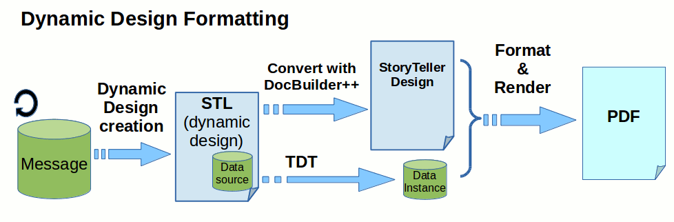

# STL Use cases

This document shows some of the usecases we can use *STL definition*
for. It is a part of the *STL Framework Documentation*.

## Automated layout conversion

In a traditional setting we use a static StoryTeller design and all
dynamism must be realized during formatting. Such approach works great
for relatively static cases, when overall layout is known in design-time
and only content changes based on input data.


But here are also cases when input data contain style and even layout
information, not just content. In such scenarios we need to integreate
StoryTeller formatter with a different layout environment producing
proprietary data formats or even designs.

For such cases it is possible to create a custom transformation
generating StoryTeller designs dynamically based on given input data.



Naturally the two approaches above can be arbitrarily combined, so it is
possible to realize some operations in *conversion time*, some in
*preprocessing time* and others in *runtime*. There are different
trade-offs for each approach so user should make consideration and look
for an optimal solution for every problem at hand.

The following table lists individual

|  Operation      | Conversion-time          | Preprocessor   | TDT runtime   | Formatter runtime   |
|  -------------- | ------------------------ | -------------- | ------------- | ------------------- |
|  Variables      | `xsl:variable`           | -              | `$variable`   | `require('vars')`   |
|  Repeating      | `xsl:for-each`           | -              | `tdt:value`   | `stl:repeater`      |
|  Switch         | `xsl:choose`, `xsl:if`   | -              | `tdt:value`   | `stl:switch`        |
|  Substitution   | `xsl:value-of`           | `xp:include`   | `tdt:value`   | `stl:datasource`    |
|  Reuse          | `xsl:call-template`      | `xp:include`   | -             | `stl:fragment`      |
|                 | ...                      | ...            | ...           | ...                 |

Consider the following (real world) example:

-   [Expected Output (PDF)](file:///git/docplatform/plain/distribution/py/pfdesigns/docbuilder/Platts/Platts-expected.pdf?h=pfi01/develop/docbuilder)
-   [Source Data (XML)](file:///git/docplatform/tree/distribution/py/pfdesigns/docbuilder/Platts/Platts2-big.xml?h=pfi01/develop/docbuilder)
-   [Design Transformation (XSLT)](file:///git/docplatform/tree/distribution/py/pfdesigns/docbuilder/Platts/Platts.xslt?h=pfi01/develop/docbuilder)
-   [Load-time Stylesheet (CSS)](file:///git/docplatform/tree/distribution/py/pfdesigns/docbuilder/Platts/Platts.css?h=pfi01/develop/docbuilder)
-   [Generated Design (STL)](file:///git/docplatform/tree/distribution/py/pfdesigns/docbuilder/Platts/Platts.xml?h=pfi01/develop/docbuilder)
-   [Formatted Output (PDF)](file:///git/docplatform/plain/distribution/py/pfdesigns/docbuilder/Platts/Platts-py.pdf?h=pfi01/develop/docbuilder)

## Generated Fragments

In previous section we generate whole design dynamically. But it is also
possible to use a static host design and use a dynamically generated STL
fragment, so that we dynamically create or modify a page object or a
story content.

In the following example we use a host design containing script used for
dynamic content creation. The script dynamically loads
[CSV](https://en.wikipedia.org/wiki/Comma-separated_values) file
containing customer data. For that purpose we are using the
[PapaParse](http://papaparse.com/) javascript library. Let's imagine
that we want to schedule a 25 minutes long meeting for each our
customer. With [Markup.js](https://github.com/adammark/Markup.js/)
javascript template engine it is fairly easy. We loop over each customer
and create a table row containing customer data. We even use dynamically
created class names to create zebra effect:

```xml
<stl:table class="table" w="100%">
  <stl:story>
    {{addresses}}
    <stl:row h="50pt">
      <stl:cell class="trow{{#|mod>2}}"><stl:p>{{##}}</stl:p></stl:cell>
      <stl:cell class="trow{{#|mod>2}}">
        <stl:p>{{last_name}}, {{first_name}}</stl:p>
      </stl:cell>
      ...
    </stl:row>
    {{/addresses}}
  </stl:story>
</stl:table>
```

In right-most column there is a dynamically created analog clock face
for each customer meeting. We use an SVG fragment for background and
dynamically create/rotate clock hands with help of registered filter
functions `Mark.pipes.minutes` and `Mark.pipes.hours`.:

```xml
<stl:group transform="scale(0.1)">
  <stl:fragment src="wd:/clock.svg" selector="/item[1]" />
  <stl:group transform="translate(1024 1024) scale(0.22)">
    <stl:path class="handh" data="M -50,-600  l 50,-50 50,50 0,800  -100,0 z" transform="rotate({{#|hours}})"/>
    <stl:path class="handm" data="M -40,-900  l 40,-40 40,40 0,1180 -80,0  z" transform="rotate({{#|minutes}})"/>
  </stl:group>
</stl:group>
```

Dynamically created STL definition file is then uploaded to blob
repository and resulting URI is set to the content substitution. System
automatically detects the STL syntax and uses DocBuilder to create
StoryTeller content fragment.

-   [Host Design (STL)](file:///git/docplatform/tree/distribution/py/pfdesigns/docbuilder/clock.xml?h=pfi01/develop/docbuilder)
-   [Dynamic Addresses (CSV)](file:///git/docplatform/tree/distribution/py/pfdesigns/docbuilder/addresses.csv?h=pfi01/develop/docbuilder)
-   [Content template (STL + Markup.js)](file:///git/docplatform/tree/distribution/py/pfdesigns/docbuilder/addresses-template.xml?h=pfi01/develop/docbuilder)
-   [Clock fragment (SVG)](file:///git/docplatform/plain/distribution/py/pfdesigns/docbuilder/clock.svg?h=pfi01/develop/docbuilder)
-   [Formatted Output (PDF)](file:///git/docplatform/plain/distribution/py/regr_output/pfdesigns/docbuilder/clock-xml-m.c.pdf?h=pfi01/develop/docbuilder)

While we understand STL format as an alternative format for maintaining
StoryTeller documents at the same time we plan to utilize STL in
scenarios where StoryTeller does not figure at all.

## TDT-based document creation

Consider a case when we have an HTML or SVG template and we want to use
TDT transformation for making some dynamic modifications based on input
data. Then we can utilize STL as a serialization format associating HTML
template with set of TDT rules and possibly other assets like other
streams containing client-side logic (javascript) and styling
information (CSS stylesheet).

Following two examples demonstrate such approach:

### HTML Invoice

In this example we create more sophisticated HTML invoice which could in
principle serve directly as a *StoryTeller Document Output*. Please,
note that *StoryTeller Formatter Engine* is not invoked at all in this
case - the resulting HTML is a direct result of the *TDT Transformation
Engine*.


The *HTML Template* is kept separately from associated *TDT
Transformation Definition* and so can be easily edited and maintained
with a specialized *HTML Editor* (as far as references from associated
TDT remain valid).

-   [STL](file:///git/docplatform/tree/distribution/py/pfdesigns/docbuilder/data-html.xml?h=pfi01/develop/docbuilder)
-   [Data Source](file:///git/docplatform/tree/distribution/py/pfdesigns/docbuilder/invoice-data.xml?h=pfi01/develop/docbuilder)
-   [HTML Template](file:///git/docplatform/plain/distribution/py/pfdesigns/docbuilder/invoice-template.html?h=pfi01/develop/docbuilder)
-   [HTML Data Instance](file:///git/docplatform/plain/distribution/py/regr_output/pfdesigns/docbuilder/data-html-xml-m.data.html?h=pfi01/develop/docbuilder)

### SVG Chart

This example demonstrates a possibility to create SVG graphics via *STL*
definition format. No Formatter or an Image Library is used for the SVG
creation, just the *DocBuilder++* and *TDT Data Transformation*.


The *SVG Template* is kept separately from associated *TDT
Transformation Definition* and so can be easily edited and maintained
with a specialized *SVG Editor* (as far as references from associated
TDT remain valid).

-   [STL](file:///git/docplatform/tree/distribution/py/pfdesigns/docbuilder/data-svg.xml?h=pfi01/develop/docbuilder)
-   [SVG Template](file:///git/docplatform/plain/distribution/py/pfdesigns/docbuilder/chart-template.svg?h=pfi01/develop/docbuilder)
-   [SVG Data Instance](file:///git/docplatform/plain/distribution/py/regr_output/pfdesigns/docbuilder/data-svg-xml-m.data.svg?h=pfi01/develop/docbuilder)

## Dynamic HTML

Another approach would be to generate a responsive and dynamic HTML
directly from *STL*.

Currently we support two kinds of HTML outputs:

-   *Paginated HTML* ... produced by StoryTeller formatter followed by a
    surface-based paginated HTML driver (this output uses HTML format
    only to emulate other paginated formats like PDF).
-   *Static HTML* ... produced by StoryTeller formatter followed by an
    enumeration HTML driver (this output is designed to imitate PDF-like
    static content as closely as possible without breaking it to
    individual pages)

But consider another approach - yet another flavour of HTML driver -
producing truly *Dynamic and responsive HTML*.

For such cases the *StoryTeller Document Model* and *Formatter*
represent very limiting factor. Converting our internal document
representation to HTML looses lots of information. Much easier approach
would be to bypass the StoryTeller engine completely and convert STL
description directly to HTML as can be seen at the bottom of the
following diagram:


Consider the following example demonstrating the dual approach:

-   [Design (STL)](file:///git/docplatform/tree/distribution/py/pfdesigns/docbuilder/stl2html/stl2html.xml?h=pfi01/develop/docbuilder)
-   [StoryTeller generated PDF](file:///git/docplatform/plain/distribution/py/regr_output/pfdesigns/docbuilder/stl2html/stl2html-xml-m.c.pdf?h=pfi01/develop/docbuilder)
-   [StoryTeller generated HTML](file:///docs/stl2html.xml-m-html/index.html)
-   [StoryTeller generated Layout HTML](file:///git/docplatform/plain/distribution/py/regr_output/pfdesigns/docbuilder/stl2html/stl2html-xml-m.layout.html/index.html?h=pfi01/develop/docbuilder)
-   [Design Transformation (XSLT)](file:///git/docplatform/tree/distribution/py/pfdesigns/docbuilder/stl2html/stl2html.xslt?h=pfi01/develop/docbuilder)
-   [Directly generated HTML](file:///docs/stl2html/stl2html.html)

More Detailed diagrams demonstrate both approaches (quite similar to an old diagram of [Dynamic HTML](file:///docs/DynamicHTML.pdf)):

Conversion to PDF:


Conversion to responsive and dynamic HTML:


The example above demonstrates that in principle any runtime operation
(repeaters, switches, substitutions, runtime scripts) can be executed
not just in context of StoryTeller formatter, but alternatively in
context of HTML document object model. Moreover the scripts can be
executed not just on server-side, but alternatively on client-side (in
web browser).

The following table demonstrates two independent dimension - *engine* and *processing time*:

| Time vs Engine  | StoryTeller Formatter  |  HTML DOM Formatter       |
| --------------- | ---------------------- | ------------------------- |
| Server-side     | ST batch production    |  Responsive HTML (email)  |
| Client-side     | ST Preview (REST API)  |  Dynamic HTML             |


