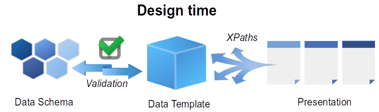
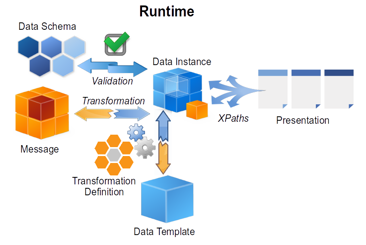
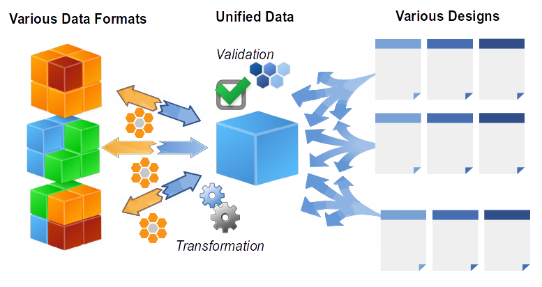

Table of Contents
=================

   * [Design time](#design-time)
      * [Data Template](#data-template)
      * [Data Transformation](#data-transformation)
      * [Data schema (not in current release)](#data-schema-not-in-current-release)
      * [Validation (not in current release)](#validation-not-in-current-release)
      * [Presentation](#presentation)
   * [Runtime](#runtime)
   * [Separation](#separation-of-data-transformation-and-document-formatting)
   * [Implementation](#implementation)
      * [Source Code](#source-code)
      * [Implementation Overview](#implementation-overview)
      * [Persistence](#persistence)
      * [Transformation process](#transformation-process)
   * [Examples](#examples)

# TDT Transformation

This document shows basic principles of *Data Transformation* and
attempts to demonstrate how it can be beneficial for *StoryTeller
Document* design process.

Besides the standard XSLT based transformation we implement our own
transformation engine which better fits the needs user can have during
StoryTeller design process.

## Design time

During *Design Time* user defines several structures:

-   *Data Template* representing data structure suitable for presentation
-   *Presentation* - mapping from *Data template* to *Layout objects*
-   *Data Transformation* from incoming *Data message* format to *Data Template*
-   *Data schema* \[optional\] used for runtime validation of *Data Instance* (not implemented in current release)



### Data Template

*Data Template* fulfills several roles in the document design and
formatting process

#### Design time Data Structure

*Data template* hierarchy represents a presentation oriented data
structure. It can also contain sample data, but it is its structure
what is most important. User should prepare *Data template* so it
makes the *Presentation* process as easy and straightforward as
possible.

If *Data Message* structure is not suitable for direct presentation
then user should define such *Data Template* structure so it better
fits the presentation needs. The gap between such *Data Template*
and original *Data Message* can then be bridged by introducing
proper *Data Transformation*.

*Data Template* represents a combination of expected data structure
and sample data, but can also contain actual data values if they are
*static* and known in *design time*.

####  Data Interface of the design

*Data Template* also represent an explicit data interface of the design.

So far it was not easy to determine what data is actually needed for
a particular design. There can be *repeaters*, *switches* and
*substitutions* reaching for data via *XPath* expressions, but also
there can be *scripts* calling functions reaching for data buried in
almost any object and last but not least there can be *fragments*
containing any of the previously listed.

It should be obvious that a maintenance of such extensive diverse
set of entities is not easy. But now we have *Data Template*
providing centralized view of the *data aspect* of the whole
StoryTeller design.

Thanks to that a design maintainer has much more possibilities how
to absorb external changes (e.g. a sudden change of message
definition) and so design maintenance should be much easier.

So *Data Template* simply provides a data interface of the design -
the same as a function signature provides a data interface of a
function in a programming language.

####  Runtime Data Structure

*Data Template* also specifies how the resulting Data Instance will
look like and so how much data will be present in *Data Island*.
When we start embedding resulting data in resulting document streams
(be it *HTML*, *DOCX*, *PDF* or *SSDD*) this aspect of *Data
Template* will become more and more relevant.

### Data Transformation

*Data Transformation* definition is a set of rules referencing *Data
Template* and providing instructions how *Input Message* data should be
transformed to a *Data instance*.

####  Transformation Map

It is important to realize that in principle there can be several
*Data Transformations* for a single *Data Template*. In such case
the design can support a variety of input data structures/formats
and for each single data structure/format a corresponding *Data
Transformation* is picked and used to transform it to a unified
*Data Instance*.

StoryTeller runtime supports a map of *Data Transformations* for
each document and fragment. There can be any number of
transformations each registered for an arbitrary string keys (only
keys starting with underscore are reserved for internal usage).

There are always several keys with a special meaning present in the
transformation map:

-   `_null` ... Transformation is bypassed (see paragraph below for more detail)
-   `_template` ... Exact copy of *Data Template* is used as a *Data Instance*
-   `_default` ... Transformation registered under this key is used if used does not specify otherwise

####  Transformation in fragments

A separate *Transformation Map* is associated with each fragment. In
runtime such transformation is executed when the fragment is
instantiated.

At the moment of transformation execution the current *Data Cursor*
from host document is used as a context node for the fragment's
transformation.

Also it is important to realize that the transformations are chained
(connected serially instead of in parallel). It means that the
fragment's transformations uses the superior *Data Instance*
(product of host document transformation) as a source - not the
*Data Message*.

Such approach improves fragment re-usability and isolation - there
is typically just a tiny subset of original data what is needed to
present a fragment. As an example we can imagine a fragment
presenting an address. Even though the fragment may perform some
really sophisticated logic for how the presentation is performed,
it's logic really does not case whether the particular address it is
presenting is an address of a shop, company or an employee.

####  Bypass transformation process

If a user registers null as a transformation it means that no
transformation is performed and a direct access to a source data (be
it *Data Message* in case of *document transformation* or a hosting
document *Data Instance* in case of *fragment transformation*) is
provided to presentation.

This way user can basically fall-back to formatting mode he was
using before the concept of *Data Transformations* was introduced.

####  Transformation in design time

Even though the transformation is mainly taken as a runtime process
it is possible to perform transformation in design time as well.

If user imports *Sample Data* then the currently specified
*Transformation Definition* is executed against it and the
*Formatting Process* is performed on top of its result - *Data
Instance*.

This way user has much better feedback how the whole process will
behave in runtime.

### Data schema (not in current release)

Optional *Data Schema* definition can be used for *Data Instance
Validation* and so can help users to create more robust and easily
maintainable designs.

*Data Schema* describes not only how data should be structured but also
specifies what are individual nodes' occurrences (e.g. if a data record
is *optional*, *mandatory* or *repeatable*), and what types of values
are valid for individual data fields (e.g. whether a field is *string*,
*numeric*, *date* or *email address*).

In future it can incorporate *User Types* (like *Address* or *Customer*)
as well as the *Built-in Types* and so help user to more easily view,
edit and organize their data structures.

### Validation (not in current release)

One can see the *Data Template* as a data interface which the *Layout
Presentation* accept data through. As the *Data Message Definition* is
not part of the *StoryTeller Design* persistence it can be changed
anytime without anybody notices that the *StoryTeller Design* no longer
fits the new *Message* structure. Such "broken" design starts producing
bogus outputs and the root cause must be intricately searched through
whole presentation logic down to individual layout elements' scripts. On
the other hand if every *StoryTeller Design* has its *Data Template*
embedded then this extra level of indirection can help us tracking down
the root cause. When we run *Data Transformation* for given *Message*
and *Data template* then we can simply see that the resulting *Data
Instance* does not match the expected *Data Schema*.

### Presentation

*Presentation objects* (like *Interactive items*, *Repeaters*,
*Switches* and *Substitutions*) should point to *Data Template* elements
via *XPath* based links. There should be no *XPath* links outside the
*Data Template*.

As *Data Template* should be prepared as it suits the presentation needs
the connection between layout objects and data elements should be a
straightforward process and typically means just a trivial one-to-one
mapping (*repeater* pointing to a *repeatable element*, *substitution*
pointing to a *nested attribute*, ...).

## Runtime

During runtime the *StoryTeller Service* is invoked with an incoming
*Message Data*. *Formatter* accepts given *Data Message* and transforms
it based on a selected corresponding *Data Transformation*. A product of
the transformation process is called *Data Instance*.

*Data Message* is typically an [XML](http://en.wikipedia.org/wiki/XML)
stream, but generally it can be any data format, (for example
[CSV](http://en.wikipedia.org/wiki/Comma-separated_values)) as far as
there exists a corresponding *Data Transformation*.

There can be various kinds of *Data Transformations*. One well known
possibility is [XSLT](http://en.wikipedia.org/wiki/XSLT). Another
possibility is [XQuery](http://en.wikipedia.org/wiki/XQuery). In this
document we'll describe another possibility - our custom implementation
of transformation processor built directly on top of
[XPath](http://en.wikipedia.org/wiki/XPath) - we call it TDT (*Template
Driven Transformation*).

*Data Instance* is a product of *Data Transformation* for given input
*Data Message*. It can be validated by a *Data Schema* **before** the
actual *Formatting Process* is started.

If the *Data Instance* is valid then it is passed to the *Formatter* and
*Document Formatting* process can start (*Document Formatting* details
are described elsewhere and are out-of-scope of this document).

*Data Instance* can also be preserved and serialized to an output
stream. Such serialized *Data Instance* is then called *Data Island*.



## Separation of *Data Transformation* and *Document Formatting*

There are several reasons why separation of *Data Transformation* and
*Document Formatting* is a good thing.

### Specialization

First of all - it is in the spirit of the [Divide et
Impera](http://en.wikipedia.org/wiki/Divide_and_rule) principle. As
*Data Transformation* and *Presentation* are two different activities -
they deserve different and specialized tools. On the other hand if the
two activities were mixed together then many compromises must have been
done both in terms of *tool usability* and *design maintainability*.

### Validation

Moreover it is very natural to implement *Data Validation* when *Data
Transformation* is separated from *Formatting Process*. But if *Data
Transformation* were dissolved in *Formatting Process* then some kind of
*Data Validation* would have been very challenging.

### Combinations

And last, but not least, it is possible to mutually combine several
*Data Transformations* and *Designs* when the two processes are
separated via clear *Data Template* + *Data Schema* interface.

Imagine we have several (`N`) *Data Input* variations all leading to a
single *Data Template* format. We simply prepare a *Data Transformation*
for each input flavor.

At the same time we can have several (`M`) *Document Designs* all
sharing the same *Data Template*. So we end up with all *Data* and
*Design* combinations available.

The described situation would be a maintenance hell in case of the
"mixed" approach (all the combinations - `N * M` - of full document
design definitions would be necessary).



More details about this scenario can be described on an example:

####  Radio schedule listing

Let's say we want to visualize a *radio station list* in an unified way.

There are several kinds of views we want (e.g. an *overview*,
*detailed view* and some *charts*) each defined as a different SSD.

But there are several providers of input data - each broadcast
provides site provides its schedule listing in a vastly different
format.

So we first define a unified data structure - *Data Template* -
mainly based on *Presentations* we would like to create. Then we
create a different *Data Transformation* for each individual *Data
Message* format.

The big advantage is that we need to define only a single set of
*Presentations* regardless of a particular *Data Message* format.
*Data template* (along with corresponding *Data Schema*) protects us
as a shield - all diversity is handled in *Data Transformation* and
does not leak to *Presentation*.

Concrete transformations for two real-world radio broadcasters are
available in *Examples* section.

# Implementation

## Source Code

### POC (Python)

We have prepared relatively simple python implementation based on [lxml library](http://lxml.de/) 
as a *Data Transformation* proof-of-concept.

### Production (C++)

The production version of *Data Transformation* is based on
[libxml2](http://xmlsoft.org/) wrapped with our `IDataSource` family of interfaces.

The transformation syntax is slightly different from the one used in POC
but both implementations are reasonably similar.

## Implementation Overview

Data *Transformation* process is performed in two phases - *Compilation* and *Execution*.

### Compilation

*Compilation* takes given *source transformation* and *data template*
and basically produces a new transformation from it.

During compilation phase all user defined rules are either copied from
source to destination or - if they form a meta-rule - are transformed to
a set of corresponding rules.

The *recurse* and *enumerate* are examples of such "meta-rules"
(however, other kinds of meta-rules can exist in principle) and their
semantics is described in more detail below.

### Execution

During the *Execution phase* the *Transformation Processor* implements
whole transformation based on following simple building blocks:

-   *Data Template* tree traversal & *XPath* evaluation
-   Element/Attribute/Text data evaluation
-   Variable declarations
-   Custom *XPath* functions

Currently the implementation does not provide *sorting* right now, but
it seems like a natural extension of the functionality currently
implemented.

## Persistence

For transformation persistence a simple *XML* is used.

But as the transformation is defined just like a simple *path* ->
*rule* (*key* -> *value* dictionary) container it should be clear
that any other kind of persistence can be easily implemented (be it
[JSON](http://en.wikipedia.org/wiki/JSON),
[YAML](http://en.wikipedia.org/wiki/YAML) or whatever else).

## Transformation process

This section describes the transformation process in a slightly more
detail.

### Data Template traversal

During the *Transformation Process* the *Processor* traverses given
*Data template* in so called [Depth first,
pre-order](http://en.wikipedia.org/wiki/Tree_traversal#Pre-order).

For each visited *Element* it looks up a corresponding *Transformation
Rule*.

After each *Element* is evaluated (including its *Attribute evaluation*
and *Text node evaluation*) the *Transformation Process* continues
sequentially to its children until it reaches list nodes.

### Element evaluation

In the current implementation a full (absolute) path for the *Element*
is used as a lookup key, for example:

```xml
<tdt:rule path="/data/day/station">...
```

In case several elements share the same *XPath* then *index based
XPaths* area used for lookup. Lookup path can look for example as
follows:

```xml
<tdt:rule path="/data/day[1]/station[3]">...
```

A use case when multiple elements of the same name can be beneficial is
demonstrated in the 
[Multiple Elements example](https://github.com/opentext/storyteller/tree/master/docplatform/distribution/py/public/pfi01/xyz/multiple.rst).

If there is no *Rule* found in given *Transformation* then the *Element*
is left as is in the *Data Template*.

On the other hand if a *Rule* is found than it is evaluated in current
evaluation scope. The *Element* is then replaced by *N* (deep) copies
where *N* is a size of evaluation *Result Node-Set*.

In particular if the *Result Node-Set* is empty then the *Element* is
removed and none if its children is ever evaluated.

### Variable evaluation

If there are some *Variables* declared in the current *Evaluation* rules
than all variables are evaluated.

Each *Variable* is introduced in current *Evaluation scope* and its
corresponding *XPath expression* is evaluated. All variables are
evaluated in the declaration order but **after** the *Host Element*
evaluation.

```xml
<tdt:rule path="/data/day">
  <!-- variables are evaluated in declaration order -->
  <tdt:value key="$hello">'Hello'</tdt:value>
  <tdt:value key="$world">'World'</tdt:value>
  <tdt:value key="$greeting">concat( $hello, ' ', $world )</tdt:value>

  <!-- No variables accessible here - it is evaluated *before* the variables -->
  <!-- (regardless the tdt:value order) -->
  <tdt:value key=".">...</tdt:value>
</tdt:rule>
```

*Variables* are immutable - so it is not possible to change a value of
an already defined variable. *Variable* is valid and accessible in scope
of whole *Data Template* subtree.

If a variable of the same name already exists in a superior scope, it
can be shadowed by a new variable with the same name. Outside the scope
of the nested variable the original the superior variable still holds
the original value.

```xml
<tdt:rule path="/data/day/station">
  <!-- Here I can access all the variables from the '/data/day' rule -->
  <!-- ($hello, $world, $greeting) -->
  <tdt:value key=".">...</tdt:value>

  <tdt:value key="$greeting">concat( $hello, ' beautiful ', $world )</tdt:value>
</tdt:rule>
<tdt:rule path="/data/day/station/name">
  <!-- Here the $greeting equals to 'hello beautiful world' string -->
</tdt:rule>
<tdt:rule path="/data/day/conclusion">
  <!-- Here the $greeting equals to 'hello world' string -->
</tdt:rule>
<tdt:rule path="/data/night">
  <!-- Here the $greeting variable is not accessible at all -->
</tdt:rule>
```

### Attribute evaluation

There can be various *Attributes* in every *Element* of the *Data
Template*. If user wants to fill the attribute value dynamically then he
creates a value to the corresponding rule:

```xml
<tdt:rule path="/data/day/station">
  <!-- attribute value is retrieved from the specified source xpath -->
  <tdt:value key="@name">/this/is/a/source/xpath/for/the/@name</tdt:value>
</tdt:rule>
```

If there is no such value available in given *Transformation* then the
*Attribute* value is left as is, otherwise the original value is
overwritten by the evaluation result or deleted if the result is empty.

### Text node evaluation

If user wants to fill the text value dynamically then he creates a value
to the corresponding rule:

```xml
<tdt:rule path="/data/day/station">
  <!-- attribute value is retrieved from the specified source xpath -->
  <tdt:value key="text()">/this/is/a/source/xpath/for/the/text()</tdt:value>
</tdt:rule>
```

If there is no such value available in the *Transformation* then the
text value is left as is, otherwise an original value is overwritten by
a *Rule* evaluation result or deleted if the result is empty.

### Custom XPath functions

The *Transformation Processor* registers bunch of *XPath Extension
functions* which are available whenever an *XPath* gets evaluated during
the *Data Transformation*.

This section should provide a brief reference of those functions.

#### <document> tdt:template()

This function provides us with access to *Data Template* hierarchy.

We can for example create a simple lookup functionality with it.

First we create a static **lookup** section to our *Data Template*:

```xml
<data>
  <lookup>
    <station key="CRO1">Cesky Rozhlas 1 - Praha</station>
    <station key="CRO2">Cesky Rozhlas 2 - Vltava</station>
  </lookup>
  <day>
    <station>
      ...
```

Then we can access the just defined lookup table as follows:

```xml
<tdt:rule path="/data/day/station/name">
  <tdt:value key=".">tdt:template()/lookup/station[@key=$station/@name]/text()</tdt:value>
</tdt:rule>
```

#### <document> tdt:document( <string> )

This function provides an access to an external XML source document.
User can access any external XML specified by first parameter
representing a xml document *URL*.

```xml
<tdt:rule path="/data/day">
  <tdt:value key=".">tdt:document('http://program.rozhlas.cz/xml.php')/program/den</tdt:value>
</tdt:rule>
```

Currently `file:`, `ftp:` and `http:` URL schemas are supported The
supported schemas depend on actual repository configuration, so user
can utilize all the goodies provided by *StoryTeller Repository
Framework* (like *Mount points* and *Proprietary URL schemas* like
`wd:` or `otmm:`).

####  <node-set> tdt:tokenize( <node-set>, <string> )

This function is similar to the
[str:tokenize](http://www.exslt.org/str/functions/tokenize/)
function defined in [EXSLT](http://www.exslt.org/).

The `tdt:tokenize` function splits up given strings and returns a
node set of token elements, each containing one token from the
string.

The first argument is one or more strings to be tokenized. The
second argument is a string consisting of a number of characters.
Each character in this string is taken as a delimiting character.
The strings given by the first argument are split at any occurrence
of any of these characters.

For example the definition of:

```xml
<tdt:rule path="/data/token">
  <tdt:value key=".">tdt:tokenize( '2001-06-03T11:40:23', '-T:' )</tdt:value>
  <tdt:value key="text()">text()</tdt:value>
</tdt:rule>
```

... results in:

```xml
<data>
  <token>2001</token>
  <token>06</token>
  <token>03</token>
  <token>11</token>
  <token>40</token>
  <token>23</token>
</data>
```

#### <node-set> tdt:split( <node-set>, <string> )

This function is similar to the
[str:split](http://www.exslt.org/str/functions/split/) function
defined in [EXSLT](http://www.exslt.org/).

The `tdt:split()` function splits up given strings and returns a
node set of token elements, each containing one token from the
string.

The first argument is one or more the string to be split. The second
argument is a pattern string. The strings given by the first
argument are split at any occurrence of this pattern.

For example the definition of:

```xml
<tdt:rule path="/data/token">
  <tdt:value key=".">tdt:split( 'a, simple, list', ', ' )</tdt:value>
  <tdt:value key="text()">text()</tdt:value>
</tdt:rule>
```

... results in:

```xml
<data>
  <token>a</token>
  <token>simple</token>
  <token>list</token>
</data>
```

Empty string is not allowed as the second parameter.

#### <string> tdt:concat( <node-set> \[, <string> \] )

This function is similar to the
[str:concat](http://www.exslt.org/str/functions/concat/) function
defined in [EXSLT](http://www.exslt.org/).

The `tdt:concat()` function takes a node set and a string separator
and returns the concatenation of the string values of the nodes in
that node set. If the node set is empty, it returns an empty string.
If the separator is an empty string then strings are concatenated
without a separator.

####  <node-set> tdt:group( <node-set> \[ , <string>, ... \] ) + <node-set> tdt:ungroup( <node> )

This function allows to group given nodes based on given grouping
criteria.

Grouping criteria are represented one or mode strings containing
relative XPaths optionally prefixed with '\~' aggregation prefix.

When a user calls this function then several steps are performed:

-   Input Node-Set is enumerated
-   All given XPaths are evaluated in context of each element
-   Aggregation is performed based on given aggregation keys
-   Grouping is performed based on equality
-   For each resulting group a synthesized tdt:group element is created
-   Node-Set of all synthesized "group" elements is returned

Each synthesized `tdt:group` element contains summary information
about grouping operation, number of grouped nodes etc. but does not
contain actual *grouped nodes*.

The access to those is possible via the `tdt:ungroup()` function.
This function accepts the synthetic *group* node as an argument and
returns a Node-Set of grouped original nodes.

This relatively complicated description can be easily demonstrated
on the following example:

If we have the following input data:

```xml
<data>
  <message>
    <r cls="A" num="10">1</r>
    <r cls="A" num="5">2</r>
    <r cls="B" num="10">3</r>
    <r cls="B" num="5">4</r>
    <r cls="B" num="10">5</r>
    <r cls="A" num="5">6</r>
    <r cls="A" num="10">7</r>
    <r cls="B" num="5">8</r>
    <r cls="B" num="10">9</r>
  </message>
</data>
```

Then with following data template:

```xml
<data>
  <message>
    <cls size="?" cls="?" num="?">
      <r>?</r>
    </cls>
  </message>
</data>
```

and following transformation rules:

```xml
<tdt:rule path="/data/message/cls">
  <tdt:value key=".">tdt:group( r, '~@cls', '~@num' )</tdt:value>
  <tdt:value key="@size">@size</tdt:value>
  <tdt:value key="@cls">tdt:key[@key='~@cls']</tdt:value>
  <tdt:value key="@num">tdt:key[2]</tdt:value>
</tdt:rule>
<tdt:rule path="/data/message/cls/r">
  <tdt:value key=".">tdt:ungroup()</tdt:value>
  <tdt:value key="text()">text()</tdt:value>
</tdt:rule>
```

... we get the following output:

```xml
<data>
  <message>
    <cls cls="A" num="10" size="2">
      <r>1</r>
      <r>7</r>
    </cls>
    <cls cls="A" num="5" size="2">
      <r>2</r>
      <r>6</r>
    </cls>
    <cls cls="B" num="10" size="3">
      <r>3</r>
      <r>5</r>
      <r>9</r>
    </cls>
    <cls cls="B" num="5" size="2">
      <r>4</r>
      <r>8</r>
    </cls>
  </message>
</data>
```

Note:

The `tdt:group()` is similar to the
[uniq](http://en.wikipedia.org/wiki/Uniq) filter in Unix. It
generates a break or new group every time the value of of the keys
changes (which is why it is often necessary to add aggregate prefix
if data is not already aggregated or sorted). That behavior differs
from SQL’s GROUP BY which aggregates common elements regardless of
their input order.

####  <node-set> tdt:nodeset( \[ <object>, ... \] )

This function accepts any number of arguments (`0`, `1` or more) of
any type (`node-set`, `node`, `string`, `number`) and creates a
single `node-set` as a result. If an argument is a Node-Set then all
the nodes it contains will appear flattened in the resulting
Node-Set.

With following input data:

```xml
<data>
  <message>
    <name>Peter</name>
    <name>John</name>
    <name>Daniel</name>
  </message>
</data>
```

... this template:

```xml
<data>
  <node>?</node>
</data>
```

... and transformation:

```xml
<tdt:rule path="/data/node">
  <tdt:value key=".">
    tdt:nodeset( "This", "is" ) 
    | tdt:nodeset( "a", "test", "number", 1, ":", /data/message/name ) 
    | tdt:nodeset()
  </tdt:value>
  <tdt:value key="text()">text()</tdt:value>
</tdt:rule>
```

... you get the following output:

```xml
<data>
  <node>This</node>
  <node>is</node>
  <node>a</node>
  <node>test</node>
  <node>number</node>
  <node>1</node>
  <node>:</node>
  <node>Peter</node>
  <node>John</node>
  <node>Daniel</node>
</data>
```

### Special Forms

This section describes *special forms* that are handled by
*Transformation Processor*. The *special form* term means that the
*processor* itself handles it specially (differently than ordinary
rules).

The special forms are very powerful but at the same time they complicate
the *transformation process*. That is why we should limit the total
number of special forms supported (especially if there is a possibility
of implementation based on a *custom XPath function* - grouping
implemented via *tdt:group()* custom function is one such notable
example).

Right now there is just a single special form - *union*, but maybe there
will be a special form for element sorting in future.

####  union

There are situations when message data contain set of elements
coming in an *arbitrary order* and user wants to preserve that exact
order for presentation.

One possible solution to this problem is to create a *common
element* - we can call it *event* for example - for any *data driven
input element*. Such element represents a *generic event* and each
its instance contains a single one of the data driven elements as
its sub-element.

Such approach is demonstrated in detail in 
[Data Driven example](https://github.com/opentext/storyteller/tree/master/docplatform/distribution/py/public/pfi01/xyz/datadriven.rst).

However, there can be cases that such solution does not fit the
user's needs. If user wants to preserve both the *order* and the
*exact structure of elements* at the same time, then an alternative
would be to use the *union* special form.

Such alternative approach is described in detail in the 
[Union example](https://github.com/opentext/storyteller/tree/master/docplatform/distribution/py/public/pfi01/xyz/union.rst).

### Meta-Rules

Right now the *Transformation Processor* supports two kinds of
*meta-rules*.

The meta-rules are processed by the transformation compiler and are
transformed to a set of corresponding resulting rules.

####  recurse

Let's say that during the *Data Transformation* a user wants to copy
some sub-tree verbatim, exactly as it is, without any changes.

For simplifying this relatively frequent situation the Processor
supports a special form called *recurse*. When user specifies
recurse keyword (along with a base xpath) inside a transformation
rule then the rule starts to behave like a "meta-rule" generating
automatically corresponding rules for whole *Data Template* subtree.

The usage of the *recurse* special form looks as follows:

```xml
<tdt:rule path="/data/employee">
  <tdt:value key=".">/data/message/employee</tdt:value>
  <tdt:value key="recurse">.</tdt:value>
</tdt:rule>
```

A demonstration of this functionality is available in the 
[Recurse example](https://github.com/opentext/storyteller/tree/master/docplatform/distribution/py/public/pfi01/xyz/recurse.rst).

If user wants to make some minor changes to the element structure
then it is still possible to combine such rules with the recurse
special form. Such situation is described in the [Recurse Change
example](https://github.com/opentext/storyteller/tree/master/docplatform/distribution/py/public/pfi01/xyz/recurse_change.rst).

####  enumerate

From use standpoint the *enumerate meta-rule* is very similar to
*recurse meta-rule* with the only difference that while *recurse*
respects the *template* order of elements (is design driven) the
*enumerate* respects the element order of *input data* (it is data
driven).

# Examples

All the published examples are available
[here](https://github.com/opentext/storyteller/tree/master/docplatform/distribution/py/public/tdt).

There are several sections:

-   [pfi01/tutorial](https://github.com/opentext/storyteller/tree/master/docplatform/distribution/py/public/tdt/pfi01/tutorial)

    This section contains links to simple examples typically
    demonstrating a single feature

-   [pfi01/usecases](https://github.com/opentext/storyteller/tree/master/docplatform/distribution/py/public/tdt/pfi01/usecases)

    This section contains more advanced *Data Transformation* examples.
    They are based on real world scenarios and typically combine several
    features described above.

    Hopefully the examples will help reader to better understand and
    evaluate the concepts described above.

-   [pfi01/functions](https://github.com/opentext/storyteller/tree/master/docplatform/distribution/py/public/tdt/pfi01/functions)

    Examples demonstrating all available custom XPath functions

-   [pfi01/xyz](https://github.com/opentext/storyteller/tree/master/docplatform/distribution/py/public/tdt/pfi01/xyz)

    Some more examples, mostly uncategorized.

-   [vla01/usecases](https://github.com/opentext/storyteller/tree/master/docplatform/distribution/py/public/tdt/vla01/usecases)

    Official use cases specified as an input for TDT development process


